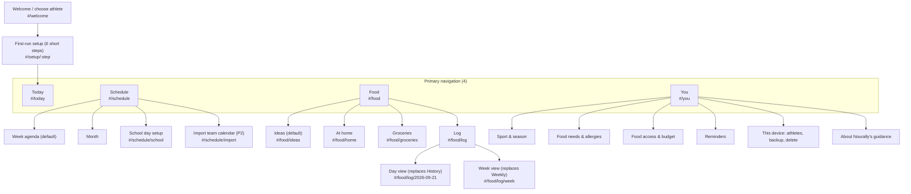

# Nourally redesign checklist

Source of truth: [CLAUDE-REDESIGN-AUDIT.md](CLAUDE-REDESIGN-AUDIT.md). Read [CLAUDE-REDESIGN-AUDIT.md](CLAUDE-REDESIGN-AUDIT.md) before each change for full details. The full audit is preserved below this tracker so the original explanations, acceptance criteria, dependencies, risks, decisions, and end-state criteria remain in this project file. Checkboxes in the audit copy are acceptance criteria; only the tracker records implementation status. A phase item closes only when its stated “Done when” condition and linked criteria pass.

**Status key:** unchecked = remaining; checked = implemented and accepted; **Blocked — owner** = requires a decision from §13.7; **Blocked — qualified review** = safety-relevant nutrition or allergen guidance pending sign-off. Partial work stays unchecked and gets a note. Implement in P0 → P1 dependency order, then P2/P3 if in scope. Do not claim MVP completion until every §13.8 checkbox passes.

## Confirmations recorded 2026.09.29

Owner Ryan Kalfus confirmed the recommended options previously presented for audit §13.7 and the preparation offsets. Qualified review approval was reported by the owner from **Emily Cornelius, RDN, dated 2026.09.29**, covering the audit's timing rules, recovery window, notes and example portions, allergen handling, game-day copy, and sports-drink guidance. See `NUTRITION-REVIEW.md`. Review approval clears the approval gate; each implementation and acceptance check remains required. Historical pending-review notes below describe the state before this confirmation.

## Phase tracker

### P0

- [x] **P0-01**
- [x] **P0-02**
- [x] **P0-03**
- [x] **P0-04**
- [x] **P0-05**
- [x] **P0-06**
- [x] **P0-07**
- [x] **P0-08**
- [x] **P0-09**
- [x] **P0-10**
- [x] **P0-11**
- [x] **P0-12**

### P1

- [x] **P1-01**
- [x] **P1-02**
- [x] **P1-03**
- [x] **P1-04**
- [x] **P1-05**
- [x] **P1-06**
- [ ] **P1-07**
- [ ] **P1-08**
- [ ] **P1-09** — Built, not ticked: per-ingredient tags, `profile.allergies`, idea and grocery filters, Open Food Facts allergens on product views, and tests for both gate states are in; filtering stays off behind `ALLERGY_TAGS_REVIEWED = false` until the pending table in NUTRITION-REVIEW.md is signed.
- [ ] **P1-10** — Blocked on P1-09 sign-off: 6.14 passes; 6.13's peanut-allergy criterion needs the review gate open. DATA-08 is done in P1-12.
- [x] **P1-11** — Allergy chips in step 5 stay hidden behind the P1-09 review gate (ONB-04).
- [x] **P1-12**
- [ ] **P1-13**

### P2

- [ ] **P2-01**
- [ ] **P2-02**
- [ ] **P2-03**
- [ ] **P2-04**
- [ ] **P2-05**
- [ ] **P2-06**
- [ ] **P2-07**
- [ ] **P2-08**

### P3

- [ ] **P3-01**
- [ ] **P3-02**
- [ ] **P3-03**
- [ ] **P3-04**
- [ ] **P3-05**

## Recommendation tracker

Each ID is an individual checkbox. Implementation notes and blockers go on the matching line; the full requirement remains in the audit copy below. IDs in related decision tables are tracked separately because they are distinct audit recommendations.

### IA

- [x] **IA-01**
- [x] **IA-02**
- [ ] **IA-03**
- [ ] **IA-04**
- [x] **IA-05**
- [x] **IA-06**
- [ ] **IA-07**
- [ ] **IA-08**
- [ ] **IA-09**
- [ ] **IA-10**
- [ ] **IA-11**
- [x] **IA-12**
- [ ] **IA-13**
- [ ] **IA-14**

### DS

- [x] **DS-01**
- [x] **DS-02**
- [x] **DS-03**
- [x] **DS-04**
- [x] **DS-05**
- [x] **DS-06**
- [x] **DS-07**
- [x] **DS-08**
- [x] **DS-09**
- [x] **DS-10**
- [x] **DS-11**
- [x] **DS-12**
- [ ] **DS-13** — Partial: 48 px inputs, selects with chevron, 22 px checkboxes, focus and `aria-invalid` error styles and the error icon are in `base.css`/`components.css`; field-level error messages linked with `aria-describedby` are not wired yet (errors are form-level; P1-13).
- [x] **DS-14**
- [ ] **DS-15** — Partial: 560/640 px dialogs, bottom sheets under 768 px with drag handle, sticky header and footer, backdrop, 200 ms entry and first-field focus are done; "Discard changes?" exists only in the You, activity, school-day and At home edit sheets, not yet in grocery edit, portion, water or Counts as.
- [x] **DS-16**
- [x] **DS-17**
- [x] **DS-18**
- [x] **DS-19**

### ENTRY

- [x] **ENTRY-01**
- [x] **ENTRY-02**
- [x] **ENTRY-03**
- [x] **ENTRY-04**
- [x] **ENTRY-05**
- [x] **ENTRY-06**

### ONB

- [x] **ONB-01**
- [x] **ONB-02**
- [x] **ONB-03**
- [ ] **ONB-04** — Partial: the safety paragraph is on You › About; step 5 shows "Allergy filtering is waiting for review. Check every label." and switches to the ONB-04 line only when `ALLERGY_TAGS_REVIEWED` is true.
- [x] **ONB-05**
- [x] **ONB-06**

### TODAY

- [x] **TODAY-01**
- [x] **TODAY-02**
- [x] **TODAY-03**
- [x] **TODAY-04**
- [x] **TODAY-05**
- [x] **TODAY-06**
- [x] **TODAY-07**
- [x] **TODAY-08**
- [x] **TODAY-09**
- [x] **TODAY-10**
- [x] **TODAY-11**

### FOOD

- [x] **FOOD-01**
- [x] **FOOD-02**
- [x] **FOOD-03**
- [x] **FOOD-04**
- [x] **FOOD-05**
- [x] **FOOD-06**

### HOME

- [x] **HOME-01**
- [x] **HOME-02**
- [x] **HOME-03**
- [x] **HOME-04**
- [x] **HOME-05**
- [x] **HOME-06**
- [x] **HOME-07**

### GROC

- [x] **GROC-01**
- [x] **GROC-02**
- [x] **GROC-03**
- [x] **GROC-04**
- [x] **GROC-05**
- [x] **GROC-06**
- [x] **GROC-07**
- [x] **GROC-08**

### IDEA

- [x] **IDEA-01**
- [x] **IDEA-02**
- [x] **IDEA-03**
- [x] **IDEA-04**
- [x] **IDEA-05**
- [x] **IDEA-06**
- [x] **IDEA-07**
- [x] **IDEA-08**

### LOG

- [ ] **LOG-01**
- [ ] **LOG-02**
- [ ] **LOG-03**
- [ ] **LOG-04**
- [ ] **LOG-05**
- [ ] **LOG-06**
- [ ] **LOG-07**
- [ ] **LOG-08**

### SCH

- [x] **SCH-01**
- [x] **SCH-02**
- [x] **SCH-03**
- [x] **SCH-04**
- [x] **SCH-05**
- [x] **SCH-06**
- [x] **SCH-07**
- [x] **SCH-08**
- [x] **SCH-09**
- [ ] **SCH-10**

### ACT

- [x] **ACT-01**
- [x] **ACT-02**
- [x] **ACT-03**
- [x] **ACT-04**
- [x] **ACT-05**

### WEEK

- [ ] **WEEK-01**
- [ ] **WEEK-02**
- [ ] **WEEK-03**
- [ ] **WEEK-04**
- [ ] **WEEK-05**

### HIST

- [x] **HIST-01**
- [ ] **HIST-02**
- [ ] **HIST-03**

### YOU

- [x] **YOU-01**
- [ ] **YOU-02** — Partial: "I don't eat" (Vegetarian, Vegan) and "Not a fan of" built; the nine allergy chips plus Other are built but hidden behind `ALLERGY_TAGS_REVIEWED` (P1-09 review); Dairy-free/Gluten-free stay hidden (gluten also needs barley and rye tags).
- [ ] **YOU-03** — Partial: Nut-free removed and never migrated into an allergy (a prompt shows instead); peanut and tree-nut allergy chips are built and gated on the P1-09 review.
- [x] **YOU-04**
- [x] **YOU-05**
- [x] **YOU-06**

### DATA

- [x] **DATA-01**
- [x] **DATA-02**
- [x] **DATA-03**
- [x] **DATA-04**
- [x] **DATA-05**
- [x] **DATA-06**
- [x] **DATA-07**
- [x] **DATA-08** — Done in P1-12 (ADD-12 backup nudge on Today).
- [x] **DATA-09**

### DLG

- [ ] **DLG-01**
- [ ] **DLG-02**
- [ ] **DLG-03**
- [ ] **DLG-04**

### SRCH

- [x] **SRCH-01**
- [x] **SRCH-02**
- [x] **SRCH-03**
- [x] **SRCH-04**
- [x] **SRCH-05**
- [x] **SRCH-06**
- [ ] **SRCH-07**

### COPY

- [x] **COPY-01**
- [x] **COPY-02**
- [x] **COPY-03**
- [x] **COPY-04**
- [x] **COPY-05**
- [x] **COPY-06**
- [x] **COPY-07**
- [x] **COPY-08**
- [x] **COPY-09**
- [x] **COPY-10**
- [x] **COPY-11**
- [x] **COPY-12**
- [x] **COPY-13**
- [x] **COPY-14**
- [x] **COPY-15**
- [x] **COPY-16**
- [x] **COPY-17**
- [x] **COPY-18**
- [x] **COPY-19**
- [x] **COPY-20**
- [x] **COPY-21**
- [x] **COPY-22**
- [x] **COPY-23**
- [x] **COPY-24**
- [x] **COPY-25**
- [x] **COPY-26**
- [x] **COPY-27**
- [x] **COPY-28**
- [x] **COPY-29**
- [x] **COPY-30**
- [x] **COPY-31**
- [x] **COPY-32**
- [x] **COPY-33**
- [x] **COPY-34**
- [x] **COPY-35**
- [x] **COPY-36**
- [x] **COPY-37**
- [ ] **COPY-38**

### KEEP

- [ ] **KEEP-01**
- [ ] **KEEP-02**
- [ ] **KEEP-03**
- [ ] **KEEP-04**
- [ ] **KEEP-05**
- [ ] **KEEP-06**
- [ ] **KEEP-07**
- [ ] **KEEP-08**
- [ ] **KEEP-09**
- [ ] **KEEP-10**
- [ ] **KEEP-11**
- [ ] **KEEP-12**
- [ ] **KEEP-13**
- [ ] **KEEP-14**
- [ ] **KEEP-15**

### MOVE

- [ ] **MOVE-01**
- [ ] **MOVE-02**
- [ ] **MOVE-03**
- [ ] **MOVE-04**
- [ ] **MOVE-05**
- [ ] **MOVE-06**
- [ ] **MOVE-07**
- [ ] **MOVE-08**
- [ ] **MOVE-09**
- [ ] **MOVE-10**
- [ ] **MOVE-11**
- [ ] **MOVE-12**
- [ ] **MOVE-13**

### DEFER

- [ ] **DEFER-01**
- [ ] **DEFER-02**
- [ ] **DEFER-03**
- [ ] **DEFER-04**
- [ ] **DEFER-05**
- [ ] **DEFER-06**
- [ ] **DEFER-07**
- [ ] **DEFER-08**
- [ ] **DEFER-09**
- [ ] **DEFER-10**
- [ ] **DEFER-11**
- [ ] **DEFER-12**
- [ ] **DEFER-13**
- [ ] **DEFER-14**
- [ ] **DEFER-15**
- [ ] **DEFER-16**
- [ ] **DEFER-17**

### ADD

- [x] **ADD-01**
- [x] **ADD-02**
- [ ] **ADD-03**
- [ ] **ADD-04**
- [ ] **ADD-05**
- [x] **ADD-06**
- [x] **ADD-07**
- [ ] **ADD-08**
- [x] **ADD-09**
- [ ] **ADD-10**
- [x] **ADD-11**
- [x] **ADD-12**
- [ ] **ADD-13**
- [ ] **ADD-14**
- [ ] **ADD-15**
- [ ] **ADD-16**

### RWD

- [x] **RWD-01**
- [x] **RWD-02**
- [x] **RWD-03**
- [x] **RWD-04**
- [x] **RWD-05**
- [x] **RWD-06**
- [x] **RWD-07**
- [x] **RWD-08**
- [x] **RWD-09**
- [x] **RWD-10**
- [x] **RWD-11**
- [x] **RWD-12**
- [x] **RWD-13**
- [x] **RWD-14**
- [x] **RWD-15**

### A11Y

- [ ] **A11Y-01**
- [ ] **A11Y-02**
- [ ] **A11Y-03**
- [ ] **A11Y-04**
- [ ] **A11Y-05**
- [ ] **A11Y-06**
- [ ] **A11Y-07**
- [ ] **A11Y-08**
- [ ] **A11Y-09**
- [x] **A11Y-10**
- [ ] **A11Y-11**
- [ ] **A11Y-12**
- [ ] **A11Y-13**
- [ ] **A11Y-14**

### STATE

- [x] **STATE-01**
- [x] **STATE-02**
- [ ] **STATE-03**
- [ ] **STATE-04**
- [ ] **STATE-05**
- [x] **STATE-06**
- [ ] **STATE-07**
- [ ] **STATE-08**
- [ ] **STATE-09**
- [ ] **STATE-10**
- [ ] **STATE-11**
- [ ] **STATE-12**
- [ ] **STATE-13**
- [x] **STATE-14**
- [ ] **STATE-15**
- [ ] **STATE-16**
- [ ] **STATE-17**

### CMP

- [ ] **CMP-01**
- [ ] **CMP-02** — Partial: button variants (primary, secondary default, text, destructive, icon, lime Go, busy spinner) are consolidated in `components.css`; no `Button`/`IconButton` React components yet.
- [x] **CMP-03**
- [ ] **CMP-04** — Partial: `Dialog` has `initialFocusRef`, `aria-labelledby`, the inline error slot, sticky footer and phone sheet styling; the dirty guard still lives in each sheet, not in `Dialog`.
- [x] **CMP-05**
- [x] **CMP-06**
- [x] **CMP-07**
- [x] **CMP-08**
- [ ] **CMP-09**
- [ ] **CMP-10**
- [x] **CMP-11**
- [x] **CMP-12**
- [ ] **CMP-13**
- [ ] **CMP-14**
- [ ] **CMP-15**
- [ ] **CMP-16**
- [ ] **CMP-17** — Partial: row menus share one details-based style with a 44 px trigger and one panel; no `Menu` component with menu keyboard semantics for At home and Groceries yet.

## Owner decisions and review gates (§13.7, §11.6)

These decisions are intentionally open. Dependent work may be prepared but cannot be accepted or released until the decision or review is recorded.

- [x] **Decision 1: Age range.** High school 14–18 only, or also middle school; affects copy and consent. Owner confirmed this previously presented recommendation (2026.09.29).
- [x] **Decision 2: Qualified nutrition reviewer.** Owner supplied Emily Cornelius, RDN; the owner reported approval dated 2026.09.29. Recorded as owner-reported in NUTRITION-REVIEW.md; not independently verified.
- [x] **Decision 3: Allergy scope.** Hide ideas listing an allergen, or only label them. Owner confirmed this previously presented recommendation (2026.09.29).
- [x] **Decision 4: Accounts.** Local backups or real accounts and sync (P3-03). Owner confirmed this previously presented recommendation (2026.09.29).
- [x] **Decision 5: Parent support.** Shareable lists or a parent view. Owner confirmed this previously presented recommendation (2026.09.29).
- [x] **Decision 6: Phone reminders.** Installable app and service worker (P3-01), or desktop-only scope. Owner confirmed this previously presented recommendation (2026.09.29).
- [x] **Decision 7: Food search source.** Bundle the local USDA index or rely on server-key API fallback. Owner confirmed this previously presented recommendation (2026.09.29).
- [x] **Decision 8: Navigation D07 reversal.** Owner confirmed four main destinations and four Food sections (2026.09.29).
- [x] **Decision 9: Prep due-time offsets.** Confirm 30 minutes before school start and 30 minutes before Leave by (J7). Owner confirmed this previously presented recommendation (2026.09.29).

### Qualified review before release

- [x] Timing thresholds and state copy, including 30/90/180-minute boundaries, recovery, evening, game and travel variants, have qualified review and documented sources.
- [x] Idea notes, example portions, and display amounts have qualified review.
- [x] Per-ingredient allergen tags and any filtering claim have qualified safety review; no item is described as allergy-safe.
- [x] Game-day and sports-drink guidance have qualified review.
- [x] Reviewer identity, date, scope, and the owner-reported approval are recorded in NUTRITION-REVIEW.md. This is the approval record supplied in chat, not independent verification.

## MVP redesign complete (§13.8)

- [ ] All P0 and P1 items pass their acceptance criteria.
- [ ] A new athlete completes setup in under 2 minutes and sees a Today action naming a real session and time.
- [ ] The full setup → plan → groceries → finish shopping → pack → log journey works at 390 and 1440 px with an automated CI test.
- [ ] No rendered database labels, ISO dates, bare 24-hour times, calorie rows, streaks, or implicit targets.
- [ ] No unsupported allergen claims; every product view has a label line; reviewer sign-off is recorded.
- [ ] Every write gives feedback; every reversible write offers Undo; no native confirm remains.
- [ ] Section 9 accessibility criteria pass, including axe and keyboard-only core journey.

## Full audit specification and acceptance criteria

The following is the complete source audit. Its checkboxes specify requirements; update the tracker above with implementation status and notes.

---

# Nourally redesign audit

A product, UX, and design-system audit of the Nourally app, with an implementation-ready redesign plan. It covers the whole product as one connected experience: setup, Today, Schedule, Food (ideas, food at home, groceries, logging), look-back views, and profile and device data.

This report recommends changes. It does not implement them, and it does not claim that any change exists.

## How to read this report

**Evidence methods.** Every claim about current behavior cites one of these:

| Label | Meaning |
|---|---|
| `file.jsx:120-140` | Source in this folder (`src/`, `server/`, `tests/`). Paths are relative to the app root; `main.jsx` means `src/main.jsx`, and component and domain files are named without their folder when the name is unique. |
| Screenshot filename | One of the 41 PNGs in the supplied `CLAUDE/screenshots/` bundle, inspected at full resolution in tiles. Section 2.4 maps every file. |
| Live check | The current source, run locally with Vite and a test athlete (method in section 2.1). |
| CSS measurement | A headless-Chrome run that loaded copies of `styles.css` and `refinement.css` in the app's import order over rebuilt markup, and measured computed styles and boxes at 320–1280 px. Contrast ratios use the WCAG 2.x formula. |
| Doc reference | Files in `CLAUDE/docs/` and `CLAUDE/audit/` (identical to the copies in this folder). These describe intent or history, not current behavior. |

**Versions.** "Baseline" screenshots are the 24 Sept 14 audit captures, taken before the logged UI fixes. "Current" screenshots are the 17 Sept 21 captures, which match today's source. Section 2.6 lists every conflict between sources.

**IDs.** Each actionable recommendation has a stable ID (for example `TODAY-03`, `GROC-05`, `DS-12`). Build items in section 12 use `P0-01` style IDs and list the recommendation IDs they cover.

**Confidence.** Findings are high confidence unless marked medium or low. Medium and low marks explain the gap.

**Safety boundary.** Nutrition timing rules, idea notes, and allergen data need review by a qualified nutrition professional before release. Section 11.6 lists each item.

## Contents

1. Executive assessment (with direct answers to the 15 product questions)
2. Evidence and current-state map
3. Core user journeys (J1–J10)
4. Information architecture and navigation proposal
5. Design-system direction
6. Page-by-page redesign specification
7. Content and voice system
8. Feature decisions
9. Responsive and accessibility audit
10. States and interaction completeness
11. Component and frontend implementation map
12. Prioritized implementation plan
13. Recommended end state
Appendix A. Coverage check

## 1. Executive assessment

### 1.1 The product today, in plain language

Nourally is a local-first web app for student-athletes. The athlete enters a school day and sport sessions. The app then picks the current "fueling moment" (before practice, during, recovery, and so on) and suggests a meal or snack from 26 built-in ideas. A planned idea becomes a short packing checklist on Today. A Food area tracks what is at home, builds a grocery list, searches USDA and Open Food Facts data, and keeps an optional food and water log. Weekly and History pages look back at the log. Saved data stays in the browser, in separate local profiles per athlete; only food searches and barcode lookups go online.

The engine is further along than the interface. The timing rules, school food-access filters, travel departure times, recurring sessions, and undo ledger are careful work. The screens around them still read like a set of separate tools and a data browser.

### 1.2 Strongest product idea

**Timing food to the school-to-sport day, using what the athlete can actually get.** No other part of the app is as specific: "Practice at 4:00, you are at school until 3:00, the cafeteria is open, and you have bananas at home." The research docs reach the same conclusion: the wedge is "real-time execution under school-day constraints" (`docs/Product Concept One Pager.md`, non-goals section; `COMPETITIVE_FEATURE_MATRIX.md`).

### 1.3 The five biggest experience problems

1. **The engine starts empty.** First-run setup asks for budget, diet, and food access, but never for the sport or the schedule (`main.jsx:244-369`). Today then leads with a generic "Plan Banana + pretzels" because it is the first catalog entry (`timing.js:331`; `catalog.js:11-12`; live check; `Screenshot 2026-09-21 at 11.38.42 AM.png`).
2. **Today is a stack of equal cards, not an answer.** Seven blocks of similar weight fill about 1,830 px on desktop and 2,491 px on a 320 px phone. The key label reads like code ("SOCCER PRACTICE / 105 MIN"), the reason is hidden, and the hero does not change after a plan is made (live check).
3. **Food is organized around data, not the job.** Five tabs (Overview, At home, Groceries, Meals, Food log) plus separate Weekly and History pages split one loop. Adding a banana takes a 10-field form. A list item has five buttons. Buying food can duplicate At home rows (live check; `PortionEditor.jsx:165-276`; `FoodWorkspace.jsx:617-693`; `food.js:250-256`).
4. **Database, developer, and clinical language leaks onto the surface.** Examples: "SR Legacy", "Survey (FNDDS)", "312 kcal / 100 g", "Limited USDA demo connection", "Ingredient relationships are explicit…", "known subtotal", "(no arrival buffer)", ISO dates, and "No prescribed target" (live check; section 7.2).
5. **The visual system is inconsistent and does not feel finished.** Three type families, monospace labels at 7–11 px with 1.9–3.0:1 contrast, five different "selected" styles, a navigation bar that scrolls away and moves between pages, a phone "More" menu clipped off-screen, and a device panel rendered below the footer (screenshots in section 2.4; `styles.css:1, 3941-3948`; `refinement.css:694-707`; CSS measurement; live DOM check).

A sixth issue is a safety issue, and it is fixed first (P0-06): the "Nut-free" filter removes nothing, because every idea and grocery item is hard-coded as nut-free, including granola, fig bars, cereal, and crackers (`catalog.js`: `nutFree: true` on all 26 ideas and all 23 grocery items). No allergen data enters the app.

### 1.4 Proposed design direction

**"Game-day calm."** Make Nourally look like the calm, clear voice on the sideline, not a wellness magazine or an admin panel. The page is warm off-white paper with deep "pitch" teal ink. One electric lime accent means "go now" and appears only on the current action and the "now" marker. Times and countdowns use a condensed numeral face, like a scoreboard, so the athlete reads "in 1 hr 50 min" at a glance. The signature element is the **Day rail**: the school day, food moments, practice, travel, and recovery on one vertical line with a "Now" marker. Everything else is quieter: fewer borders, no monospace eyebrows, no editorial serif, one icon set, and cards only where content is a real object (a plan, an idea, a list). Copy is short, specific, and never grades food or bodies.

### 1.5 Recommended MVP scope

Build one reliable loop and cut the rest down to support it:

- **In:** schedule-first setup (sport, school day, usual practice); Today with the Now card, Day rail, Pack & prep, water, and Tonight; Ideas with a shared pantry-aware ranking and planning ahead by moment; At home with one-tap Have/Low/Out; one grocery list with check-off and put-away; an optional log with a Day and Week view; allergy handling with honest label lines; per-athlete backup.
- **Reduced:** budget and prices (optional, off by default); purchase history (latest-trip undo only); nutrition numbers (optional details only); reminders (honest about desktop-only delivery until a service worker exists).
- **Out for now:** streaks, KPI tiles and charts, the Food Overview, the Generic/Branded filter, retailer checkout, chat AI, and "ask a nutritionist".

### 1.6 Direct answers to the required product questions

**Q1. What is the clearest core promise, and does the interface communicate it in the first seconds?**
Promise: "Know what to eat, pack, or buy next — timed to your school day and practice, using food you can actually get." It is not communicated in the first seconds. A first visit opens a food-preference form under the tagline "School to sport, without the guesswork." (`Screenshot 2026-09-21 at 11.38.25 AM.png`). After setup, Today says "SCHEDULE NOT SET" and offers a generic snack. With a schedule, the dark hero comes close, but its label ("SOCCER PRACTICE / 105 MIN") and hidden reason weaken it. Fix: ONB-01 to ONB-06 and TODAY-01.

**Q2. What should the main navigation be?**
Four destinations: **Today · Schedule · Food · You**.
- Today: keep primary (first tab).
- Schedule: keep primary; rename the route from `calendar` to `schedule`.
- Food: keep primary; restructure into Ideas · At home · Groceries · Log.
- Weekly: merge into Food › Log › Week.
- History: merge into Food › Log › Day.
- Profile: keep as a primary destination, renamed "You", as the settings and device hub.
Details and reasons: section 4.

**Q3. Should Weekly and History stay separate?**
No. Both read the same `dailyLogs`; Weekly is weekly at most, History is rare, and History already embeds the Food log component (`main.jsx:2289`). Merge them into Log with a "Day · Week" control. Section 4.6 compares the jobs.

**Q4. Is the Food workspace structured correctly?**
No. Overview duplicates Today and shows zero counts; "Meals" only covers the current moment; the log is split across three places. Replace it with **Ideas → At home → Groceries → Log**, in the order of the loop. Food opens on Ideas. Sections 6.4–6.8.

**Q5. What belongs on Today, in what order, and what stays out?**
In order: header with date and day chips; the Now card; the Day rail; Pack & prep (only with tasks); water; Tonight (evening or early tomorrow); at most one contextual prompt. Out: reminder settings, the setup notice, the static handoff band, duplicate schedule links, the footer tagline, weekly stats, and the Food overview. Section 6.3.

**Q6. What should the athlete see with no sport, an incomplete schedule, a rest day, and an approaching session?**
- No sport today: "No practice today" with regular-meal guidance and "Plan tomorrow" when tomorrow has a session.
- Incomplete schedule: the SETUP state ("Let's time your food to your day" + "Add practice") when nothing is saved; a one-time nudge for a missing school day when sessions exist (STATE-16).
- Rest day: "Rest day — keep regular meals", with "Undo rest day" and a weekly rest pattern in Schedule.
- Approaching session: a countdown that moves through PLAN_AHEAD, MEAL_WINDOW, PRE, and QUICK, then DURING and RECOVERY, with TRAVEL and GAME variants. Section 6.3 lists every state and its copy.

**Q7. How should schedule setup or import begin the journey?**
Setup starts with sport, then the school day, then the usual practice (steps 1–3), before food questions. Each step can be skipped. Team calendar import (`.ics` file first) joins step 3 and the Schedule header in P2, because TeamSnap and SportsEngine publish subscription calendars ([TeamSnap](https://helpme.teamsnap.com/article/1245-subscribe-to-a-team-schedule), [SportsEngine](https://help.sportsengine.com/en/articles/6307106-how-to-subscribe-to-an-ical-feed)). Section 3, J1 and J2.

**Q8. How should food at home, groceries, ideas, preparation, and logging feel like one system?**
Through one plan object with a visible status (planned → packed → eaten) and one ranking function shared by Today and Ideas. An idea shows what is at home; missing items go to Groceries with a reason; "Finish shopping" puts food away into At home; packing tasks update the plan; "Yes, as planned" logs it and offers to mark the food as used. Section 3 (J4–J8) and FOOD-02.

**Q9. Which areas feel like raw database or implementation detail?**
Search result labels ("SR Legacy", "Survey (FNDDS)", "Foundation", "Branded"), calorie density ("kcal / 100 g"), provider modes, result counts, record IDs and snapshot text in log details, the "Ingredient relationship" field, raw enums ("some", "bag", "planned"), ISO dates, 24-hour times, "known subtotal", "In-app cart", and device-storage warnings. Section 7.2 gives a translation for each.

**Q10. Which features create value, and which do not justify their MVP complexity?**
Value: the timing engine, prep checklists, school access rules, travel departure, At home status, add-missing-to-groceries, food search for logging and stock, local athletes and backup. Not worth it for the MVP: the budget and price machinery by default, the cart as a separate stage, purchase history, shopping goals and last-trip dates (they affect nothing), KPI tiles, charts, streaks, and the Food Overview. Section 8.

**Q11. Which new features strengthen the core workflow?**
In order: schedule-first setup; one shared pantry-aware ranking; an allergy model with honest label lines; plan status and one-tap logging; planning ahead by moment; sharing pack and grocery lists; school days off; team calendar import; sport and season context; "Not for me". Section 8.4.

**Q12. How can the app feel personal without collecting unnecessary sensitive data?**
Use the schedule, sport, season, school food access, home help, allergies, "I don't eat", dislikes, favorites, hidden ideas, and which ideas the athlete plans. Do not collect weight, height, body measurements, calorie goals, exact age, location, photos, or a school name. Keep allergies optional and local, and say so. Personal wording comes from the schedule ("Soccer practice in 50 min"), not from body data.

**Q13. Which visual patterns make the app feel unfinished, generic, sparse, dense, or inconsistent?**
Monospace eyebrows everywhere (three tiers per screen); an editorial serif italic on setup; bordered cards for every block with colored top stripes; zero-count KPI tiles; a boxed month grid; five selected styles; 7–11 px labels; a nav that moves and scrolls away; the device panel below the footer; native file input and checkbox styling; empty right columns on desktop setup and Profile. Evidence per screenshot: section 2.4. Rules to replace them: section 5.

**Q14. What makes the app trustworthy to an athlete and a parent?**
Honest recommendations with a visible reason and source; no calorie targets, streaks, or body data; allergy handling that never implies safety; label reminders at the point of choice; undo everywhere; clear local-data language with per-athlete backups; honest reminder limits; and a shareable pack and grocery list for the parent. Sections 7.5, 6.14, and 8.4.

**Q15. What should the desktop and mobile information architecture look like?**
Desktop (≥ 1024 px): a fixed left rail with the four destinations and the athlete switcher; content in a 720 px column; Today adds a sticky 320 px Day rail column at ≥ 1200 px. Tablet: a sticky top bar with the four destinations. Mobile: a compact top bar with the page title and one action, a fixed four-item bottom tab bar, and sticky Food section chips. Sections 4.4 and 4.5.

## 2. Evidence and current-state map

### 2.1 Materials reviewed and access

| Material | Access | How it was used |
|---|---|---|
| `athletic-nutrition-main/` (app root confirmed by `package.json`, `src/`, `server/`, `tests/`) | Full | Authoritative for behavior. `src/main.jsx`, `routing.js`, `AppFrame.jsx`, `Dialog.jsx`, `domain/plans.js`, and `domain/timing.js` (lines 120–338) were read directly. All other files in `src/`, `server/`, and `tests/` were read in full by four code-review passes that cite file:line. |
| Live render of the current source | Full | The source was copied to a scratch folder, installed from `package-lock.json`, and served with Vite at `127.0.0.1:5199`. I used a test athlete "Sam", a Mon–Fri 8:00 AM–3:00 PM school day, and a Monday 4:00–5:30 PM practice. Views: 1440 px, 375 px, and 320 × 740 px. The upload has no `data/usda/catalog.sqlite`, so food search ran on the USDA API fallback ("Limited USDA demo connection"). |
| `CLAUDE/screenshots/` | **All 41 PNGs opened** | Five inspection passes cropped every file into full-resolution tiles and read each tile. I also viewed all 17 Sept 21 captures (browser chrome removed) and three baseline captures myself. |
| `CLAUDE/docs/` (7 files) and `CLAUDE/audit/` (3 files) | Full | Product intent and dated history. All 10 files are byte-identical to their copies in the app folder (SHA-256 check). |
| `.DS_Store` | Ignored | Finder metadata. |

Nothing was inaccessible. Items deliberately skipped: `node_modules`, `dist`, `.git`, USDA archives (absent from the upload), `AUDIT/evidence/` (identical to the bundle PNGs), `AUDIT/implementation-baseline/` (used only to date screenshots), and `tmp/pdfs/`.

No file in either folder was changed, except this new report. `CODEX/AGENTS.md` asks agents to append to `CODEX/log.md`. The prompt says to treat instructions inside documents as context only, so the log was not changed.

### 2.2 Routes and major screens

| Route (hash) | Screen | Component and location | Notes |
|---|---|---|---|
| (first visit, any hash) | First-run setup | `ProfileSetup`, `main.jsx:204-371` | Shown while `data.step === "setup"` (`main.jsx:125-126`). No navigation. |
| `?signedOut=1` or after "Close profile" | Profile chooser | `LocalProfileEntry`, `Profiles.jsx:51-106` | Not wrapped in `Shell`, so save errors never show here. |
| (store failure or render crash) | Recovery | `Recovery`, `Profiles.jsx:13-50`; `main.jsx:2294-2317` | "Your data needs attention". |
| `#/today` (default and fallback for unknown routes) | Today | `Dashboard`, `main.jsx:373-750` | Includes `PrepChecklist` (`:752-813`) and `HydrationTracker` (`:2000-2049`). |
| `#/food` | Food | `FoodHub` (default export of `FoodWorkspace.jsx`) | Restores the last Food sub-route from sessionStorage, else Overview (`routing.js:15-21`). |
| `#/food/overview` | Food › Overview | `FoodWorkspace.jsx:332-376` | Four summary cards. |
| `#/food/pantry` | Food › At home | `FoodWorkspace.jsx:378-460` | Label and route disagree. |
| `#/food/groceries` | Food › Groceries | `FoodWorkspace.jsx:462-732` | List, cart, budget, purchase history. |
| `#/food/meals` | Food › Meals | `FoodWorkspace.jsx:734-932` | Only the current moment's ideas. |
| `#/food/log` | Food › Food log | `FoodLog`, `FoodWorkspace.jsx:1043-1257` | Today only. |
| `#/calendar` | Schedule | `ScheduleCalendar`, `main.jsx:815-1998` | Nav label "Schedule", eyebrow "CALENDAR". |
| `#/weekly` | Weekly | `WeeklyProgress`, `main.jsx:2051-2259` | Rolling 7 days. |
| `#/history` | History | `History`, `main.jsx:2261-2292` | Date input plus the same `FoodLog`. |
| `#/profile` | Profile | `ProfileSetup` (tabbed) + `ProfileManager` (`Profiles.jsx:107-173`) | `ProfileManager` renders after `</main>` and after the footer. |
| `#/groceries` | (none) | `main.jsx:167` | Dead branch. `routing.js:2-9` does not list it, so it shows Today. |

**Dialogs:** Add/Edit activity (`main.jsx:1657-1852`); Add/Edit food at home and grocery food (`FoodWorkspace.jsx:937-967`); Log food and Edit food portion (`:1207-1247`); Review grocery suggestions (`:983-1036`); Log the meal you ate (`:1315-1419`); Confirm pantry used (`:1259-1313`); Barcode scanner inside the food dialogs (`BarcodeScanner.jsx`). Five further confirmations use native `window.confirm` (`main.jsx:218, 1033, 1100`; `Profiles.jsx:37, 160`).

### 2.3 Principal components and shared patterns

| Component or pattern | File | Role | Observation |
|---|---|---|---|
| `Shell` | `AppFrame.jsx:2-24` | Page wrapper: save-error banner, brand, eyebrow breadcrumb, footer | Does not own navigation. |
| `AppNavigation` | `AppFrame.jsx:26-59` | Six text buttons; on phones, three plus a "More" `<details>` | Rendered inside each page header. The "More" popover is clipped about 30–35 px off-screen on phones (CSS measurement; `styles.css:3941-3948`; `refinement.css:694-707`). |
| `Dialog` | `Dialog.jsx:1-32` | Native `<dialog>` with `showModal()` | Focus starts on "×"; React `autoFocus` inside fails ([react#23301](https://github.com/react/react/issues/23301)). |
| `PrepChecklist` | `main.jsx:752-813` | Task list with toggle and remove | Used for today and tomorrow. |
| `HydrationTracker` | `main.jsx:2000-2049` | Water quick-add and undo | No target in logic. |
| `FoodSearch` | `FoodSearch.jsx` | Search, Generic/Branded filter, quick basics, saved foods, pagination | Used by five flows. |
| `PortionEditor` | `PortionEditor.jsx` | One form for log, at-home, and grocery entries | 10+ fields in at-home mode. |
| `BarcodeScanner` | `BarcodeScanner.jsx` | Camera and manual barcode lookup (Open Food Facts) | Camera preview invisible: `.camera-frame video` stays at `opacity: 0` (`styles.css:1111-1119`). |
| `getFuelingGuidance` | `timing.js:129-338` | Picks the moment, label, title, timing, and ideas | Core of the product. |
| `planMeal` / `undoPlan` | `plans.js:9-105` | Plan object and linked tasks | Status is only "planned" or "logged". |
| Store | `store.js` | IndexedDB `nourally-v2`, one document with all profiles, BroadcastChannel sync | Every write rewrites all profiles. |
| Card pattern | `.card`, `section-label`, `kicker` | White bordered card with a monospace uppercase label | Used on almost every block; see section 5.1. |
| Chip grid pattern | `.choice-grid`, `.intensity-options`, `.food-access-options` | Toggle buttons with `aria-pressed` | At least five different selected styles (`01-onboarding.png`; `Screenshot 2026-09-21 at 11.39.16 AM.png`; `Screenshot 2026-09-21 at 11.39.34 AM.png`). |
| Status line | `p.status-line[role=status]` in `FoodWorkspace.jsx:309-311` | Only feedback channel in Food | Never cleared; shared by every Food tab. |

### 2.4 Screenshot map (all 41 files)

"Baseline" means the Sept 14 audit evidence. These 24 files are byte-identical to `AUDIT/evidence/` and predate every logged UI fix (`CODEX/log.md` lines 239–270; SHA-256 match with `AUDIT/evidence/`). "Current" means the Sept 21 captures, which match today's source strings.

| # | File | Version | Viewport | Screen and state | Key visual evidence |
|---|---|---|---|---|---|
| 1 | `01-onboarding.png` | Baseline | 1425 desktop | First-run setup, empty name | Form card uses ~740 px of a 1080 px column; empty right column ~330 × 820 px; "OPTIONAL" at 2.6:1; native blue checkbox `#0075ff`. |
| 2 | `02-today-empty.png` | Baseline | 1425 desktop | Today, no schedule, reminders off | Two-line serif H1; "No training is coming up soon" beside a "PRE-PRACTICE" callout; 9 monospace eyebrows. |
| 3 | `03-school-calendar.png` | Baseline | 1425 desktop | Schedule month with the school calendar card | ~30 identical truncated "Audit High Sc…" chips; two "today" highlights; square placeholder icon on "School". |
| 4 | `04-today-scheduled.png` | Baseline | 1425 desktop | Today with away practice 7:00 PM and early away game tomorrow | Hero "Choose something small and easy right now."; label "SOCCER PRACTICE EDITED / 28 MIN"; Pack + Prep card with ~250 px empty; "Undo 8 oz" at 1.6:1. |
| 5 | `05-usda-generic.png` | Baseline | 1425 desktop | Food Overview with a generic USDA search for "banana" | Developer text "Add `VITE_FDC_API_KEY` locally…"; "FOUNDATION" labels; "Log 100g"; a banana pepper result. |
| 6 | `06-grocery-budget.png` | Baseline | 1425 desktop | Food Groceries, $5 budget, $8 list | Over-budget bar is full lime with a small red "$3.00 over"; bananas listed while 3 are at home; cart and history panels. |
| 7 | `07-branded-search-log.png` | Baseline | 1425 desktop | Food log with branded "Cheerios" search | Three near-duplicate "Cheerios Cereal" cards; kcal is the boldest number; results grid clipped at row 4. |
| 8 | `08-food-mobile-top.png` | Baseline | 390 phone | Food log, top of page | Hero, 3 × 2 nav grid, and 3 × 2 sub-tab grid fill ~62% of the first screen. |
| 9 | `09-food-mobile-log.png` | Baseline | 390 phone | Food log, bottom of page | "Edit" 40 × 28 px and "Delete" 53 × 28 px, 7 px apart, same style. |
| 10 | `10-meals-desktop.png` | Baseline | 1425 desktop | Food Meals with "peanut butter" search | Meal cards start ~1,280 px down; "MEALS FOR SOCCER PRACTICE EDITED / 25 MIN"; "GEAR"/"FOOD" tags ~7 px. |
| 11 | `11-weekly.png` | Baseline | 1425 desktop | Weekly, data on one day | Five KPI tiles with an empty sixth slot; bars imply targets (75% and ~81% fills). |
| 12 | `12-second-account-shared-data.png` | Baseline | 1280 × 720 | Food Overview in a second "account" | Audit defect B03: counts identical to the first profile; no active-profile indicator. Current code isolates profiles. |
| 13 | `1024-today.png` | Baseline | 1024 tablet | Today, scheduled (seed profile) | Lime label pill looks like a button; timeline uses ~25% of its card width. |
| 14 | `1024-food.png` | Baseline | 1024 tablet | Food Overview | Permanent USDA panel; "0 meals within reach"; "ONE CONNECTED RECORD"; "GROCERY QUEUE". |
| 15 | `1024-schedule.png` | Baseline | 1024 tablet | Schedule month, Sep 14 selected | 20+ truncated chips; tiny Edit/Delete/Cancel links. |
| 16 | `1024-weekly.png` | Baseline | 1024 tablet | Weekly | Tall chart with "–" bars; empty tile slot. |
| 17 | `1024-history.png` | Baseline | 1024 tablet | History, empty | Half-width card; ~40% blank screen. |
| 18 | `1024-profile.png` | Baseline | 1024 tablet | Profile, filled (Everyday; Vegan, Gluten-free, Nut-free) | Selected chips have no checkmark; native blue checkbox. |
| 19 | `390-today.png` | Baseline | 390 phone | Today, scheduled | Chrome takes ~49% of the first screen; H1 wraps to 3 lines. |
| 20 | `390-food.png` | Baseline | 390 phone | Food Overview | Sub-tabs wrap to "At / home", "Food / log"; search starts ~64% down. |
| 21 | `390-schedule.png` | Baseline | 390 phone | Schedule month | Event chips shrink to ~7 px marks; day panel below the fold. |
| 22 | `390-weekly.png` | Baseline | 390 phone | Weekly | Tiles reflow to 2 + 2 + 1; chart below the fold. |
| 23 | `390-history.png` | Baseline | 390 phone | History, empty | Fits one screen; footer wraps awkwardly. |
| 24 | `390-profile.png` | Baseline | 390 phone | Profile, filled | Form starts ~64% down; intro paragraph inset ~34 px. |
| 25 | `Screenshot 2026-09-21 at 11.38.25 AM.png` | Current | ~1470 desktop | First-run setup, top (`#/today`) | Serif italic H1; empty right column; "OPTIONAL" ~8 px at 2.7:1. |
| 26 | `Screenshot 2026-09-21 at 11.38.28 AM.png` | Current | ~1470 | First-run setup, bottom | Safety callout under the teal primary button. |
| 27 | `Screenshot 2026-09-21 at 11.38.42 AM.png` | Current | ~1470 | Today after setup, top | "SCHEDULE NOT SET" plus "Plan Banana + pretzels"; four schedule links with four names. |
| 28 | `Screenshot 2026-09-21 at 11.38.49 AM.png` | Current | ~1470 | Today, timeline and "TODAY'S FOOD WINDOW" | Empty timeline card with full-width "Open calendar"; dark band with static copy. |
| 29 | `Screenshot 2026-09-21 at 11.38.52 AM.png` | Current | ~1470 | Today, water and reminders | "Undo last entry" ~1.7:1; reminder controls ~9–10 px text. |
| 30 | `Screenshot 2026-09-21 at 11.38.54 AM.png` | Current | ~1470 | Today, bottom | Page ≈1,830 px of empty states. |
| 31 | `Screenshot 2026-09-21 at 11.38.58 AM.png` | Current | ~1470 | Food Overview, empty (`#/food/overview`) | 2 × 2 zero-count tiles; "Your tracked stock looks up to date." with nothing tracked. |
| 32 | `Screenshot 2026-09-21 at 11.39.04 AM.png` | Current | ~1470 | Food At home, empty (`#/food/pantry`) | Data-model copy "Ingredient relationships are explicit…"; duplicate add buttons. |
| 33 | `Screenshot 2026-09-21 at 11.39.07 AM.png` | Current | ~1470 | "Add food at home" dialog | Disabled "Search foods" looks selected (white on `#77B4B7` ≈2.3:1); dialog ends in an empty divider. |
| 34 | `Screenshot 2026-09-21 at 11.39.13 AM.png` | Current | ~1470 | Schedule month, empty (`#/calendar`) | Agenda/Month show no selected state; coral today dot 2.6:1; 35 boxed cells. |
| 35 | `Screenshot 2026-09-21 at 11.39.16 AM.png` | Current | ~1470 | "Add activity" dialog | Submit button clipped at the dialog edge; double scrollbars; Title Case options. |
| 36 | `Screenshot 2026-09-21 at 11.39.23 AM.png` | Current | ~1470 | Weekly, empty, top | Five zero tiles incl. "Current logging streak"; grey bars look like data. |
| 37 | `Screenshot 2026-09-21 at 11.39.27 AM.png` | Current | ~1470 | Weekly, bottom | "0 oz" rows vs "Not logged" table; ISO dates. |
| 38 | `Screenshot 2026-09-21 at 11.39.31 AM.png` | Current | ~1470 | History, empty (`#/history`) | "Export records" prominent; "Calories are optional."; ISO date. |
| 39 | `Screenshot 2026-09-21 at 11.39.34 AM.png` | Current | ~1470 | Profile, top (`#/profile`) | Marketing H1 instead of "Profile"; stacked eyebrows. |
| 40 | `Screenshot 2026-09-21 at 11.39.37 AM.png` | Current | ~1470 | Profile, middle | "Save changes →" and the safety callout; footer follows the card. |
| 41 | `Screenshot 2026-09-21 at 11.39.39 AM.png` | Current | ~1470 | Profile, bottom | "Device profiles & data" below the footer; native "Choose File" control; delete beside routine actions. |

The Sept 21 filenames contain a narrow no-break space (U+202F) before "AM"; this report writes it as a normal space. The Sept 21 captures include browser tabs, bookmarks, and a first name. This report does not repeat them. Crop them before any wider sharing.

### 2.5 Functionality in code that no screenshot shows

The live check covered the items marked "(live)". The others come from source only.

- Current phone layout of every page, including the "More" menu and agenda mode (live at 375 and 320 px).
- Current Meals, Groceries with items, Food log, search results, and portion editor (live).
- Current At home add form with 10 controls (live).
- Current profile chooser "Your day. Your food plan." (live).
- Planned-meal states on Today: "Review missing ingredients", "Finish meal preparation", "Log what you ate" (`main.jsx:423-441`; first two live).
- Moments: pre, quick, during, recovery, travel with "Leave by", evening prep (`timing.js:206-264`; `reminders.js:28-37`).
- Tomorrow card and tomorrow checklist for events at or before 10:00 AM (`main.jsx:644-681`).
- Rest-day state (`main.jsx:523-540, 590-602`).
- Recurring activity series, skip day, restore day, delete series (`main.jsx:1111-1130, 1854-1884, 1937-1958`).
- School form with lunch, snack times, commute, and food access (`main.jsx:1332-1511`).
- Grocery suggestion preview, purchase, undo trip, and budget settings (`FoodWorkspace.jsx:462-732, 983-1036`).
- Meal logging with per-ingredient amounts and pantry deduction with undo (`FoodWorkspace.jsx:1259-1419`).
- Barcode scanner and Open Food Facts lookup (`BarcodeScanner.jsx`).
- Reminder permission flow and notification text (`main.jsx:491-512`; `reminders.js`).
- Save-error banner and Recovery screen (`AppFrame.jsx:6-11`; `Profiles.jsx:13-50`).
- Backup export, additive import, and delete (`store.js:161-243`; `Profiles.jsx:107-173`).
- Favorites and recent foods (`FoodSearch.jsx:18-20, 195-203`).
- Cross-tab sync through BroadcastChannel (`store.js:14-17, 244-251`).

### 2.6 Evidence conflicts and version limits

| # | Claim | What each source says | Relied on | Confidence |
|---|---|---|---|---|
| EV-01 | The screenshots show the current interface | The prompt calls them current. 24 files are byte-identical to the Sept 14 audit evidence, taken before the logged fixes. Their headings match `AUDIT/implementation-baseline/main.jsx`, not `src/`. | Hashes and source markers. Baseline files are used only for issues that the source confirms still exist. | High |
| EV-02 | `12-second-account-shared-data.png` shows the second-profile state | It is audit defect B03 ("a new local account inherits existing food and activity data"). Current code isolates profiles (`store.js:133-142`), and `tests/browser-reliability.js:66-88` checks isolation. | Current source. The image is historical evidence only. | High |
| EV-03 | The checklist marks all app items "implemented and verified" | Several items are partial in source: spacing tokens defined but used 0 times (`refinement.css:45-50`); tiny text remains; Weekly keeps 5 tiles; the "date strip" is a date input; Agenda/Month have no visible selected state; the no-schedule hero still leads with "Plan Banana + pretzels". | Source and live check. | High |
| EV-04 | Food search quality | The concept assumes the indexed USDA snapshot. The upload has no `catalog.sqlite`, so the live check used the API fallback. The local index ranks exact names and "{q}, raw" first (`server/catalog.js:47-68`), so ranking may be better in local mode. | Labels and calorie-first rows: high (they come from client code, `FoodSearch.jsx:189-192`). Ranking critique: medium. | Mixed |
| EV-05 | Allergen guidance | REMAINING-APP-CHANGES says to keep label-check guidance. The baseline search panel had "confirm allergens and serving information on the package" (`base/main.jsx:643`). The current search dialog has no allergen line. | Current source. | High |
| EV-06 | Parents are secondary users | The concept names parents. The app has only a "parent can help" checkbox and one copy variant (`main.jsx:342-353, 622-623`). | Source. Parent sharing is proposed as ADD-06. | High |
| EV-07 | Target age | The one-pager says "middle- and high-school… generally ages 14–18". Middle schoolers are younger. The research report recommends 14–18 and flags COPPA below 13. | Owner decision (section 13.7). | Medium |
| EV-08 | Keep six main and five Food destinations | Checklist D07: "Keep all six main destinations and five Food destinations accessible". This report merges destinations and keeps every function reachable. | New evidence: phone chrome budget, overlap, and live measurements. The reversal is deliberate. | High |
| EV-09 | Editorial serif italic as a brand strength | The research report (§4.3) calls it a strength. The audit (§16) limits the serif to onboarding. This report retires it (DS-03). | Design judgment with reasons in section 5. | Medium |
| EV-10 | "Your data stays on this device" | Stored data is local. Food search queries and barcodes go to the app server and then to USDA or Open Food Facts (`server/api.js:72-108`). | Source. Copy fix in DATA-01. | High |
| EV-11 | No horizontal overflow at 320–1440 px | The verification file claims it; its Playwright captures are missing (gitignored). My live check at 320 px found no overflow on 10 routes. The test never inspects `ProfileManager`, which sits outside `<main>`. | Live check. | High |

## 3. Core user journeys

Each journey uses the same structure: current path, friction, proposed path, affected screens, behavior and copy changes, edge states, and acceptance criteria. "Live check" means the current source, run locally at 1440 px and 375 px on the review date (see section 2.1).

### J1. First visit and setup

**Current path**

1. The athlete opens the app. `StoreGate` shows "Opening your saved profile…" (`main.jsx:2309-2314`).
2. The first screen is the profile form. The eyebrow is "FUELING THAT FITS REAL LIFE" and the headline is "School to sport, without the guesswork." (`main.jsx:244-262`; `Screenshot 2026-09-21 at 11.38.25 AM.png`).
3. The form asks for first name, "Usual food budget", "Dietary needs", "Food you can usually access", and parent help (`main.jsx:276-353`).
4. "Save and see today →" opens Today (`main.jsx:89-96`).
5. Today says "SCHEDULE NOT SET", "Keep a regular eating rhythm today.", and offers "Plan Banana + pretzels" (live check; `Screenshot 2026-09-21 at 11.38.42 AM.png`).

**Friction**

- Setup never asks for the schedule. The schedule is the input that makes Nourally different. The first recommendation is therefore generic.
- The first screen reads like a marketing page. The form sits in a 740 px card beside an empty right column (`Screenshot 2026-09-21 at 11.39.34 AM.png`).
- Budget is the first choice. Many 14–18-year-olds do not control the food budget.
- "Dietary needs" mixes a preference (vegetarian) with an allergy proxy ("Nut-free"). Allergies need their own treatment (see ADD-03).
- The long safety paragraph sits under the primary button in every visit to Profile (`main.jsx:362-367`).
- There is no welcome or privacy explanation before the form. The local-profile entry screen exists (`Profiles.jsx`), but a first visit skips it (live check).

**Proposed path**

1. **Welcome** (`#/welcome`): one screen with the promise, a privacy line, and "Get started". Existing athletes on the device appear as "Continue as [name]".
2. **Sport & season:** sport chips plus "In season / Preseason / Off-season". Optional first name.
3. **School day:** school days (Mon–Fri preselected), start and end time, lunch time. "No school right now" skips the step.
4. **Practices & games:** "Add your usual practice" (days + start + end + home/away). "Add a game" is optional. "Import a team calendar" appears in P2.
5. **Food at school & home:** school access chips (cafeteria, fridge, microwave, can eat in class) and "Someone at home can help pack or cook".
6. **Food needs:** three groups: "Allergies" (the nine major US allergens plus "Other"), "I don't eat" (vegetarian, vegan, and more), and "Not a fan of" (free text chips, optional).
7. **First plan:** Today opens with a real next action, for example "Practice in 2 hr 10 min — plan a snack for 2:30".

**Affected screens and components:** `ProfileSetup` (split into `SetupFlow` steps), `LocalProfileEntry`, `Dashboard` empty state, `ScheduleCalendar` school form (reused inside step 3), store field `step`.

**Behavior and copy changes**

- Show a progress label "Step 2 of 6" and a "Skip" text button on steps 2–6.
- Keep each step to one screen at 390 × 844 without scrolling, except step 6.
- Save each step when the athlete taps "Next". A reload resumes at the same step.
- Move the full safety text to You › About Nourally's guidance. On Welcome, show one line: "Nourally gives food ideas and timing tips. It is not medical advice."
- Move budget out of setup. Default it to "Everyday" and edit it in You › Food access & budget.

**Edge and empty states**

- The athlete skips every step: Today shows the SETUP hero state (TODAY-04) with "Add practice times" as the primary action.
- The athlete has no school now (summer, homeschool): step 3 stores `school.enabled = false`. Today uses activity timing only.
- The athlete plays two sports: step 4 allows several recurring activities. Sport chips allow two selections.
- Storage fails during setup: show the existing save-error bar (`AppFrame.jsx:6-11`) and keep the entered values on screen.

**Acceptance criteria**

- [ ] A new browser profile opens `#/welcome`, not the profile form.
- [ ] Completing steps 1–6 with one weekday practice produces a Today hero whose label names that practice and a time.
- [ ] Every step after step 1 offers "Skip". Skipping all steps still lands on Today with the SETUP state.
- [ ] Allergies and "I don't eat" preferences are stored in separate fields.
- [ ] The setup flow does not ask for weight, height, body measurements, calorie goals, or exact age.

### J2. Adding or importing school and sport schedules

**Current path**

1. Open Schedule (`#/calendar`). Tap "▤ School" to open the school form inside a card (`main.jsx:1269-1271, 1332-1511`).
2. Fill 11 fields: name, year start and end, day start and end, weekdays, lunch start and end, two optional snack times, commute minutes, and four food-access toggles.
3. Save, then select a date and tap "+ Add". A dialog opens with 8 controls: type, name, start, end, activity level, location, travel time, repeat (`main.jsx:1657-1852`).
4. Overlaps trigger a native `window.confirm` (`main.jsx:1031-1035`). Deletes trigger a native confirm (`main.jsx:1097-1109`).

**Friction**

- School setup is a long form hidden behind an ambiguous "▤ School" button (`Screenshot 2026-09-21 at 11.39.13 AM.png`).
- The school year defaults to Aug 15 – Jun 15 (`main.jsx:852-857`). Every weekday in that range becomes a school day, including holidays such as Labor Day (live check). The athlete must cancel each holiday one at a time.
- "Travel Day" is a location option, and "Travel time" shows for home events with a value of 0 (`Screenshot 2026-09-21 at 11.39.16 AM.png`).
- The dialog's submit button is clipped at the bottom edge at 1470 px (`Screenshot 2026-09-21 at 11.39.16 AM.png`).
- There is no import. Team apps publish subscription calendars ([TeamSnap](https://helpme.teamsnap.com/article/1245-subscribe-to-a-team-schedule), [SportsEngine](https://help.sportsengine.com/en/articles/6307106-how-to-subscribe-to-an-ical-feed)).
- In the phone agenda, the athlete sees one day and must use the native date picker to move to the next day (live check at 375 px).
- Raw data appears in the agenda: "skipped on 2026-09-21", "weekly series through 2026-12-14" (`main.jsx:1859, 1912`).

**Proposed path**

1. First run creates the school day and the usual practice (J1 steps 3–4).
2. Schedule opens on a **week agenda**: seven day rows, each with its activities and food moments. "‹ This week ›" changes weeks.
3. "+ Add" opens a short sheet: type chips (Practice, Game, Workout, Other), days/date, start, end, home/away. "More options" reveals intensity, travel minutes, repeat end date, and notes.
4. "School day" is a row at the top of the agenda: "School · Mon–Fri · 8:00 AM–3:00 PM · Lunch 11:30". Tapping it opens the school editor.
5. The school editor adds "Days off": a date-range list for breaks and holidays.
6. P2: "Import team calendar" accepts an `.ics` file first, then a subscription link through the server.

**Affected screens:** `ScheduleCalendar` (split into `ScheduleAgenda`, `MonthGrid`, `ActivitySheet`, `SchoolDayEditor`), `timing.js` (`isSchoolDay`, `eventsForDate`), new `domain/ics.js` (P2).

**Behavior and copy changes**

- Replace `window.confirm` with the app `Dialog` for overlaps and deletes. Offer "Save anyway" and "Change time".
- Replace "Delete series" with a choice: "Delete this day only" or "Delete all [title] practices".
- Show "Leave by 3:15 PM" on away activities when travel minutes are set.
- Format dates as "Mon, Sep 21", never as `2026-09-21`.

**Edge and empty states**

- No school and no activities: the agenda shows "Your week is empty. Add your usual practice so Nourally can time your snacks." with "+ Add practice".
- An activity crosses midnight: keep the current rule (`main.jsx:1003-1007`), but word it as "End time must be after start time. Split late trips into two activities."
- An imported event has no end time: set the end to start + 90 minutes and mark it "End time estimated".
- An import brings duplicates: match on title + date + start time and skip duplicates. Show "12 added, 3 already on your schedule."

**Acceptance criteria**

- [ ] Adding a weekly practice takes at most 5 taps plus time entry from the Schedule page.
- [ ] A days-off range removes school from every date in the range on Today and in the agenda.
- [ ] No native `confirm()` or `alert()` calls remain in `src/`.
- [ ] No ISO date string (pattern `\d{4}-\d{2}-\d{2}`) appears in rendered text on Schedule.
- [ ] The phone agenda offers previous and next controls with 44 × 44 px targets.

### J3. Opening Today at five moments

**Current path**

`getFuelingGuidance` picks one "moment" from the time and today's activities (`timing.js:129-338`):

| Moment | Rule | Current hero text |
|---|---|---|
| Regular | No activity soon | "Keep a regular eating rhythm today." |
| Plan ahead | Next activity > 180 min away | "Plan the handoff from school to sport." |
| Meal window | 91–180 min before | "Use this meal window before the rush." |
| Pre | 31–90 min before | "Have a practical pre-activity snack now." |
| Quick | ≤ 30 min before, or a short session in progress | "Choose something small and easy right now." |
| During | Long or high-intensity session in progress | "Hydrate now; keep mid-session fuel familiar." |
| Recovery | ≤ 90 min after the end | "Refuel with carbs, protein, and fluids." |

**Friction by moment**

- **Before school:** school food windows only count while school is in session (`timing.js:155-177`). At 7:00 AM, Today does not tell the athlete to pack lunch or the after-school snack. The "Prepare tonight" card appears only for events that start at or before 10:00 AM (`main.jsx:402-404, 644-681`).
- **Before practice:** the label "SOCCER PRACTICE / 105 MIN" means "starts in about 105 minutes" (`timing.js:244`). It reads like a 105-minute session. The primary idea is chosen without checking what is at home.
- **During travel:** the timing line appends "Leave by 2:45 PM · 45 min travel (no arrival buffer)" (`timing.js:257-264`). "(no arrival buffer)" is engineering language.
- **After activity:** "Ended 12 min ago" is useful. After 90 minutes the state falls back to "regular". The evening has no "tomorrow" guidance unless tomorrow starts early.
- **Rest day:** marking a rest day stores the date in `profile.restDays` (`main.jsx:527-535`). The hero keeps the "regular" title. There is no way to undo the mark from Today, and no weekly rest-day pattern.
- **All moments:** the "why" is hidden in a `<details>` (`main.jsx:550-553`). The static "ACTIVITY HANDOFF" band says "Share the packing list with whoever can help before the busy part of the day." even at 2:08 PM during school (live check).

**Proposed path**

The Now card uses one state machine with a fixed content model: countdown, action title, one-line reason, food pick, primary action. Section 6.3 defines every state. Summary:

| Moment | Countdown line | Action title | Primary action |
|---|---|---|---|
| Before school (from wake-up to school start) | "School starts in 45 min" | "Pack your after-school snack" (adds "and lunch" when school cafeteria access is off) | "Open packing list" |
| Plan ahead | "Practice at 4:00 PM" | "Choose your after-school snack" | "Choose a snack" |
| Meal window | "Practice in 1 hr 50 min" | "Eat a real snack or small meal by 2:45" | "Plan Banana + pretzels" |
| Pre | "Practice in 50 min" | "Have a small, familiar snack now" | "Log it" / "Mark eaten" |
| Quick | "Practice in 20 min" | "Something small and easy, plus a few sips" | "Mark eaten" |
| During | "Practice until 5:30 PM" | "Sip water. Keep any mid-session food familiar." | "+8 oz water" |
| Recovery | "Practice ended 12 min ago" | "Refuel with carbs, protein, and fluids" | "Choose a recovery option" |
| Evening | "Tomorrow: practice at 4:00 PM" | "Set up tomorrow tonight" | "Build tomorrow's list" |
| Rest | "Rest day" | "Keep regular meals and snacks" | "Plan tomorrow" (if tomorrow has an activity) |
| Travel | "Leave by 2:45 PM" | "Pack food and water before you leave" | "Open packing list" |

**Affected components:** `Dashboard`, `timing.js` (`getFuelingGuidance`, new `beforeSchool` and `evening` moments), `plans.js`, new `NowCard`, new `DayRail`.

**Edge and empty states:** two activities in one day (use the next one; show the second on the rail); an activity already started when the app opens; school canceled today; a rest day marked by mistake ("Undo rest day" on the Now card).

**Acceptance criteria**

- [ ] At 7:00 AM on a school day with a 4:00 PM practice, the Now card title contains "Pack".
- [ ] The countdown line uses "in 1 hr 50 min" or "at 4:00 PM" wording. No label uses the pattern `/ \d+ MIN`.
- [ ] The reason line is visible without expanding anything.
- [ ] After 7:00 PM, if tomorrow has any activity, the Now card switches to the Evening state.
- [ ] A marked rest day shows "Undo rest day" until midnight.

### J4. Choosing a meal or snack based on time and access

**Current path**

1. Today shows one idea as the button label "Plan Banana + pretzels" (`main.jsx:429-431`). `guidance.alternates` exists but Today does not show it (`timing.js:331-332`).
2. "Plan …" creates a plan and tasks immediately (`main.jsx:471-473`, `plans.js:9-69`). There is no preview and no undo on Today.
3. Food › Meals shows the planned item, then six idea cards with "Show more meals (5 remaining)" (live check). Each card has "Plan meal", "Add missing to groceries", "Favorite", and "Preparation & storage".

**Friction**

- The Today idea ignores food at home. The Meals tab does rank by stock (live check: cards with bananas moved up after I added bananas). The two surfaces can disagree.
- A new athlete sees "NEEDS INGREDIENTS" on every card because nothing is at home yet (live check).
- Units read as data: "1 piece Bananas", "2 piece Bagels or bread", "1 serving(s) · 16:00 · planned" (live check).
- The planned card still offers "Plan meal" on the same idea.
- Budget "Save where possible" filters out every idea whose cost is not "save" (`timing.js:125`). The athlete is not told why ideas disappear.

**Proposed path**

1. The Now card shows the top pick plus two alternates as compact chips. Each chip shows availability: "At home", "Buy 1 item", or "Cafeteria".
2. Tapping a chip previews it in place: portion example, what is at home, what is missing, and 1–3 prep steps.
3. "Plan this" saves the plan. A toast says "Planned for 2:45 PM. Undo".
4. Food › Ideas uses the same ranking function as Today.

**Affected components:** `timing.js` (ranking input adds `pantry`), `food.js` (`ingredientsForMeal`), `Dashboard`, Ideas list in `FoodWorkspace.jsx`, new `IdeaChip` and `MealPlanCard`.

**Edge and empty states**

- Nothing matches all filters: show `guidance.emptyReason` in plain words and name the filter to relax, for example "Ideas are limited to low-cost options. Show all ideas?"
- At school with no cafeteria and nothing packed: "Nothing is available at school right now. Next time, pack a snack. See ideas for later."
- Travel mode: show only portable ideas and say why: "Away game — showing foods that travel well."

**Acceptance criteria**

- [ ] Today and Ideas show the same first idea for the same inputs (unit test on the shared ranking function).
- [ ] An idea whose ingredients are all at home ranks above an equal idea that needs shopping.
- [ ] No rendered text contains "serving(s)" or a bare 24-hour time such as "16:00".
- [ ] Planning from Today shows an Undo toast for at least 6 seconds.

### J5. Checking food at home and adding missing ingredients to groceries

**Current path**

1. Food › At home › "+ Add food" opens a search dialog. A quick-basic chip such as "Bananas" opens a form with 10 controls: food name, quantity, unit (default "package"), "Ingredient relationship", package contents, contents unit, stock tracking, location, use-by date, low-stock threshold, and notes (live check; `PortionEditor.jsx:165-276`).
2. The saved row reads "Bananas · 1 package · pantry · Ingredient: bananas · Updated 2026-09-28" with "Edit", "Mark out", and "Remove" (live check; `FoodWorkspace.jsx:396-458`).
3. On Meals, a card compares its ingredients with At home: "At home: Bananas — confirm amount", "Missing 30 g" (live check; `FoodWorkspace.jsx:841-854`).
4. "Add missing to groceries" adds the shortfall in recipe units, for example "Pretzels · 30 g · Price unknown · meal" (live check; `food.js:131-162`).

**Friction**

- Adding one banana takes a 10-field form. A teen will not keep an inventory at this cost.
- Every new At home item counts as "low", because the default quantity 1 equals the default threshold 1 (`PortionEditor.jsx:24, 48`; `FoodWorkspace.jsx:125`).
- Package units do not convert to recipe units, so an idea almost never reaches "READY NOW" (`food.js:120-130`; verified by running `ingredientsForMeal` against a "1 package" pantry row).
- "Add missing" skips ingredients with approximate stock and never says which ones it skipped (`food.js:136-140`).
- The feedback line appears at the top of Food, not next to the tapped button, and it stays on screen on other tabs (`FoodWorkspace.jsx:74, 309-311`; live check).
- Grocery rows use recipe amounts ("30 g" of pretzels). People buy a bag, not 30 g.

**Proposed path**

1. At home shows three groups: "Kitchen & pantry", "Fridge & freezer", "In my bag".
2. Quick-add chips add the food at once with status "Have". No form opens. A toast says "Added bananas. Undo · Edit details".
3. Each row has a three-state control: "Have", "Low", "Out". Exact quantities are optional, inside "Edit details".
4. Ideas show ingredient status as "Have", "Low", or "Need". A "Have" status on every ingredient marks the idea "Ready — you have everything". Amount checks apply only to rows with exact quantities.
5. "Add missing" adds each missing ingredient as a shopping item in a shopping unit ("Pretzels · 1 bag"), with the reason "For Banana + pretzels · Mon practice". The recipe amount stays in the item's detail.
6. The toast says "Added pretzels to groceries. Undo · View list". If an ingredient is skipped, the toast says why: "Bananas skipped — marked as Have."

**Affected components:** `PortionEditor` (split into `QuickAddSheet` and `FoodDetailsSheet`), At home list in `FoodWorkspace.jsx`, `food.js` (`ingredientsForMeal`, `missingGroceries`, new `shoppingUnitFor`), `catalog.js` (add a `shoppingUnit` field per ingredient), new `Toast`.

**Edge and empty states**

- Empty At home: "What's in your kitchen? Add a few staples. Ideas that use them move to the top." with 8 quick-add chips filtered by food needs.
- An ingredient is ambiguous ("toast" could be bread or a product): the details sheet asks "Counts as: Bread? Yes / Choose another". It never guesses allergy safety.
- A food past its use-by date: show "Use-by passed" in the warning color and exclude it from "Have" (current rule `food.js:93`).

**Acceptance criteria**

- [ ] Adding a quick-basic food to At home takes one tap and no form.
- [ ] A new At home item is not "low" unless the athlete marks it "Low".
- [ ] An idea whose ingredients are all marked "Have" shows "Ready" (unit test on `ingredientsForMeal`).
- [ ] "Add missing" creates grocery items in shopping units and names every skipped ingredient in the toast.
- [ ] Feedback for an action renders within 48 px of the control or in a toast, and clears on navigation.

### J6. Shopping, checkout, and pantry update

**Current path**

1. Food › Groceries shows a budget banner ("$0.00 known subtotal"), "Suggest groceries", a disclaimer paragraph, a settings disclosure, "Shopping list", "In-app cart", and "Purchase history" (live check; `FoodWorkspace.jsx:462-732`).
2. Each list row has five buttons: "Edit", "Substitute", "Add to cart", "Bought", "Remove" (live check).
3. "Record cart as bought" or a row's "Bought" moves items into At home, with no feedback (`food.js:241-287`; `FoodWorkspace.jsx:592-607, 672-684`).
4. "Undo this trip" sits inside the collapsed purchase history (`FoodWorkspace.jsx:714-727`).
5. "Suggest groceries" opens a preview with every suggestion pre-checked, sorted cheapest first, within a $50 default budget the athlete never chose (`storage.js:18`; `FoodWorkspace.jsx:190-229`).

**Friction**

- List, cart, and "Bought" are three ways to express one fact: "I got it".
- Buying creates duplicate At home rows because of a `null` vs `undefined` comparison (`food.js:250-256` compared with `PortionEditor.jsx:47, 84`).
- "Undo this trip" also deletes unrelated At home rows with quantity 0 (`food.js:305-314`; §9 item 5).
- Two generators with different rules ("Suggest groceries" and "Add missing") produce items with different units and prices.
- Budget and price language reads like accounting ("known subtotal", "remaining estimate", "unpriced items").
- The screen at 1425 px in the baseline shows the over-budget state as a full lime bar ("$8.00 of $5.00") with a small red "$3.00 over" (`06-grocery-budget.png`).

**Proposed path**

1. Groceries is one list grouped by reason: "For your plans", "For this week", "Added by you".
2. Each row has a round "Got it" check, the name, a shopping amount, and a reason chip. Other actions ("Edit", "Swap", "Remove") move to a row menu.
3. While any item is checked, a sticky bar shows "Finish shopping (3)".
4. "Finish shopping" opens a sheet: "Put these away?" Each item shows its At home place (Kitchen, Fridge, Bag) and the status "Have". "Add to At home" confirms.
5. A toast says "3 items added to At home. Undo".
6. "Past trips" at the bottom opens a list of trips with dates ("Sat, Sep 26 · 5 items") and "Undo trip" on the latest trip only.
7. "Add food for this week" replaces "Suggest groceries". It uses the schedule and food needs, shows 5–8 suggestions unchecked, and gives a reason per item.
8. Spending is optional. In You › Food access & budget, "Show price estimates" defaults to off. When on, the list footer shows "About $14 for 4 of 5 items".

**Affected components:** Groceries section of `FoodWorkspace.jsx`, `food.js` (`purchase`, `undoPurchase`, `groceryPreview`, `knownMoney`), `storage.js` (default `budgetAmount: null`), new `ShoppingBar`, `PutAwaySheet`.

**Data changes:** remove the `cart` status (map existing `status: "cart"` to `checked: true`); normalize `packageAmount`/`expiry` to `null` before comparison; scope undo to the trip's own rows.

**Edge and empty states**

- Nothing checked: the sticky bar is hidden.
- An item has no At home match: the sheet creates a new row with "Have".
- Undo after some stock was used: "Some of this trip's food was already used. Undo the rest?" with "Undo the rest" / "Keep".
- Offline: the list works fully, because it is local.

**Acceptance criteria**

- [ ] No row in the list shows more than two visible buttons (check + menu).
- [ ] Finishing a trip with an item already in At home updates that row. No duplicate row appears (unit test).
- [ ] Undoing a trip never removes a row that the trip did not create or change (unit test).
- [ ] With price estimates off, no currency symbol renders on Groceries.
- [ ] "Add food for this week" never pre-checks suggestions.

### J7. Completing preparation tasks

**Current path**

1. Planning creates tasks such as "FOOD Pack Banana + pretzels" and "GEAR Set it beside your school or team bag" (`timing.js:83-97`; live check).
2. Today shows "PACK + PREP · Today's preparation 0/2 ready" with a percentage badge (`main.jsx:752-813`).
3. Each task has a round check button and a "×" remove button. Remove has no undo.
4. "Build / restore tomorrow's list →" appears only for activities that start by 10:00 AM (`main.jsx:644-681`).

**Friction**

- Tasks have no time. "Pack" does not say "by 7:15 AM".
- "Set it beside your school or team bag" has no clear "it" (`10-meals-desktop.png`; `timing.js:95`).
- The kind tags ("FOOD", "GEAR") are about 7 px tall at 2.81:1 contrast (`10-meals-desktop.png`; `styles.css:2423-2432`).
- The percentage badge adds a grade-like number to a two-item list.
- Nobody else can see the list, although "Share the packing list with whoever can help" appears on Today.
- Finished tasks do not change the plan's status. The Now card keeps the same title.

**Proposed path**

1. Tasks carry a due time from the plan: "Pack Banana + pretzels · by 7:15 AM".
2. Checking the last food task sets the plan status to "Packed". The Now card updates: "Packed. Eat it around 2:45 PM."
3. "×" becomes "Remove" in an overflow menu, with an Undo toast.
4. "Share list" uses the Web Share API when available, otherwise "Copy list". The text is a plain checklist.
5. The Evening state builds tomorrow's list for any activity day, not only early starts.

**Affected components:** `PrepChecklist` (`main.jsx:752-813`, becomes `Checklist`), `planTasksForIdea` and `tomorrowPrepTasks` (`timing.js:78-116`), `plans.js` (status), `Dashboard` tomorrow card (`main.jsx:644-681`), new `share.js`.

**Behavior and copy changes**

- Task labels: "Pack Banana + pretzels · by 7:15 AM", "Put the snack in your school bag", "Fill your water bottle", "Add an ice pack" (only for cold foods), "Check you can use a microwave" (only for foods that need heat).
- Progress text: "1 of 3 done". No percentage badge.
- Due time rule: on a school day, food tasks are due 30 minutes before school starts (the app stores no "leave home" time; add one to the school editor if owners want precision). For away sessions, gear and food tasks are due 30 minutes before "Leave by". Both offsets need owner confirmation.
- Travel tasks: never "allow 0 minutes for travel" (`timing.js:108-114` bug); omit the travel task when travel minutes are 0.

**Edge and empty states**

- No tasks: "Nothing to pack yet. Plan a snack to get a list." with "See ideas" (STATE-11).
- All done: the list collapses to "All packed · 3 of 3" with "Show list".
- A plan is removed: its sole-owner tasks disappear with an Undo toast; shared gear tasks stay (current merge rule, `plans.js:39-58`).
- A task is due in the past: show "Was due 7:15 AM" in the warning color until done or removed.

**Acceptance criteria**

- [ ] Every generated task label names its object ("Put Banana + pretzels in your school bag").
- [ ] Checking all food tasks of a plan sets the plan status to `packed` within the same render.
- [ ] "Share list" produces plain text with one task per line and no internal IDs.
- [ ] Removing a task shows Undo; Undo restores the task at the same position.

### J8. Logging food and water

**Current path**

1. Food › Food log › "+ Log food" opens a search dialog. The athlete types, taps "Search foods", and picks a result (live check).
2. The portion editor defaults to "100 g" and shows "97 kcal calculated for this amount" plus "Calories override (optional)" (live check; `PortionEditor.jsx:18-33, 143-164`).
3. "Save check-in" saves with no feedback (`FoodWorkspace.jsx:1208-1247`; live check).
4. A planned meal logs through Meals › "Log what I ate", which opens a per-ingredient form (`FoodWorkspace.jsx:1315-1419`).
5. Today's "Log what you ate" opens the generic log. Saving there does not mark the plan as logged, so Today keeps asking (`main.jsx:423-440` vs `FoodWorkspace.jsx:1367-1368`).
6. Water: "+8 oz", "+12 oz", "+16 oz", "+24 oz", "Undo last entry", "No prescribed target" on Today (`main.jsx:2000-2049`).

**Friction**

- The log is calorie-first: every search row shows "kcal / 100 g", and the editor computes calories. The brief says Nourally must not feel like a calorie tracker.
- Search ranks unrelated branded products first for "banana" in the fallback provider (live check), and shows database labels.
- The default amount (100 g) is not how anyone eats a banana.
- Editing an entry replaces its time with the current time (`food.js:385-388`).
- "Undo last entry" for water renders at 1.6:1 contrast in the baseline (`04-today-scheduled.png`).

**Proposed path**

1. When a plan's eat time passes, the Now card shows "Did you eat Banana + pretzels?" with "Yes, as planned" and "Changed it".
2. "Yes, as planned" logs the plan in one tap and sets its status to `eaten`. A toast says "Logged. Undo".
3. "Log food" (in Food › Log) opens search with recent and favorite foods first. Results show a plain name and a portion hint ("1 medium banana"), never calories.
4. The portion step shows natural choices first: "½", "1", "2", plus "Other amount". Nutrition details (calories and macros) sit in a collapsed "Nutrition details (optional)" section.
5. Water is a compact row: "Water today · 24 oz" with "+8", "+16", "+24", and "Custom". Undo is a toast.

**Affected components:** `FoodLog`, `FoodSearch`, `PortionEditor` (log mode), `MealLog`, `Dashboard`, `HydrationTracker`, `food.js` (`makeLog`, keep original time on edit), `usda.js` (portion hints from `householdServing`), `server/catalog.js` ranking.

**Edge and empty states**

- Search provider down: "Food search isn't working right now. Try again, or add the food yourself." Recent and favorite foods stay usable.
- No match: "No matches for "…". Check the spelling or add it yourself."
- Unknown calories: show nothing. Do not print "Calories unknown" in the row.
- Logging for a past day: keep the day's date and ask for an approximate time ("Morning", "Lunch", "Afternoon", "Evening") instead of stamping the current clock time.

**Acceptance criteria**

- [ ] Logging a planned item from Today takes one tap and sets the plan status to `eaten` (integration test).
- [ ] No search result row renders the text "kcal".
- [ ] The default portion for a food with a household serving is 1 of that serving.
- [ ] Editing a log entry keeps its original time unless the athlete changes it.
- [ ] Water undo is available for 6 seconds as a toast, and "Undo" text meets 4.5:1 contrast.

### J9. Reviewing progress or history

**Current path**

1. Weekly (`#/weekly`) shows a "Last 7 days" switcher, five stat tiles, a check-in bar chart, a hydration bar list, a data table, and a safety footnote (`main.jsx:2051-2259`; `Screenshot 2026-09-21 at 11.39.23 AM.png`, `Screenshot 2026-09-21 at 11.39.27 AM.png`).
2. History (`#/history`) shows a "Review date" input, "Export records", one water sentence, and the Food log for that date (`main.jsx:2261-2292`; `Screenshot 2026-09-21 at 11.39.31 AM.png`).

**Friction**

- The same "no data" appears four ways on Weekly: zero tiles, grey bars, "0 oz" rows, and "Not logged" cells (`Screenshot 2026-09-21 at 11.39.23 AM.png`; `Screenshot 2026-09-21 at 11.39.27 AM.png`).
- The table caption says "Blank means not logged, not zero intake", but no cell is blank. The hydration rows show "0 oz" for days the table calls "Not logged" (`main.jsx:2227-2247`).
- "Current logging streak" adds pressure. Streaks reward daily logging, and daily diet tracking links to disordered-eating symptoms in young people ([systematic review, 2025](https://www.ncbi.nlm.nih.gov/pubmed/39671845); [Simpson & Mazzeo, 2017](https://www.researchgate.net/publication/313537618_Calorie_counting_and_fitness_tracking_technology_Associations_with_eating_disorder_symptomatology)).
- Bar scales use a hidden minimum of 4 check-ins and 64 oz (`main.jsx:2072-2073`). A day with 3 check-ins looks "75% full", which reads like a target (`11-weekly.png`).
- Weekly ignores the schedule. It cannot say "3 practices, 2 had a plan", which is the reflection an athlete can use.
- History has no previous/next day controls, and its prominent action is "Export records".
- Dates show as ISO strings: "2026-09-15" (`main.jsx:2241`), "Food check-ins · 2026-09-21" (`FoodWorkspace.jsx` log header; live check).

**Proposed path**

1. Food › Log opens on **Day** for today. "‹" and "›" move one day. The date label reads "Mon, Sep 21".
2. The Day view lists the day's activities as thin context rows ("Practice 4:00–5:30 PM") between food entries, so the athlete sees food around training.
3. **Week** shows seven rows, newest first. Each row: day name, activity chips, food check-in count, water total or "No water logged". Tapping a row opens that day.
4. One summary sentence sits above the rows. It describes and never grades: "4 practices this week. You planned food for 3 of them."
5. "View as table" reveals the accessible table for screen-reader and data users.

**Affected components:** `WeeklyProgress` and `History` (remove as pages), `FoodLog` (add Day and Week modes), new `WeekList`, `store.js` `exportBackup` (move button to You).

**Behavior and copy changes**

- Remove the streak tile, the five stat tiles, and both bar charts from the MVP.
- Write "No water logged" for missing data and "0 oz" only for an explicit zero entry.
- Keep the non-grading statement once, in the Week view footer: "This is a record of what you logged. It is not a score."

**Edge and empty states**

- No logs this week: "Nothing logged this week. That's fine — logging is optional." Link: "Log a food".
- Future dates: the "›" button is disabled on today.
- A day with a rest-day mark shows a "Rest day" chip.

**Acceptance criteria**

- [ ] `#/weekly` and `#/history` redirect to Log › Week and Log › Day.
- [ ] No rendered text on Log contains "streak".
- [ ] Every date label on Log uses the "Mon, Sep 21" format.
- [ ] The Week view shows the count of activities with a linked plan, computed from `mealPlans[].eventId`.
- [ ] The accessible table exists in the DOM behind "View as table" and has a `<caption>`.

### J10. Managing profile, preferences, and local data

**Current path**

1. Profile (`#/profile`) reuses the first-run page. The H1 is the tagline "School to sport, without the guesswork." and there is no "Profile" heading (`main.jsx:244-262`; `Screenshot 2026-09-21 at 11.39.34 AM.png`).
2. The form holds name, budget tier, dietary needs, food access, and parent help. "Save changes" always navigates to Today (`main.jsx:89-96`).
3. After the page footer, a second section "Device profiles & data" holds a profile `<select>`, "Close profile / choose another", "Export backup", a native file input for "Import backup", and "Delete this profile" (`Profiles.jsx:107-173`; live DOM check; `Screenshot 2026-09-21 at 11.39.39 AM.png`).
4. Delete uses `window.confirm`, downloads a backup of **every** profile, deletes the current one, and silently opens another profile (`store.js:37, 233-243`; `Profiles.jsx:156-169`).

**Friction**

- The page mixes athlete settings, marketing copy, and device administration without a clear order.
- Export always includes all profiles on the device and a legacy copy (`store.js:161-176`). A sibling's data leaves the device with "my" backup.
- The backup filename has no date ("nourally-backup.json", `store.js:151`).
- There is no rename. The first-name field acts as an implicit rename (`store.js:133-138`; `Profiles.jsx:78, 126`).
- Closing a profile does not stop its reminders (`main.jsx:50-85` run before `:124`).
- Import adds a " (imported)" suffix that the lists hide, so a re-import shows two identical names (`store.js:227`; `Profiles.jsx:78, 126`).
- Safari can clear script-written storage after 7 days without a visit in a browser tab ([WebKit tracking prevention](https://webkit.org/tracking-prevention/)). The app never calls `navigator.storage.persist()` and never reminds the athlete to back up.
- Budget tier "Save where possible" is the default and silently hides every "standard" cost idea, while "Flexible" behaves exactly like "Everyday" (`timing.js:125`; `catalog.js:3`; no idea has a "flexible" cost).

**Proposed path**

You (`#/you`) is a settings list. Each row opens a focused sheet or sub-page.

1. **Header:** athlete initial avatar, first name, sport, and "Switch athlete".
2. **Sport & season:** sport chips, season state, typical practice length (optional).
3. **Food needs & allergies:** allergies (the 9 major US allergens plus "Other"), "I don't eat", and "Not a fan of". See ADD-03.
4. **Food access & budget:** school access (also editable in Schedule › School day), home help, "Keep ideas low-cost" switch, "Show price estimates" switch.
5. **Reminders:** on/off, lead time, evening prep, with an honest note on where reminders work (DATA-06).
6. **This device:** athletes on this device, "Save a backup file", "Restore from a backup file", "Delete [name]'s data".
7. **About Nourally's guidance:** the full safety explanation (section 7.5).

**Data changes:**

- Export only the current athlete by default. Offer "Include all athletes on this device" as an explicit option. The filename reads `nourally-[name]-2026-09-28.json`.
- Add `profile.sport`, `profile.season`, `profile.allergies[]`, `profile.avoid[]`, `profile.dislikes[]`. Keep `dietaryNeeds` for "I don't eat".
- Map budget tiers to one boolean `lowCostIdeas` (true for "save", false otherwise). Drop "Flexible".
- Add `lastBackupAt` and show "Last backup: Sep 12" in This device.

**Edge and empty states**

- One athlete only: "Switch athlete" becomes "Add another athlete".
- Deleting the last athlete: after deletion, open Welcome, not an auto-created "New profile".
- Restoring a file with a newer schema: "This backup comes from a newer version of Nourally. Update the app, then try again." Keep the file untouched.
- Storage write fails: show an inline banner on the current page (not behind a dialog) with "Try again" that repeats the failed write.

**Acceptance criteria**

- [ ] You has exactly one H1: "You" (or the athlete's name as a visually styled title with "You" as the accessible page name).
- [ ] "Save a backup file" exports only the current athlete unless the athlete opts in to all.
- [ ] Switching or closing an athlete stops that athlete's reminder effect within one minute (unit test on the effect guard).
- [ ] After deleting an athlete, the app opens Welcome and never opens another athlete's data without a choice.
- [ ] Every settings change shows a toast ("Saved") and stays on the same page.

## 4. Information architecture and navigation proposal

### 4.1 Current navigation hierarchy (observed)

The source defines six hash destinations and five Food sub-routes. Each page renders its own copy of the navigation inside its page header. The shell does not own the navigation.

```text
(first visit)       ProfileSetup "School to sport, without the guesswork."   main.jsx:125-126 (step === "setup")
(closed profile)    LocalProfileEntry "Your day. Your food plan."             main.jsx:45-49, 124 (sessionStorage or ?signedOut=1)
#/today             Dashboard (default for any unknown hash)                  main.jsx:185-201, routing.js:32
#/food              -> last Food sub-route from sessionStorage, else overview routing.js:15-21
   ├─ #/food/overview   "Overview"
   ├─ #/food/pantry     "At home"
   ├─ #/food/groceries  "Groceries"
   ├─ #/food/meals      "Meals"
   └─ #/food/log        "Food log"
#/calendar          ScheduleCalendar (nav label "Schedule", eyebrow "CALENDAR") main.jsx:156-166, 815-1998
#/weekly            WeeklyProgress                                           main.jsx:148-155, 2051-2259
#/history           History (date input + FoodLog)                           main.jsx:144-147, 2261-2292
#/profile           ProfileSetup (tabbed) + ProfileManager                   main.jsx:127-143
                    ProfileManager renders after </main> and after the footer (confirmed in the live DOM)
```

Navigation behavior today:

- Desktop: six right-aligned text buttons under the monospace breadcrumb (`AppFrame.jsx:26-58`). The navigation scrolls away with the page (`Screenshot 2026-09-21 at 11.39.27 AM.png`).
- Phone: the first three items show as underlined tabs. "Weekly", "History", and "Profile" go into a `<details>` "More" disclosure on its own row (`AppFrame.jsx:47-56`, live check at 375 px).
- Food adds a second tab row under the page title (`FoodWorkspace.jsx:293`). At 320 px, Food content starts 359 px from the top of a 740 px screen (live measurement).
- The route `groceries` in `main.jsx:167` is unreachable. `routing.js:2-9` does not list it, so it falls back to Today.

### 4.2 Recommended hierarchy

Use four primary destinations. Put every other job inside one of them.



The same structure as a text tree:

```text
Today                      what to do now, today's rail, pack & prep, water, tonight
Schedule                   week agenda | month | school day | import (P2)
Food
  Ideas                    meal and snack ideas for the next food moment
  At home                  what is in the kitchen, fridge, freezer, and bag
  Groceries                one list with check-off, finish shopping
  Log                      Day view (was History) | Week view (was Weekly)
You                        sport & season, food needs & allergies, food access & budget,
                           reminders, this device (athletes, backup, delete), about guidance
```

### 4.3 Every move, merge, rename, and removal

| ID | Current | Decision | Destination |
|---|---|---|---|
| IA-01 | Today | Keep primary | `#/today`, first tab |
| IA-02 | Schedule (`#/calendar`) | Keep primary, rename route | `#/schedule`; keep `#/calendar` as a redirect |
| IA-03 | Food | Keep primary, restructure | `#/food` with four sub-sections |
| IA-04 | Food › Overview | Remove | Today carries "what is next"; tab badges carry counts |
| IA-05 | Food › Meals | Rename | "Ideas", `#/food/ideas`; redirect `#/food/meals` |
| IA-06 | Food › At home (`pantry`) | Keep label, rename route | `#/food/home`; redirect `#/food/pantry` |
| IA-07 | Food › Food log | Rename, absorb two pages | "Log", `#/food/log` |
| IA-08 | Weekly | Merge | Food › Log › Week view |
| IA-09 | History | Merge | Food › Log › Day view with a date stepper |
| IA-10 | Profile | Rename, restructure | "You", `#/you`; redirect `#/profile` |
| IA-11 | Device profiles & data | Move | You › This device |
| IA-12 | Reminder settings card on Today | Move | You › Reminders, plus one contextual prompt on Today |
| IA-13 | "Export records" on History | Move | You › This device › Back up |
| IA-14 | Local profile entry screen | Redesign | `#/welcome`, shown on first visit and after "Switch athlete" |

Reasons for each decision:

1. **IA-01 Today stays first.** Today is the product's answer screen. The athlete opens it several times a day.
2. **IA-02 Schedule stays primary.** The schedule is the input that makes every recommendation specific. Setup and weekly edits need a stable home. The label "Schedule" is correct. The breadcrumb "CALENDAR" and the route `calendar` conflict with it (`Screenshot 2026-09-21 at 11.39.13 AM.png`). Use one word everywhere.
3. **IA-04 Remove Food › Overview.** The overview repeats Today's next action ("UP NEXT") and shows counts that are zero for new users ("0 low, out, or past use-by", "0 items to shop", "0 food check-ins today"; live check and `Screenshot 2026-09-21 at 11.38.58 AM.png`). It also says "Your tracked stock looks up to date" when nothing is tracked. Move each count to a badge on its tab ("Groceries 2", "At home: 1 low"). Food opens on Ideas.
4. **IA-05 "Meals" becomes "Ideas".** The list mixes snacks and meals. The word "Ideas" also states the safety boundary: these are examples, not prescriptions.
5. **IA-07, IA-08, IA-09 Merge Weekly and History into Log.** All three read the same `dailyLogs` data (`main.jsx:2051-2292`). Section 4.6 compares the jobs in detail.
6. **IA-10 "Profile" becomes "You".** The word "profile" now means two things: the athlete's settings and the local "device profile" (`Profiles.jsx`). "You" is short enough for a four-item tab bar. Inside the page, call the local profiles "athletes on this device".
7. **IA-12 Move reminder settings.** The reminder card is a settings form with a toggle, a lead-time select, and a checkbox (`main.jsx:683-747`). It sits at the bottom of Today in every state. Keep one contextual prompt on Today (TODAY-09) and move the controls to You.

### 4.4 Desktop navigation behavior

- **Width 1024 px and up:** show a fixed left navigation rail, 232 px wide, full height.
  1. Put the brand mark and wordmark at the top (24 px from the top edge).
  2. Show the four destinations as icon + label rows, 48 px tall, with a 4 px lime indicator bar on the active row.
  3. Pin the athlete switcher to the bottom: a 32 px initial avatar, the first name, and a "Switch" text button.
  4. Keep the rail visible on every route, including dialogs' backgrounds.
- **Width 768–1023 px:** show a top app bar, 64 px tall. Put the brand at left, the four tabs in the center, and the athlete switcher at right. Make the bar sticky.
- **Food sub-sections on desktop:** show a segmented control directly under the page title. Keep it sticky below the top edge of the content column.
- **Remove** the monospace breadcrumb (`.eyebrow`, `AppFrame.jsx:16`) and the page kicker. The rail and the page title already state the location.

### 4.5 Mobile navigation behavior (below 768 px)

- **Top bar (56 px, sticky):** page title at left (20 px, semibold). One contextual action at right, for example "+ Add" on Schedule or the athlete initial on You.
- **Bottom tab bar (fixed):** four items, each 25% of the width. Each item has a 24 px icon and a 12 px label. The bar is 64 px tall plus `env(safe-area-inset-bottom)`. The active item uses the primary teal icon and label plus a lime dot.
- **Too many destinations:** the recommended structure has four. Do not add a "More" item. Put secondary jobs inside the four destinations, as in section 4.3.
- **Food sub-sections:** a sticky row of four chips under the top bar ("Ideas", "At home", "Groceries", "Log"). At 320 px, the row fits in 288 px with 13 px labels. If a future label does not fit, scroll the row sideways, keep the active chip in view, and show an 8 px fade at the cut edge.
- **Chrome budget:** on a 740 px tall phone screen, the top bar and Food chips take at most 112 px. Content starts at or above 120 px on every route. Today, the first content starts at 282 px, and Food content at 359 px (live measurement at 320 × 740).

### 4.6 Weekly and History: separate or merged?

| Question | Weekly (`#/weekly`) | History (`#/history`) |
|---|---|---|
| User job | Notice patterns across 7 days | Look at or fix one past day |
| Data | Counts from `dailyLogs` entries and water | The same day's entries and water |
| Likely frequency | Once a week at most | Rare; mostly "fix yesterday's log" |
| Current overlap | Repeats the same counts in stat tiles, a chart, and a table | Repeats the Food log component (`main.jsx:2289`) |

Decision: **merge both into Food › Log.**

- **Day view** replaces History. It shows today by default. It has "‹ Previous day" and "Next day ›" buttons plus a date picker.
- **Week view** replaces Weekly. It shows one 7-row day list and one plain-language summary sentence (see LOG-06 and WEEK-01).
- **Why:** both pages answer "what did I log?". Logging lives in Food, so the look-back belongs there. The athlete finds past days where they log today. The product loses two top-level destinations that do not serve the daily loop.
- **Redirects:** `#/history` opens Log › Day. `#/weekly` opens Log › Week.

### 4.7 Where cross-cutting controls belong

| Control | Home |
|---|---|
| Athlete switcher (local profiles) | Desktop rail bottom; You › This device on phones |
| Backup, restore, delete | You › This device |
| History of past days | Food › Log › Day view |
| Weekly reflection | Food › Log › Week view; optional Monday card on Today (P2) |
| Reminder settings | You › Reminders |
| Reminder prompt | Today, once per upcoming activity, dismissible |
| Food needs, allergies, access, budget | You |
| School day and breaks | Schedule › School day |
| Safety and data explanations | You › About Nourally's guidance; short inline notes only where a decision happens |

### 4.8 One alternative with a real tradeoff

**Alternative (not recommended): five tabs with "Log" as a primary tab** (Today · Schedule · Food · Log · You).

- **Gain:** logging is one tap from anywhere.
- **Cost:** a primary "Log" tab pushes the product toward a food-tracker identity. The brief says Nourally must not feel like a calorie tracker. Research also links frequent diet-tracking app use with disordered-eating symptoms in young people ([systematic review, 2025](https://www.ncbi.nlm.nih.gov/pubmed/39671845)).
- **Decision:** keep four tabs. Put a "Log it" action on Today at the moment it is relevant, after a planned meal or snack.

### 4.9 Acceptance criteria for the IA

- [ ] Exactly four primary destinations render on every signed-in route: Today, Schedule, Food, You.
- [ ] `AppNavigation` renders once, from the shell. No page component imports it.
- [ ] The navigation stays visible while the page scrolls, at 320, 390, 768, 1024, and 1440 px.
- [ ] `#/calendar`, `#/weekly`, `#/history`, `#/profile`, `#/food/overview`, `#/food/pantry`, and `#/food/meals` redirect to their new homes with `history.replaceState`, so Back does not loop.
- [ ] The page title, the navigation label, and the route use the same word on every page.
- [ ] On a 320 × 740 viewport, the first content block starts at or above 120 px on every route.
- [ ] Unknown routes show a "Page not found" state with a "Go to Today" button. They do not silently render Today.

## 5. Design-system direction: "Game-day calm"

### 5.1 The current system, measured

These facts come from a full parse of both stylesheets and a CSS measurement pass (see "Evidence methods" at the top of this report).

| Area | Current state | Evidence |
|---|---|---|
| Dead CSS | 133 of 301 class names never appear in JSX; 373 of 933 rules can never match; 47.7% of `styles.css` declarations are dead | Class-name comparison of `styles.css`/`refinement.css` against `src/**/*.jsx` |
| Two-layer cascade | `styles.css` is semantically the Sept 14 baseline; `refinement.css` patches it and loses many specificity fights (nav tabs 13.12 px, checklist tags 7 px, reminder labels 9 px) | `AUDIT/implementation-baseline/styles.css` vs `src/styles.css`; `styles.css:295-299, 2423-2432, 2558-2562` vs `refinement.css:96-100, 188-196, 532-536` |
| Tokens | 9 color tokens and 1 radius token; spacing tokens defined but used 0 times; 153 distinct literal colors in live rules | `refinement.css:38-50`; `styles.css:8-15` |
| Type | 3 families (DM Sans, DM Mono in 46 declarations, Playfair for one italic phrase); 35 live font sizes; 61 live declarations under 12 px | `styles.css:1, 4, 67, 111` |
| Spacing and shape | 42 spacing values (53% off a 4 px grid); 19 radii; 5 accent-stripe colors | CSS parse; `styles.css:3206-3229`; `refinement.css:64` |
| Selection | 7 selected-state patterns; the Agenda/Month toggle has none | `styles.css:1413-1501, 1707-1726, 2024-2046`; `refinement.css:207-231`; `main.jsx:1527-1538` |
| States | No `:active`; no `[aria-pressed]` styles; 6 disabled opacities; no loading styles; no toast | `refinement.css:74-77`; `styles.css:675-678, 949-952, 3159-3162` |
| Contrast | 46 of 112 checked pairs fail; hero secondary text on hover is 1.09:1 | CSS measurement (WCAG 2.x); hover bug: `refinement.css:70` vs `styles.css:3163-3167` |
| Brand | Three different logo lockups; `theme-color` `#f7f6f2` vs page `#f4f7f6` | `styles.css:55-63`; `public/favicon.svg`; `Profiles.jsx:57`; `index.html:6`; `refinement.css:53` |

The palette core is worth keeping: deep teal ink, a teal action color, and the lime accent on a dark "pitch" surface. The monospace overlines, the serif flourish, the stripe-per-card habit, and the unscaled sizes are what make it feel like a template.

### 5.2 Principles

1. **Time is the hero.** Countdowns and times get the most distinctive type.
2. **Lime means "now".** Lime appears only on the current action, the "Now" marker, and the active-tab dot.
3. **One primary action per view.**
4. **Objects get cards; pages do not.** Plans, ideas, and list groups are cards. Page sections are headings plus space.
5. **Color carries meaning, never decoration.** Activity colors appear with a text label or icon.
6. **Every number has a unit and a reason.**

### 5.3 Color roles (light theme)

Contrast values are approximate WCAG 2.x ratios against white unless noted. Verify each pair with a contrast checker when implementing.

| ID | Token | Hex | Role | Contrast |
|---|---|---|---|---|
| DS-01 | `--color-paper` | `#F7F6F2` | Page background (matches the existing `theme-color`) | — |
| | `--color-surface` | `#FFFFFF` | Cards, sheets, list groups | — |
| | `--color-surface-muted` | `#EFEEE8` | Segmented-control track, grouped rows | — |
| | `--color-ink` | `#14333C` | Primary text, icons | 13.4:1 (≈12.4:1 on paper) |
| | `--color-ink-muted` | `#52656B` | Secondary text | 6.1:1 (≈5.7:1 on paper) |
| | `--color-ink-subtle` | `#66746F` | Placeholders, disabled labels | ≈4.9:1 |
| | `--color-line` | `#DDDBD2` | Decorative dividers only | decorative |
| | `--color-line-strong` | `#7A847F` | Input and control boundaries | ≈3.9:1 (≈3.6:1 on paper) |
| | `--color-pitch` | `#0F3640` → `#16484A` | Now card and dark surfaces (gradient allowed) | white text ≥10:1 |
| | `--color-lime` | `#D7F45F` | "Go now" accent; lime button fill | ink on lime ≈10.8:1 |
| | `--color-primary` | `#08777C` | Primary buttons, links, active nav | white on it 5.3:1 |
| | `--color-primary-hover` | `#065F65` | Hover | white on it 7.4:1 |
| | `--color-primary-pressed` | `#054F54` | Active/pressed | — |
| | `--color-focus` | `#05666D` (on dark: `#E5FF91`) | Focus ring | ≥6.2:1 |
| | `--color-selected-bg` | `#E3F1EF` | Selected chip/segment fill (always with a 2 px primary border and a check icon) | border carries the 3:1 |

**Status colors (text on tint):**

| Status | Text | Tint | Text contrast |
|---|---|---|---|
| Success | `#1E6B3A` | `#E6F2E9` | ≈6.5:1 |
| Warning | `#8A5300` | `#FDF1DC` | ≈6.3:1 on white |
| Error / destructive | `#A12C24` | `#FBEAE8` | 7.2:1 |
| Information | `#1F5A96` | `#E7F0FA` | ≈7.1:1 |
| Neutral | `#52656B` | `#EFEEE8` | ≈5.7:1 |

**Activity colors** (rail dots, month dots, agenda bars; always paired with a label or icon):

| Activity | Hex | Contrast on white |
|---|---|---|
| School | `#5B6B8A` | ≈5.4:1 |
| Practice | `#08777C` | 5.3:1 |
| Game | `#C2410C` (replaces coral `#FF7657`, 2.6:1) | ≈5.2:1 |
| Workout | `#6D4FB3` | ≈6.1:1 |
| Travel | `#9A6700` | ≈4.9:1 |
| Food moment | `#3F7D20` | ≈5.0:1 |

**Retire:** the coral `#FF7657` as a text or badge color (keep a pale coral tint only if a design needs it), the 42 near-white tints, and every hard-coded gray that is not in this table.

### 5.4 Typography

| ID | Decision |
|---|---|
| DS-02 | Keep **DM Sans** for all UI text (self-hosted, variable weights 400–700). |
| DS-03 | Retire **Playfair Display** and **DM Mono**. Add **Barlow Semi Condensed 600** for numerals only: countdowns, rail times, water totals, and 12–13 px activity badges. Use `font-variant-numeric: tabular-nums`. |
| DS-04 | Self-host both families with `@fontsource` packages. Remove the Google Fonts `@import` (`styles.css:1`), which is render-blocking and sends each visit to a third party while the footer says data stays on the device. |
| DS-05 | Minimum text size 13 px. No text below 12 px anywhere. |

**Type scale** (mobile / desktop, size/line-height, weight):

| Role | Mobile | Desktop | Weight | Notes |
|---|---|---|---|---|
| Display (Welcome) | 36/40 | 44/48 | 700 | −0.02em |
| Page title (H1) | 28/32 | 32/36 | 700 | −0.02em |
| Now title | 24/28 | 28/32 | 700 | on pitch |
| Section heading (H2) | 20/26 | 20/26 | 600 | |
| Card title (H3) | 17/22 | 18/24 | 600 | |
| Body | 16/24 | 16/24 | 400 | max 70ch |
| Body small | 14/20 | 14/20 | 400 | secondary text |
| Label (buttons, chips, tabs, form labels) | 15/20 | 15/20 | 600 | sentence case |
| Caption (meta, timestamps) | 13/18 | 13/18 | 500 | ink-muted |
| Numeral XL (countdown) | 32/36 | 40/44 | 600 | Barlow Semi Condensed |
| Numeral M (rail time, totals) | 16/20 | 17/22 | 600 | Barlow Semi Condensed |
| Badge (activity type) | 12/16 | 12/16 | 600 | Barlow Semi Condensed, uppercase, +0.04em; the only uppercase style |

Remove uppercase strings from JSX (`main.jsx:248, 264, 518, 544, 571, 646, 685, 1264, 1278, 1419, 2014, 2088, 2150, 2193`; `FoodWorkspace.jsx:282, 335`). Case comes from the style, not the copy.

### 5.5 Spacing, width, and gutters

| ID | Decision |
|---|---|
| DS-06 | Spacing scale (4 px base): `--space-1` 4, `--space-2` 8, `--space-3` 12, `--space-4` 16, `--space-5` 20, `--space-6` 24, `--space-8` 32, `--space-10` 40, `--space-12` 48, `--space-16` 64. Only these values in padding, margin, and gap. |
| DS-07 | Gutters: 16 px below 768 px, 24 px at 768–1023 px, 32 px at 1024 px and wider. |
| DS-08 | Widths: reading column 720 px (Today, Log, Schedule, You); grid column 960 px (Ideas); right column 320 px; desktop rail 232 px; page max 1280 px. |
| DS-09 | Vertical rhythm: 32 px between page sections, 16 px between cards in a list, 12 px between rows in a card. Remove all nine negative-margin hacks (for example `styles.css:74, 1327, 1452, 2006, 2324`). |

### 5.6 Shape: radius, borders, shadows

| Token | Value | Use |
|---|---|---|
| `--radius-sm` | 6 px | Badges, small tags |
| `--radius-md` | 10 px | Buttons, inputs, segmented tracks |
| `--radius-lg` | 16 px | Cards, list groups |
| `--radius-xl` | 24 px | Now card, dialogs, sheets |
| `--radius-full` | 999 px | Chips, avatars, dots |
| `--border` | 1 px `--color-line` | Dividers and card edges |
| `--border-control` | 1 px `--color-line-strong` | Inputs, secondary buttons, checkboxes |
| `--shadow-1` | `0 1px 2px rgb(20 51 60 / .06)` | Cards on paper |
| `--shadow-2` | `0 -1px 0 var(--color-line), 0 -8px 24px rgb(20 51 60 / .08)` | Sticky bottom bars |
| `--shadow-3` | `0 24px 64px rgb(15 44 56 / .24)` | Dialogs, sheets, menus |

DS-10: Remove colored top and left stripes from cards. Status uses a status badge or an icon, not a stripe. Remove the global `button { border-radius: 9px }` side effects on calendar cells and text links (`refinement.css:64`).

### 5.7 Components

**Buttons (DS-11)**

| Variant | Look | Height | Use |
|---|---|---|---|
| Primary | `--color-primary` fill, white 15/600 label | 48 px (52 px for full-width mobile CTAs) | One per view |
| Go | `--color-lime` fill, ink label | 52 px | Only the Now card's primary action |
| Secondary | White fill, `--border-control`, ink label | 44 px | Alternatives |
| Tertiary (text) | No border, primary-color label, underline on hover | 44 px target | Low-emphasis actions |
| Destructive | In menus: error-color text. In a confirm dialog: `#A12C24` fill, white label | 48 px | Delete, remove data |
| Icon | 20 px icon in a 44 × 44 target, hover tint `#EEF3F1` | 44 px | Close, menu, steppers |

Rules: labels are sentence case and verb-first; no floated "→" arrows in labels; loading shows a 16 px spinner and "Saving…" with `aria-busy="true"`; disabled uses `--color-surface-muted` fill and `--color-ink-subtle` text, never opacity.

**Selection controls (DS-12)**

- **Segmented control** (2–4 single-choice options, e.g. "Day · Week", "Have · Low · Out"): track `--color-surface-muted`, 4 px padding, `--radius-md`; selected segment white with `--shadow-1` and 600 text. Semantics: radio group, or links with `aria-current` when each option is a route.
- **Chips** (multi-select, e.g. allergies): 36 px tall with a 44 px touch area, `--radius-full`, `--border-control`; selected = `--color-selected-bg` + 2 px primary border + leading check icon.
- **Badges:** 20 px tall, `--radius-sm`; activity badge = colored dot + label.
- **Style `[aria-pressed="true"]` and `[aria-checked="true"]` directly**, so state and semantics cannot drift apart (fixes the Agenda/Month toggle, `main.jsx:1527-1538`).

**Inputs (DS-13):** 48 px tall, white, `--border-control`, `--radius-md`, 16 px text (prevents iOS zoom). Focus: 2 px primary border plus the focus ring. Error: 2 px error border, an error icon, and a message below linked with `aria-describedby`. Placeholder `--color-ink-subtle`. Selects use the same box plus a chevron icon. Checkboxes 22 px, 2 px `--color-line-strong`, checked = primary fill + white check. Date and time inputs stay native but use the same box.

**Cards (DS-14):** white, `--radius-lg`, `--border`, `--shadow-1`, padding 20 px (mobile) / 24 px (desktop). The Now card uses `--color-pitch`, `--radius-xl`, 20/28 px padding.

**Dialogs and sheets (DS-15):** desktop dialog 560 px (forms) or 640 px (search), `--radius-xl`, `--shadow-3`, sticky header and footer, scrollable body. Mobile uses a bottom sheet at up to 92% of the viewport height with a drag handle. Backdrop `rgb(15 44 56 / .48)`. Initial focus on the first field; "Discard changes?" on dirty close.

**Toasts (DS-16):** ink background, white 14/20 text, lime "Undo" action, `--radius-md`, bottom-center above the tab bar (mobile) or bottom-left of the content column (desktop). 6 s, 10 s with an action. `role="status"`.

**Navigation (DS-17):** desktop rail items 48 px tall with a 20 px icon and a 15 px label; active = primary color text and icon plus a 4 px lime bar at the left edge. Mobile tab bar items: 24 px icon, 12 px label, active = primary color plus a 6 px lime dot above the icon.

### 5.8 Icons and imagery

- DS-18: Use **Lucide** (MIT) at 20 px (inline) and 24 px (navigation), stroke 1.75. Suggested mapping: Today `Sunrise`, Schedule `CalendarDays`, Food `Apple`, You `CircleUserRound`, water `Droplet`, pack `Backpack`, groceries `ShoppingBasket`, travel `Bus`, game `Trophy`, workout `Dumbbell`, school `School`, food moment `Utensils`.
- Replace text glyphs used as icons: "↗", "◒", "▤", "＋", "×", "✓", "‹", "›", "☆" (`AppFrame.jsx:13`, `main.jsx:592, 1270, 2016`, `FoodSearch.jsx`).
- Unify the brand lockup: the lime-on-ink mark from the favicon becomes the only mark (32 px in the rail, 40 px on Welcome), next to the lowercase wordmark.
- No photography and no body imagery. Optional: sport pictograms from the same icon set in setup step 1.

### 5.9 Charts

- MVP: no charts. Week view uses rows and one sentence (WEEK-01).
- If charts return: bars use `--color-primary` with ≥3:1 against the background; "not logged" uses a dashed outline, never a gray filled bar; no hidden maximums (the current 4-check-in and 64 oz floors imply targets, `main.jsx:2072-2073`); every chart has an adjacent table.

### 5.10 Interaction states

| State | Rule |
|---|---|
| Hover | Only inside `@media (hover: hover)`. Tint or darken; never change text color to near-white (fixes the 1.09:1 hero bug, `refinement.css:70`). |
| Focus | `:focus-visible` 3 px solid `--color-focus`, offset 2 px; on pitch surfaces `#E5FF91`. Never clipped: scroll containers get 4 px padding. |
| Active | Pressed color (one step darker), no movement. |
| Disabled | Explicit muted colors; `aria-disabled` plus an explanation when the reason is not obvious ("Choose at least one food source"). |
| Loading | Spinner + verb label; skeletons for regions; `aria-busy`. |
| Success | Toast; inline check icon on the changed row for 2 s. |
| Error | Inline message with icon at the field or in the dialog; page banner only for storage failures. |

### 5.11 Motion

- DS-19: 150 ms ease-out for color and opacity; 200 ms for sheet and dialog entry (translateY 16 px → 0 plus fade); 250 ms for the checklist check draw.
- No celebratory animation for logging. A short check animation is fine for "Packed".
- Under `prefers-reduced-motion: reduce`, remove transforms and keep only opacity changes (the existing rule at `refinement.css:812-820` already removes transitions).

### 5.12 Accessibility requirements for the system

- Text contrast ≥ 4.5:1 (≥ 3:1 for text ≥ 24 px, or ≥ 18.66 px bold); control boundaries and focus rings ≥ 3:1 ([WCAG 1.4.11](https://www.w3.org/WAI/WCAG22/Understanding/non-text-contrast.html)).
- Touch targets ≥ 44 × 44 px for primary and frequent controls; never below 24 × 24 px ([WCAG 2.5.8](https://www.w3.org/WAI/WCAG22/Understanding/target-size-minimum.html)).
- Selected, current, and error states never rely on color alone (icon, border weight, or text).
- Forced-colors mode: selected states use borders, not only background fills.

### 5.13 Why this will not look like a template

1. The Day rail is specific to Nourally's job; no generic dashboard has it.
2. Scoreboard numerals give time a sport feel without mascots or neon.
3. Lime is rare, so it signals "act now" every time it appears.
4. Removing overlines, stripes, and a card around every section removes the most common template tells (overline + H2 + white card + stripe, repeated per section).
5. Copy names real sessions, real times, and real foods, so screens read as this athlete's day.

## 6. Page-by-page redesign specification

Each page uses the tokens and components from section 5 and the copy rules from section 7. "Desktop" means 1024 px and wider with the left rail. "Mobile" means below 768 px with the bottom tab bar. Tablet (768–1023 px) uses the mobile page layouts with the top app bar, unless a page says otherwise.

### 6.1 Signed-out / entry screen (Welcome and athlete chooser)

**What works**

- The chooser states the truth about local profiles: "They are not password-protected accounts… there is no cloud sync." (`Profiles.jsx:65-67`).
- Profiles are isolated per athlete (`store.js:133-142`).

**What weakens it**

- A first visit never shows it. The app opens the setup form directly (`store.js:53-75`; live check).
- The screen is unstyled and cramped: the headline touches the brand, the profile button is a plain full-width bar, and "Create separate profile" looks disabled (live check at 1440 px).
- It is not wrapped in `Shell`, so it cannot show save errors (`Profiles.jsx:51-106`; errors render only in `AppFrame.jsx:6-11`).
- After a choice, the app keeps the old hash, so the athlete often lands on Profile instead of Today (`main.jsx:117-123`).

**Primary job:** start Nourally, or pick which athlete is using this device.

**Section order**

1. Brand mark (40 px) and wordmark.
2. Headline and one-line promise.
3. Primary action ("Get started") or the athlete list.
4. Privacy line and "How Nourally works" link.

**Keep, move, remove**

| ID | Element | Decision |
|---|---|---|
| ENTRY-01 | First visit | Show Welcome before setup. Route `#/welcome`. |
| ENTRY-02 | "Your day. / Your food plan." with serif italic | Replace with "Fuel for the day you actually have." in the display style (DS-03). |
| ENTRY-03 | "Sam · Open" bars | Replace with athlete tiles: 48 px initial avatar, name, sport, "Last used Mon". |
| ENTRY-04 | "New profile name" form | Move behind "Add another athlete", which opens a one-field sheet. |
| ENTRY-05 | Local-profile explanation | Keep, shorten: "Saved on this device only. No account or password. Anyone using this browser can open it." |
| ENTRY-06 | After choosing | Always open `#/today`. |

**Desktop layout:** a centered column, 480 px wide, vertically centered in the viewport. Brand at the top of the column. Headline 40/44 px. Tiles in a single column, 72 px tall, 12 px apart. The page background uses `--color-paper`. No card around the content.

**Mobile layout:** the same column with 16 px gutters, top-aligned at 48 px. "Get started" is a full-width 52 px primary button pinned 24 px above the safe-area bottom.

**Sample copy**

- Headline: "Fuel for the day you actually have."
- Sub-line: "Nourally plans snacks and meals around school and practice."
- Primary: "Get started"
- Chooser title: "Who's using Nourally?"
- Privacy line: "Saved on this device only. Nourally gives food ideas, not medical advice."

**New elements:** `#/welcome` route, athlete tiles with sport and last-used day, "Add another athlete" sheet, one-line privacy statement, "How Nourally works" link to You › About.

**Interactions:** "Get started" opens setup step 1. Tapping a tile opens Today for that athlete. "Add another athlete" opens a sheet with one name field and "Create"; creating opens setup step 1 for the new athlete. Each tile has a menu ("Rename", "Remove from this device") that opens the same confirm dialogs as You › This device.

**States:** loading ("Getting your day ready…", skeleton tiles); storage error (inline banner with "Try again" and "Save a backup file"); one athlete (tile plus "Add another athlete"); many athletes (list scrolls; the last-used athlete first).

**Accessibility:** one H1. Athlete tiles are buttons with the accessible name "[Name], [sport], last used [day]". Focus lands on the H1 on load.

**Implementation:** `Profiles.jsx:51-106` (`LocalProfileEntry`), `main.jsx:45-49, 117-124`, `store.js:53-75` (first-launch path), `routing.js` (add `welcome`).

**Acceptance criteria**

- [x] A new browser shows Welcome. "Get started" opens setup step 1.
- [x] Choosing an athlete always opens Today.
- [x] Welcome renders inside the shared frame and can show a save error.
- [x] No serif italic type renders on the page.

### 6.2 First-run setup

**What works**

- Chip groups with `aria-pressed` are quick to answer (`main.jsx:286-341`).
- "These details stay on this device" is honest.
- The unsaved-changes guard exists (`main.jsx:206-220`).

**What weakens it**

- It skips sport and schedule, which the product needs most (J1).
- One long form mixes budget, diet, access, and a legal paragraph.
- Pick-one and pick-many chips look the same (`Screenshot 2026-09-21 at 11.38.25 AM.png`).
- "Save and see today" is disabled with no explanation when no food source is selected (`main.jsx:354-358`).

**Primary job:** give Nourally the minimum it needs to time the first recommendation.

**Section order (six steps, one per screen)**

| Step | Title | Content | Skippable |
|---|---|---|---|
| 1 | "What do you play?" | Sport chips (single or two), season segmented control, optional first name | Name only |
| 2 | "Your school day" | Days (Mon–Fri preset), start, end, lunch start and end | Yes: "No school right now" |
| 3 | "Practices and games" | "Add your usual practice": days, start, end, Home/Away. "+ Add a game" | Yes |
| 4 | "Food at school" | Cafeteria, Fridge, Microwave, Can eat in class; "Someone at home can help pack or cook" | Yes |
| 5 | "Food needs" | Allergies (9 chips + Other), "I don't eat" (Vegetarian, Vegan, Dairy-free, Gluten-free), "Not a fan of" (free chips) | Yes |
| 6 | "You're set" | A preview of Today's first recommendation and "Open Today" | — |

**Keep, move, remove**

| ID | Decision |
|---|---|
| ONB-01 | Split `ProfileSetup` into a `SetupFlow` with six step components and a shared step header ("Step 2 of 6", "Back", "Skip"). |
| ONB-02 | Reuse the school editor fields from Schedule in step 2. Reuse the activity sheet fields in step 3. |
| ONB-03 | Move budget out of setup (default `lowCostIdeas: false`). |
| ONB-04 | Move the safety paragraph to You › About. Show one line on step 5: "Nourally hides ideas that list your allergies, but always check labels." |
| ONB-05 | Show a checkmark icon on selected multi-select chips. Use a segmented control for single-select groups (DS-12). |
| ONB-06 | Save each step on "Next". Store `setupStep` so a reload resumes. |

**Desktop layout:** a 560 px centered column. A 4 px progress bar at the top of the column. Step title 32/36 px. Content in one column. "Next" (primary, 48 px) and "Back" (text) at the bottom-right of the column.

**Mobile layout:** full-width column with 16 px gutters. Step header sticky at the top (56 px). "Next" pinned to the bottom with a 16 px gutter and safe-area padding.

**Sample copy**

- Step 1 helper: "Nourally uses this to name your sessions and time your snacks."
- Step 3 empty: "No set practices? Skip this. You can add sessions any time."
- Step 5 allergy helper: "Pick every allergy. Ideas that list these foods are hidden."
- Step 6: "Here's your first plan: Practice today at 4:00 PM. Plan a snack for about 2:30."

**New elements:** step header with progress, per-step "Skip", sport chips, season control, "No school right now" option, usual-practice builder, allergy chips, "You're set" preview.

**Interactions:** "Next" validates the step, saves it, and moves focus to the next step heading. "Back" keeps entered values. "Skip" saves nothing for the step and moves on. On step 6, "Open Today" sets `step: "dashboard"` and opens `#/today`. Leaving the flow mid-way keeps the saved steps; the next visit resumes at `setupStep`.

**States:** validation errors inline under the field ("End time must be after start time"); storage error banner; resume after reload; "Skip all" leads to Today's SETUP state.

**Accessibility:** each step is a `<form>` with a visible `<h1>`. Progress uses `aria-valuenow` on a `progressbar` role, or plain text "Step 2 of 6". Focus moves to the step heading on each step change.

**Implementation:** `main.jsx:204-371` (`ProfileSetup`), `main.jsx:1138-1234` (school logic to extract), `main.jsx:1001-1072` (activity logic to extract), `storage.js:5-25` (`emptyData` new fields), `catalog.js:1-7` (profile defaults).

**Acceptance criteria**

- [x] Each step fits a 390 × 844 viewport without scrolling, except step 5.
- [x] A reload during step 4 reopens step 4 with steps 1–3 saved.
- [x] Completing only steps 1 and 3 gives a Today hero that names the practice.
- [x] Single-select and multi-select groups are visually different (segmented vs chips with checkmarks).

### 6.3 Today

**What works**

- One dark "Now" card with one lime button is the strongest pattern in the app. It holds up at 1024 and 390 px (`1024-today.png`, `390-today.png`, live check).
- The timing engine names real moments: pre, quick, during, recovery, and travel departure (`timing.js:206-264`).
- The prep checklist turns a food choice into concrete tasks.
- Water logging has no target.

**What weakens it**

- The page is a stack of seven equal-weight cards: about 1,830 CSS px empty on desktop (`Screenshot 2026-09-21 at 11.38.42 AM.png` to `Screenshot 2026-09-21 at 11.38.54 AM.png`, from scrollbar geometry) and 2,491 px at 320 px (live).
- The first recommendation is generic and ignores food at home (`main.jsx:407`; `timing.js:331`).
- The hero never reflects a planned meal; its title stays the same after planning (live check).
- The label reads like a code: "SOCCER PRACTICE / 105 MIN" (live).
- The reason is hidden in "Why this action?" (`main.jsx:550-553`).
- Four schedule links with four names: "Set schedule", "View full schedule", "Open calendar", and the nav "Schedule" (`Screenshot 2026-09-21 at 11.38.42 AM.png`; `main.jsx:526, 564, 607`).
- A static dark band repeats advice that does not match the moment (`main.jsx:611-626`).
- A settings form for reminders sits at the bottom of every Today view (`main.jsx:683-747`).
- The lunch window disappears whenever a later practice exists (`timing.js:254` overwrites `:197-203`; verified by running `getFuelingGuidance` at 11:45 AM with a 4:00 PM practice).

**Primary job:** tell the athlete the one food action to take next, and by when.

**Section order**

1. **Header:** "Today" title (desktop) or top bar (mobile); date "Mon, Sep 28"; day chips ("School 8–3", "Practice 4:00").
2. **Now card** (TODAY-01).
3. **Day rail** (TODAY-02).
4. **Pack & prep** (TODAY-05), only when tasks exist.
5. **Water** row (TODAY-06).
6. **Tonight** card (TODAY-07), only in the evening state or when tomorrow starts before 10:00 AM.
7. **One contextual prompt** at most (TODAY-09).

**Keep, move, combine, remove**

| ID | Element (current) | Decision |
|---|---|---|
| TODAY-01 | Action hero (`main.jsx:541-568`) | Keep as the **Now card**. New content model below. |
| TODAY-02 | "TODAY'S TIMELINE / School to sport" card (`main.jsx:569-628`) | Replace with the **Day rail**: school block, food moments, activities, recovery, and a "Now" marker. |
| TODAY-03 | Setup notice (`main.jsx:523-540`) | Remove. The Now card's SETUP state replaces it. |
| TODAY-04 | "NEXT RECOMMENDED ACTION" badge and context pill | Remove the badge. Replace the pill with a countdown line ("Practice in 1 hr 50 min"). |
| TODAY-05 | "PACK + PREP" checklist (`main.jsx:629-638, 752-813`) | Keep, rename "Pack & prep". Add due times. Replace "0%" with "1 of 3 done". Add "Share list". |
| TODAY-06 | Hydration card (`main.jsx:2000-2049`) | Compact to one row: "Water today · 24 oz" plus "+8", "+16", "+24", "Custom". Undo becomes a toast. Remove "No prescribed target". |
| TODAY-07 | "PREPARE TONIGHT" card (`main.jsx:644-681`) | Keep as **Tonight**. Show it after 7:00 PM when tomorrow has any activity, and any time tomorrow starts before 10:00 AM. |
| TODAY-08 | "ACTIVITY HANDOFF / TODAY'S FOOD WINDOW" band (`main.jsx:611-626`) | Remove. Travel advice moves into the Now card's TRAVEL state. |
| TODAY-09 | Reminders card (`main.jsx:683-747`) | Move settings to You › Reminders. On Today, show a one-time dismissible prompt before the first upcoming activity: "Get a heads-up 60 min before practice?" with "Turn on" and "Not now". |
| TODAY-10 | "View full schedule" / "Open calendar" | Replace with one "Edit schedule" link in the Day rail header. |
| TODAY-11 | Footer tagline | Remove from Today. The brand line lives on Welcome and in You › About. |

**New elements:** day chips in the header, countdown line, visible reason line, availability chips, two alternate idea chips, "Why this?" sheet, the Day rail with a "Now" marker, due times on tasks, "Share list", the compact Water row, the contextual prompt slot, and the new Now card states listed below.

**Now card content model**

| Slot | Content | Example |
|---|---|---|
| Countdown | Icon + activity + relative time, condensed numerals | "Practice in 1 hr 50 min" |
| Title | The action with a time | "Eat a real snack by 2:45" |
| Reason | One visible sentence from the rule set | "A snack 1–2 hours before practice gives you energy without feeling full." |
| Pick | The chosen idea with availability chips | "Banana + pretzels · Bananas at home · Pretzels to buy" |
| Alternates | Two idea chips, then "More ideas" | "Bagel + jam" · "Cereal cup" · More ideas |
| Primary action | One state-based button (lime) | "Plan this" |
| Why | Text button that opens the rule sheet | "Why this?" |

The primary action follows the plan status (FOOD-02):

| Plan status | Primary action | Result |
|---|---|---|
| No plan | "Plan this" | Creates the plan; toast "Planned for 2:45 PM. Undo" |
| Needs items | "Add [item] to groceries" | Adds items; toast with "View list" |
| Ready | "Pack it" or "Mark packed" | Marks food tasks done; status `packed` |
| Packed | "Eat around 2:45" (disabled until the eat time) then "Log it" | Opens the one-tap log confirmation |
| Eaten | Card moves on to the next moment | — |

**Now card states (full list)**

| State | Trigger (from `getFuelingGuidance` plus new rules) | Title | Primary action |
|---|---|---|---|
| SETUP | No school and no activities saved | "Let's time your food to your day" | "Add practice" (secondary: "Add school day") |
| NO_SPORT | Activities exist, none today, not a rest day | "No practice today" | "Plan tomorrow" if tomorrow has an activity, else "Choose a snack" |
| REST | Today in `restDays` or a weekly rest pattern | "Rest day — keep regular meals" | "Plan tomorrow" or none; "Undo rest day" text button |
| BEFORE_SCHOOL (new) | School day, before school start, activity later | "Pack your after-school snack" (adds "and lunch" when school cafeteria access is off) | "Open packing list" |
| PLAN_AHEAD | Next activity more than 180 min away | "Choose your after-school snack" | "Choose a snack" |
| MEAL_WINDOW | 91–180 min before | "Eat a real snack or small meal by [time]" | "Plan this" |
| PRE | 31–90 min before | "Have a small, familiar snack now" | "Log it" / "Plan this" |
| QUICK | 30 min or less before | "Something small and easy, plus a few sips" | "Mark eaten" |
| DURING | Session in progress | "Sip water. Keep any mid-session food familiar." | "+8 oz water" |
| RECOVERY | Up to 90 min after the end | "Refuel with carbs, protein, and fluids" | "Choose a recovery option" |
| TRAVEL | Away activity with travel minutes, before "Leave by" | "Pack food and water before you leave at [time]" | "Open packing list" |
| GAME | Next activity type is "game" | Same as the time state, with a "Game day" chip | Same |
| EVENING (new) | After 7:00 PM, tomorrow has an activity | "Set up tomorrow tonight" | "Build tomorrow's list" |
| LATE (new) | After 9:30 PM, nothing tomorrow | "Nothing to plan tonight" | none |

All thresholds (30, 90, 180 minutes, the 90-minute recovery window, 7:00 PM, 9:30 PM) need nutrition review and a documented source (REMAINING-APP-CHANGES §5; [joint position statement on nutrition and athletic performance](https://pubmed.ncbi.nlm.nih.gov/26920240/)).

**Day rail**

- One row per item, sorted by time. Row anatomy: time column (56 px, condensed numerals), 12 px activity-color dot on a 2 px vertical line, title, one sub-line.
- Row types: School ("School · 8:00 AM–3:00 PM", sub-line "Lunch 11:30"), food moment ("Snack · about 2:30 · Banana + pretzels · packed"), activity ("Practice · 4:00–5:30 PM · Home"), travel ("Leave by 3:15 PM"), recovery ("Recovery · 5:30–7:00 PM").
- A lime "Now" marker line with "Now · 2:08 PM" sits between rows.
- Past rows use `--color-ink-muted`. Tapping a row opens its details sheet (food moment → plan; activity → activity sheet).
- Header: "Your day" plus "Edit schedule".

**Desktop layout**

- Content column max 720 px, left-aligned in the space right of the rail, with a 32 px gutter.
- At 1200 px and wider, use two columns: Now card + Pack & prep + Water in a 720 px column; Day rail in a 320 px sticky right column (top offset 24 px).
- Now card: 24 px radius, 28 px padding, min-height 240 px.

**Mobile layout**

- Order: header chips, Now card, Day rail, Pack & prep, Water, Tonight.
- Now card: full width, 20 px padding, 20 px radius. Primary button full width, 52 px tall.
- The first screen at 390 × 844 shows the whole Now card and the top of the Day rail.

**Interactions**

- "Plan this" is optimistic: the card updates at once, and a toast offers Undo for 6 seconds.
- Alternate chips swap the pick in place. They do not plan until "Plan this".
- "Why this?" opens a bottom sheet (mobile) or popover (desktop) with "Why it fits you" (time, access, food at home) and "What the tip is based on" (rule source and review status).
- The countdown refreshes each minute. Align the timer to the minute boundary (`main.jsx:50-56` currently drifts up to 59 s).

**States:** loading (skeleton Now card with a pulsing 12 px bar, no spinner text); empty schedule (SETUP); school canceled today ("No school today" chip); save failure (inline banner above the Now card with "Try again"); stale plan after a schedule change ("Practice moved to 5:00. Update your snack time?" with "Update" and "Keep").

**Accessibility**

- The Now card is a `<section aria-labelledby>` with the title as its heading (H2). The page H1 is "Today".
- The countdown is plain text, not a live region. Announce only state changes with a polite live region ("Snack planned for 2:45 PM").
- Rail rows are a list (`<ol>`); the "Now" marker is a list item with `aria-current="time"`.
- Lime button text uses `--color-ink` on `--color-lime` (about 10.8:1 for `#14333C` on `#D7F45F`).

**Implementation references:** `main.jsx:373-750` (`Dashboard`), `main.jsx:752-813` (`PrepChecklist`), `main.jsx:2000-2049` (`HydrationTracker`), `timing.js:129-338` (add `beforeSchool`, `evening`, `late`, `game`; stop overwriting school windows), `plans.js` (status model), new `components/today/NowCard.jsx`, `DayRail.jsx`, `WaterRow.jsx`, `TonightCard.jsx`.

**Acceptance criteria**

- [ ] At 390 × 844 the Now card is fully visible without scrolling in every state.
- [ ] Today renders at most six sections; the reminder settings form is absent from Today.
- [ ] The Now card title changes after "Plan this" (for example, to "Banana + pretzels is planned").
- [ ] With practice at 4:00 PM and lunch 11:30–12:00, the Now card at 11:45 AM mentions lunch (timing unit test).
- [ ] The Today pick and the first Food › Ideas card are the same for the same inputs (shared ranking test).
- [ ] No text on Today matches `/ \d+ MIN` or "NEXT RECOMMENDED ACTION".

### 6.4 Food overview (and the Food frame)

**What works**

- Food search lives in a dialog now, so each Food tab shows its own content first (`FoodWorkspace.jsx:935-969`; compare the baseline panel in `1024-food.png`).
- The tab row scrolls on phones and keeps the active tab in view (`refinement.css:708-719`; `FoodWorkspace.jsx:81-86`).
- Section headings receive focus on tab change (`FoodWorkspace.jsx:81-86`).

**What weakens it**

- Overview repeats Today's next action and shows zero-count tiles that give a new athlete nothing to do (`Screenshot 2026-09-21 at 11.38.58 AM.png`).
- "Your tracked stock looks up to date." appears when nothing is tracked (`FoodWorkspace.jsx:343-348`).
- The header repeats itself: breadcrumb "NOURALLY / FOOD", kicker "YOUR FOOD WORKSPACE", H1 "Food", tab "Overview", H2 "Overview" (live check).
- "UP NEXT" can show a meal that is already logged (`FoodWorkspace.jsx:113, 336`).
- One status line serves all tabs and never clears (`FoodWorkspace.jsx:74, 309-311`).

**Primary job of the Food frame:** move between the four food jobs without losing context.

**Decisions**

| ID | Decision |
|---|---|
| FOOD-01 | Remove Overview. `#/food` opens Ideas. Redirect `#/food/overview` to `#/food/ideas`. |
| FOOD-02 | Add a plan status model: `planned` → `packed` → `eaten`, with a derived "needs items" flag from `ingredientsForMeal`. Map stored `logged` to `eaten`. Add `eatAt` (the intended eating time, not the activity start), `packedAt`, `eatenAt`, `logEntryId`. |
| FOOD-03 | Tab badges replace Overview counts: "At home" shows a dot when any item is Low or Out; "Groceries" shows the unchecked item count; "Log" shows nothing. |
| FOOD-04 | Replace the shared status line with toasts (CMP-06). A toast belongs to one action, lasts 6 s (10 s with Undo), and clears on navigation. |
| FOOD-05 | Every button that writes data shows a pending state and ignores repeat taps until the write settles. |
| FOOD-06 | Remove the kicker "YOUR FOOD WORKSPACE" and the H2 that repeats the tab label. |

**Section order of the Food frame:** page title "Food" → section control (Ideas · At home · Groceries · Log) → the active section. Overview has no replacement page.

**New elements:** tab badges (FOOD-03), the sticky section control, `Toast` feedback (FOOD-04), pending button states (FOOD-05), the plan status shown on `MealPlanCard` (FOOD-02).

**Sample copy:** badges read "Groceries 3" and, on At home, a dot with the accessible text "At home, 2 items low or out". The first visit to Food shows a one-time tip under the control: "Food now opens on Ideas. Counts moved onto these tabs."

**Desktop layout:** page title "Food" (32 px) with the four-segment control directly below it, left-aligned, 44 px tall. The control sticks under the top edge while the content scrolls. Content column max 960 px.

**Mobile layout:** top bar "Food". The four chips sit in a sticky row below it (48 px). Content starts at 112 px from the top.

**Interactions:** a section tap changes the URL, keeps scroll position per section for the session, and moves focus to the section heading (already done at `FoodWorkspace.jsx:81-86`). `#/food` remembers the last section only within the session (current behavior, `routing.js:15-21`); the default is Ideas.

**States:** loading (skeleton of the active section); save error (inline banner in the section); offline (banner from STATE-03; Ideas, At home, Groceries, and Log keep working because they are local).

**Accessibility:** the segmented control is a `<nav aria-label="Food sections">` with links and `aria-current="page"`. It is not a `tablist`, because each section has its own URL. Badges have text alternatives.

**Implementation:** `FoodWorkspace.jsx:49-64, 278-376`; `routing.js:15-21`; `refinement.css:207-231, 708-719`.

**Acceptance criteria**

- [ ] `#/food` and `#/food/overview` open Ideas.
- [ ] A toast from At home never appears on another tab.
- [ ] Double-clicking "Plan this" creates one plan (integration test).

### 6.5 Food › At home

**What works**

- Stock can be exact or approximate ("Some", "Low", "Out"), which fits real kitchens (`PortionEditor.jsx:187-262`).
- Use-by dates exclude expired food from ideas (`food.js:93`).
- Ingredient matching never treats a name as allergy evidence (`food.js:69-75`).

**What weakens it**

- Adding one food opens a 10-control form (live check).
- Every new item is "low" by default (quantity 1, threshold 1; `PortionEditor.jsx:24, 48`; `FoodWorkspace.jsx:125`).
- Rows show raw enums and slugs: "some", "bag", "Ingredient: frozen berries", "Updated 2026-09-28" (`FoodWorkspace.jsx:401-418`).
- No grouping, sorting, or search (`FoodWorkspace.jsx:396-458`).
- "Mark out" then "Some left" turns exact stock into approximate stock (`FoodWorkspace.jsx:440-441`).
- Adding a food that matches an existing row silently merges and drops the new status and notes (`FoodWorkspace.jsx:166-175`).

**Primary job:** know what food is available right now, with the least effort.

**Section order**

1. Header row: "At home" title (mobile top bar) and "+ Add food".
2. Filter chips: "All", "Low or out", "In my bag".
3. Groups: "Kitchen & pantry", "Fridge & freezer", "In my bag". Each group is a list.
4. Quick-add strip at the bottom of the list: 8 common foods, filtered by food needs.

**Row anatomy (HOME-01):** food name (16 px), optional brand (14 px muted), a three-state segmented control "Have · Low · Out" (right side, 36 px tall, 44 px touch area), and a row menu (Edit details, Move to…, Remove). Exact-quantity rows show "3 left" instead of the segmented control, with "−" and "+" steppers.

**Decisions**

| ID | Decision |
|---|---|
| HOME-01 | New row anatomy as above. Remove "Ingredient: …" and "Updated …" from the row. |
| HOME-02 | Quick add creates `{availability: "have"}` immediately, with a toast "Added bananas. Undo · Edit details". |
| HOME-03 | "Edit details" opens a sheet with: name, "Counts as" (ingredient), place, amount type (Have/Low/Out or exact), use-by date, notes. Remove "Low-stock threshold"; derive Low from the status or from quantity ≤ 1 for exact rows. |
| HOME-04 | Rename statuses: `some` → "Have", `low` → "Low", `out` → "Out". "Mark out" toggles back to the previous state, keeping exact quantities. |
| HOME-05 | Merging duplicates asks: "You already have Bananas (Have). Update it or keep both?" |
| HOME-06 | "Low or out" items show "Add to groceries" in the row menu and as a one-tap action on the filter view. |
| HOME-07 | Resolve ingredients automatically for catalog foods. Ask "Counts as?" only when the food has no match. |

**Sample copy**

- Empty: "What's in your kitchen? Add a few staples. Ideas that use them move to the top." Button "Add food".
- Row menu: "Edit details", "Move to fridge", "Remove".
- Toast after remove: "Removed Pretzels. Undo".

**Desktop layout:** two columns at 1200 px and wider: groups on the left (max 640 px), a sticky "Low or out" summary on the right (320 px) with "Add all to groceries". Below 1200 px, one column.

**Mobile layout:** one column. Rows 56 px tall. The segmented control shrinks to icons with text labels hidden visually but kept for screen readers ("Have", "Low", "Out") only below 360 px.

**New elements:** place groups, filter chips, the Have/Low/Out control, exact-quantity steppers, the quick-add strip, the "Low or out" summary, and "Add all to groceries".

**Interactions:** changing Have/Low/Out saves at once and shows no toast (the control itself shows the state). "Low" and "Out" rows get "Add to groceries" in their menu; the summary's "Add all to groceries" adds every Low and Out row with a single toast and Undo. Remove shows a toast with Undo. Steppers save after 600 ms without further taps.

**States:** empty (above); loading (three skeleton rows); expired item (row shows "Use-by passed" in the warning color and is excluded from ideas); storage error (inline banner).

**Accessibility:** each group is a `<section>` with an H2. The segmented control is a radio group with the food name in its accessible name ("Bananas stock: Have").

**Implementation:** `FoodWorkspace.jsx:378-460`, `PortionEditor.jsx:165-276`, `food.js:89-130` (`usable`, `quantityIn`), `storage.js:226-240` (migration of `some`), `FoodWorkspace.jsx:121-126` (low rule).

**Acceptance criteria**

- [ ] A quick add takes one tap and creates a "Have" row.
- [ ] No row renders an ISO date, an enum value, or "Ingredient:".
- [ ] "Out" then "Have" restores the previous exact quantity when one existed.
- [ ] A new row is never "Low" unless the athlete chooses Low or an exact quantity of 1 or less.

### 6.6 Food › Groceries

**What works**

- Suggestions are previewed before they are added, and existing items are preserved (`food.js:175-240`).
- Unknown prices stay unknown (`price: null`) instead of counting as zero (`food.js:163-174`).
- Purchases have an undo path (`food.js:288-342`).
- Suggestions cite an activity reason (`FoodWorkspace.jsx:210-224`).

**What weakens it**

- Five buttons per row, a separate cart, and "Bought" in two places (`FoodWorkspace.jsx:592-608, 636-690`).
- Accounting copy and a default $50 budget the athlete never set (`storage.js:18`).
- Two generators with different units and rules ("Suggest groceries" vs "Add missing") (J6).
- Buying duplicates At home rows, and undo can delete unrelated rows (J6).
- The over-budget state looks positive in the baseline (`06-grocery-budget.png`).

**Primary job:** know what to buy, check it off in the store, and put it away in one step.

**Section order**

1. Header: "Groceries" and "+ Add food".
2. "Add food for this week" button (secondary), with a one-line reason: "Based on 3 practices and 1 away game."
3. List groups: "For your plans", "For this week", "Added by you".
4. Sticky bar (only while items are checked): "Finish shopping (3)".
5. "Past trips" link.

**Row anatomy (GROC-01):** a 28 px round "Got it" check (44 px touch area), name, shopping amount ("1 bag"), reason chip ("For Mon practice"), and a row menu ("Edit", "Swap for another food", "Remove").

**Decisions**

| ID | Decision |
|---|---|
| GROC-01 | New row anatomy. Remove "Add to cart", "Back to list", and per-row "Bought". |
| GROC-02 | Remove the "In-app cart" section. Map `status: "cart"` to `checked: true`. |
| GROC-03 | "Finish shopping" opens the put-away sheet (J6 step 4). |
| GROC-04 | Merge "Suggest groceries" and "Add missing" into one generator in `food.js` with shopping units, reasons, and no pre-checked items. |
| GROC-05 | Default `budgetAmount` to `null`. Hide all prices unless You › "Show price estimates" is on. |
| GROC-06 | Fix `purchase()` matching (normalize `null`/`undefined`) and scope `undoPurchase` to rows the trip created or changed. |
| GROC-07 | Rename "Substitute" to "Swap for another food". Title the dialog "Swap Pretzels". Prefill the search with the item name. |
| GROC-08 | "Past trips" shows date, item count, and "Undo trip" on the latest trip only. |

**Sample copy**

- Reason chips: "For Banana + pretzels", "For Sat away game", "Staple".
- Put-away sheet title: "Put these away?" Button: "Add to At home".
- Empty: "Your list is empty. Add missing items from an idea, or add food yourself."

**Desktop layout:** one 640 px list column plus a 320 px right column with "Add food for this week" and, if enabled, the estimate. The finish bar docks to the bottom of the list column.

**Mobile layout:** one column. The finish bar is fixed above the bottom tab bar (56 px, full width minus gutters).

**New elements:** reason groups and chips, the round "Got it" check, the row menu, the sticky "Finish shopping (n)" bar, the put-away sheet, "Past trips", and the optional estimate line.

**Interactions:** checking an item moves it to the bottom of its group with a strikethrough and updates the finish bar count. "Finish shopping" opens the put-away sheet; each row there lets the athlete change the place (Kitchen, Fridge, Bag) before "Add to At home". Unchecked items stay on the list. "Add food for this week" opens a preview sheet with unchecked suggestions and an "Add selected" button.

**States:** empty; all checked ("Everything's checked. Finish shopping?"); offline (works; local only); undo after partial use (J6); price estimates on with unknown prices ("About $9 for 3 of 5 items").

**Accessibility:** the check is a checkbox with the label "Got [name]". The finish bar is a region with a heading-level label; its count updates in a polite live region.

**Implementation:** `FoodWorkspace.jsx:462-732, 983-1036`, `food.js:131-342`, `storage.js:17-24`.

**Acceptance criteria**

- [ ] Each row shows one check and one menu button, no other buttons.
- [ ] Finishing a trip updates existing At home rows without duplicates (unit test).
- [ ] With estimates off, no "$" renders on Groceries.
- [ ] Undoing the latest trip restores only that trip's changes (unit test).

### 6.7 Food › Ideas (was Meals)

**What works**

- Ideas are filtered by timing moment, access, dietary needs, travel portability, and school fridge/microwave access (`timing.js:275-314`).
- Ideas rank by what is at home (`FoodWorkspace.jsx:99-112`).
- Six cards first, then "Show more" (`FoodWorkspace.jsx:80, 923-930`).
- Honest empty-state reasons (`timing.js:324-326`).

**What weakens it**

- The tab only shows ideas for the current moment; the athlete cannot plan tonight's recovery or tomorrow's lunch (`FoodWorkspace.jsx:99-112` ranks `guidance.allIdeas`, which covers the current moment only). During a session, the default profile sees one idea.
- Units read as data ("1 piece Bananas", "30 g Pretzels").
- Each card has three or four actions of equal weight plus a details disclosure.
- "Favorite" has no visible state (`FoodWorkspace.jsx:902-918`; no `[aria-pressed]` CSS).
- "READY NOW" is almost unreachable (`food.js:120-130`: "package" stock never converts to recipe units).
- "Planned today" rows show "1 serving(s) · 16:00 · planned" and keep every action after logging.

**Primary job:** pick a realistic meal or snack for a specific food moment.

**Section order**

1. Moment picker (IDEA-01): "Now · Before practice · After practice · Tomorrow".
2. Context line: "Before practice · eat by 2:45 PM · at school: cafeteria, packed food".
3. Planned card (if a plan exists for this moment), using `MealPlanCard`.
4. Idea list, ranked by the shared ranking function.
5. "Show more ideas".
6. One line of guidance: "Ideas are examples, not amounts you must eat. Check labels for allergens."

**Idea card anatomy (IDEA-02):** name (18 px semibold), one-line note, availability chips ("Have 2 of 2" or "Buy: pretzels"), tags as small icons with text ("Packs well", "No fridge needed", "Needs a microwave"), one primary action ("Plan this"), and a menu ("Add missing to groceries", "Save as favorite", "Not for me").

**Decisions**

| ID | Decision |
|---|---|
| IDEA-01 | Add the moment picker. Compute ideas with a pure function `ideasFor({moment, date, access, profile, pantry})` extracted from `getFuelingGuidance`. |
| IDEA-02 | New card anatomy with one primary action. |
| IDEA-03 | Readiness labels: "Ready — you have everything", "Buy 1 item", "Buy 2 items". Base readiness on "Have" status, not unit math, unless exact quantities exist. |
| IDEA-04 | "Not for me" hides the idea for this athlete (`profile.hiddenIdeas[]`) with Undo. |
| IDEA-05 | Favorite shows a filled icon and the text "Saved"; favorites rank first; meal favorites never appear in food search results. |
| IDEA-06 | Planned card uses `MealPlanCard` with status, eat time, and one next action. Replace "Replace" with "Change idea". Hide "Log what I ate" after eating. |
| IDEA-07 | Human units: "1 banana", "2 slices of bread", "1 small bag of pretzels". Add `displayAmount` per ingredient in `catalog.js`. |
| IDEA-08 | Explain filters: when the low-cost setting hides ideas, show "Showing low-cost ideas. Show all" once. |

**Sample copy**

- Moment picker labels: "Now", "Before practice", "After practice", "Tomorrow".
- Empty (no access): "Nothing is available at school right now. Pack a snack next time — see ideas for tomorrow."
- Planned card: "Banana + pretzels · eat around 2:45 PM · packed".

**Desktop layout:** cards in a 2-column grid at 1024 px, 3 columns at 1280 px and wider, each card min 280 px wide, 16 px gaps. The moment picker and context line span the grid width.

**Mobile layout:** one column of cards. The moment picker is a horizontally scrollable segmented row.

**New elements:** the moment picker, the context line, readiness labels, tag icons, "Not for me", the visible favorite state, and the `MealPlanCard` for planned items.

**Interactions:** changing the moment updates the URL (`?moment=`) and re-ranks the list. "Plan this" plans for the selected moment and shows a toast with Undo; the card then becomes the planned card at the top. "Not for me" removes the card with an Undo toast. "Add missing to groceries" adds only missing items and names skipped ones in the toast (J5).

**States:** no ideas (reason + fix); allergy filter active (label line); travel mode ("Away game — showing foods that travel well"); preferences changed after planning ("Your food needs changed. Check this plan." with "Check" and "Keep").

**Accessibility:** each card is an `<article>` with an H3. The primary button's accessible name includes the idea ("Plan Banana + pretzels").

**Implementation:** `FoodWorkspace.jsx:734-932`, `timing.js:118-127, 275-314, 288-314`, `catalog.js:9-521`, `food.js:96-119`, `plans.js`.

**Acceptance criteria**

- [ ] The athlete can plan an idea for "Tomorrow" from Ideas.
- [ ] Each card shows exactly one primary button.
- [ ] Favorite state is visible and announced (`aria-pressed` plus text change).
- [ ] No card renders "piece", "portion", or "serving(s)".

### 6.8 Food › Log (was Food log, History, and Weekly)

**What works**

- Logging keeps the original entry and marks user adjustments (`FoodWorkspace.jsx:1057-1071`).
- Unknown calories stay unknown, not zero (`food.js:351-365`).
- Removal has undo (`FoodWorkspace.jsx:1184-1205`).
- Planned meals can be logged with actual amounts (`FoodWorkspace.jsx:1315-1419`).

**What weakens it**

- It is calorie-first ("97 kcal calculated for this amount", "{n} kcal" on each row) (live check).
- The tab covers today only; past days live on a separate History page with an "Export records" button.
- No feedback after saving; editing changes the entry time to now (`food.js:385-388`; `FoodWorkspace.jsx:1062-1069`).
- Detail disclosures expose IDs and snapshots ("USDA {fdcId}", "Source retrieved {ISO timestamp}…") (`FoodWorkspace.jsx:1111-1140`).
- Pantry deduction is a separate dialog listing every exact pantry row (`FoodWorkspace.jsx:1259-1313`).

**Primary job:** record what was eaten, quickly, when the athlete wants to.

**Section order (Day view)**

1. Day switcher: "‹  Today · Mon, Sep 28  ›" and a calendar button.
2. "Log food" primary button.
3. Planned items not yet eaten: "Did you eat Banana + pretzels? Yes / Changed it".
4. Timeline of the day: activity rows (thin, muted) and food entries in time order.
5. Water summary for the day ("24 oz") with "+ Water".

**Section order (Week view)** — see 6.11.

**Entry row anatomy (LOG-02):** time ("2:45 PM"), name, portion ("1 medium banana"), and a menu ("Edit", "Used from At home…", "Remove"). No calories on the row.

**Decisions**

| ID | Decision |
|---|---|
| LOG-01 | Add Day and Week views with a segmented control "Day · Week". |
| LOG-02 | New row anatomy without calories. Calories live in "Nutrition details (optional)" in the edit sheet. |
| LOG-03 | One-tap "Yes, as planned" logs a plan and sets `status: "eaten"`. |
| LOG-04 | Keep the entry time on edit. For past days, ask for an approximate time ("Morning", "Midday", "Afternoon", "Evening") or an exact time. |
| LOG-05 | Replace "Update pantry used" with a prompt after logging a food that matches At home: "Used bananas from home? Yes / No". Deduct only matched rows. |
| LOG-06 | Remove "Source & details" IDs from the UI. Show "From USDA food data" or "From Open Food Facts (community data)" as one line in the edit sheet. |
| LOG-07 | Toast after every save and removal, with Undo. |
| LOG-08 | Remove "Calories are optional." from the empty state. |

**Desktop layout:** 640 px column for the day timeline, 320 px right column with the Week mini-strip (7 day dots) and water summary.

**Mobile layout:** one column. The day switcher sticks under the Food chips. "Log food" is a full-width button under the switcher.

**New elements:** the Day/Week control, the day switcher, planned-item confirmations, activity context rows, the "Used from home?" prompt, and "Nutrition details (optional)" in the edit sheet.

**Interactions:** "‹" and "›" change the date in the URL (`#/food/log/2026-09-27`). "Yes, as planned" logs the plan in one tap; "Changed it" opens the portion sheet prefilled with the plan's ingredients. After a log that matches At home items, the prompt "Used bananas from home?" offers "Yes" and "No"; "Yes" deducts only the matched rows and shows Undo. Row menu "Edit" opens the portion sheet; "Remove" shows a toast with Undo that also restores any stock deduction.

**States:** empty day; future day (disabled "›" on today); offline (search unavailable, manual and recent foods available); entry from another tab removed ("This entry was removed on another screen.").

**Accessibility:** the day switcher buttons have names "Previous day, Sun Sep 27" and "Next day, Tue Sep 29". The timeline is an ordered list.

**Implementation:** `FoodWorkspace.jsx:1043-1257` (`FoodLog`), `main.jsx:2261-2292` (`History`, remove), `main.jsx:2051-2259` (`WeeklyProgress`, move), `food.js:366-469`, `PortionEditor.jsx:143-164`.

**Acceptance criteria**

- [ ] `#/food/log` shows today; "‹" shows yesterday with the same editing tools.
- [ ] No log row renders "kcal".
- [ ] Editing an entry keeps its time unless changed.
- [ ] Logging a plan from Today or Log sets the plan to `eaten`, and Today's Now card moves on.

### 6.9 Schedule (week agenda and month)

**What works**

- A complete model: school year, weekdays, lunch, snack times, commute, food access, one-time and weekly activities, skip and restore a day, cancel and restore school days (`main.jsx:815-1998`).
- Validation messages are specific ("Lunch must fit inside the school day and end after it starts.", `main.jsx:1157-1159`).
- The phone view opens in agenda mode (`main.jsx:831-833`).
- At 1024 px the month grid plus day panel is the strongest layout in the baseline set (`1024-schedule.png`).

**What weakens it**

- Four names for one place: "Schedule", "CALENDAR", `#/calendar`, "Open calendar" (`AppFrame.jsx:30`; `main.jsx:526, 564, 607, 1261, 1265`; `routing.js:5`).
- "▤ School" opens an 11-field form inside the page (`main.jsx:1269-1271, 1332-1511`).
- Agenda and Month show no selected state (`Screenshot 2026-09-21 at 11.39.13 AM.png`; `main.jsx:1527-1538` sets only `aria-pressed`, and no CSS styles it).
- The phone agenda shows one day and has no previous/next controls (live check at 375 px).
- 35 boxed empty cells and two "today" markers (coral dot plus lime cell) on desktop (`Screenshot 2026-09-21 at 11.39.13 AM.png`).
- Raw data in agenda rows: "practice · medium activity", "local", "weekly series through 2026-12-14" (`main.jsx:1907-1920`).
- School runs through holidays unless each day is canceled by hand (live check: Labor Day shows School).

**Primary job:** see and fix the week's school and sport schedule quickly.

**Section order**

1. Header: "Schedule" and "+ Add".
2. View control: "Week · Month" (segmented, with a visible selected state).
3. Week switcher: "‹ Sep 28 – Oct 4 ›" and "This week".
4. School day row: "School · Mon–Fri · 8:00 AM–3:00 PM · Lunch 11:30" with "Edit".
5. Seven day sections (Week view), or the month grid plus the selected day (Month view).
6. "Days off" summary: "No school: Oct 12, Nov 26–27" with "Edit days off".

**Day section anatomy (SCH-03):** day heading ("Tue, Sep 29"), then rows: time range, activity-color bar, title, sub-line ("Home" or "Away · leave by 3:15 PM"), and a row menu ("Edit", "Skip this day", "Delete…"). School appears as one muted row. Food moments do not appear here; they belong on Today.

**Decisions**

| ID | Decision |
|---|---|
| SCH-01 | Rename the route to `#/schedule`; redirect `#/calendar`. Remove the "CALENDAR" eyebrow. |
| SCH-02 | Default view is Week on all widths. Month stays available. Store the choice per device. |
| SCH-03 | New day section anatomy. Replace "practice · medium activity" with "Practice" and move intensity into the activity sheet. |
| SCH-04 | Move the school form into a `SchoolDayEditor` sheet opened from the school row. Split it into "School hours", "Lunch & snack times", "Food at school", "Days off". |
| SCH-05 | Add "Days off" (date ranges) to `schoolSchedule.excludedRanges[]`. Keep `excludedDates` for single days. |
| SCH-06 | Replace the "Shown/Hidden" toggle with "Pause school" in the editor ("Paused Jun 16 – Aug 20"). |
| SCH-07 | Month view: remove cell borders; show up to three colored dots per day and a count; mark today with one ring only. |
| SCH-08 | Replace native `confirm()` for overlap and delete with `ConfirmDialog` (CMP-05). |
| SCH-09 | Add sport to activity titles by default: "Soccer practice" when the athlete's sport is soccer. |
| SCH-10 | P2: "Import team calendar" entry point in the header menu (ADD-08). |

**Desktop layout:** Week view in one 720 px column; day sections separated by 24 px. At 1200 px and wider, a 320 px right column shows the selected day's details and "This week at a glance" (count of practices, games, away trips).

**Mobile layout:** Week view is the default. The week switcher sticks under the top bar. "+ Add" sits in the top bar. Each day section is collapsible when empty ("Wed, Sep 30 · nothing scheduled").

**New elements:** Week view, week switcher, school row, "Days off" summary and editor, "Pause school", sport-based titles, "This week at a glance" (desktop), and the import entry point (P2).

**Sample copy:** school row "School · Mon–Fri · 8:00 AM–3:00 PM · Lunch 11:30"; away row sub-line "Away · leave by 3:15 PM"; days off summary "No school: Oct 12, Nov 26–27"; empty day "Nothing scheduled".

**Interactions:** "+ Add" opens the activity sheet with the selected day prefilled. Tapping a row opens the same sheet in edit mode. "Skip this day" applies at once with an Undo toast. Delete uses the scope dialog (ACT-03). Month view: tapping a day scrolls the list below the grid to that day.

**States:** empty week (J2 copy); school paused; imported events flagged "From team calendar" (P2); overlap warning; canceled school day ("No school" chip with "Restore").

**Accessibility:** the view control is a radio group; the week switcher buttons have full names ("Previous week, Sep 21 – 27"). Each day section is an H2. Row menus are menu buttons with `aria-haspopup="menu"`.

**Implementation:** `main.jsx:815-1998` (split into `pages/Schedule.jsx`, `ScheduleWeek.jsx`, `MonthGrid.jsx`, `SchoolDayEditor.jsx`, `ActivitySheet.jsx`), `timing.js` (`isSchoolDay` reads `excludedRanges`), `routing.js`.

**Acceptance criteria**

- [ ] The selected view (Week or Month) is visually and programmatically marked.
- [ ] The phone Week view moves between weeks with two taps at most, without the native date picker.
- [ ] A days-off range hides school on those dates in Schedule, Today, and timing.
- [ ] No row renders "medium activity", "local", "series", or an ISO date.

### 6.10 Add or edit activity

**What works**

- Good defaults (practice, 4:00–5:30 PM, medium, home) and clear validation (`main.jsx:836-847, 1001-1041`).
- Weekly repeat with an end date and later day skips (`main.jsx:1768-1845`).
- The series edit title warns about scope (`main.jsx:1662`).

**What weakens it**

- Eight controls in one scroll; the submit button is clipped at 1470 px (`Screenshot 2026-09-21 at 11.39.16 AM.png`).
- "Travel Day" is a location; "Travel time 0" shows for home events.
- Helper text ~9–10 px at 3.0:1 (`Screenshot 2026-09-21 at 11.39.16 AM.png`; `styles.css:2597-2601`).
- Title Case options by CSS (`styles.css:1712-1720`) against sentence case elsewhere.
- The activity type does not change any guidance (`timing.js:129-338` never reads `event.type`).
- Edits to a repeating activity always change every occurrence.

**Primary job:** add a session with the fewest decisions.

**Section order (ActivitySheet, ACT-01)**

1. Type chips: "Practice", "Game", "Workout", "Other".
2. Name (placeholder from sport and type: "Soccer practice").
3. Date or days: "One day" (date) or "Every week" (weekday chips) plus "Until" date.
4. Start and end time.
5. Where: "Home" or "Away". If Away: "Travel time (min)" and a computed line "Leave by 3:15 PM".
6. "More options" disclosure: intensity ("Easy · Normal · Hard"), notes.
7. Primary: "Add practice" (label follows the type). Secondary: "Cancel".

**Decisions**

| ID | Decision |
|---|---|
| ACT-01 | New sheet order. Remove "Travel Day" from location. Show travel time only for Away. |
| ACT-02 | For repeating activities, editing asks: "Change only Tue, Sep 29" or "Change all Tuesday practices". Store single-day overrides in `recurrence.overrides{date: {...}}`. |
| ACT-03 | Deleting asks the same scope question (see 7.4 copy). |
| ACT-04 | Use the activity type in guidance: games get the GAME chip and game-day copy after nutrition review. |
| ACT-05 | Sticky footer inside the sheet with the primary button, so it never clips. |

**Desktop layout:** a 560 px dialog, max-height `min(90vh, 760px)`, with a scrollable body and a sticky footer.

**Mobile layout:** a bottom sheet at 92% viewport height with a drag handle, sticky header ("Add practice", "×") and sticky footer.

**New elements:** type chips, the computed "Leave by" line, the "More options" disclosure, the edit-scope question, and the sticky footer.

**Sample copy:** title "Add practice" / "Edit Tuesday practice"; scope question "Change only Tue, Sep 29" / "Change all Tuesday practices"; helper under travel time "Minutes from home to the venue."

**Interactions:** choosing a type updates the title, the name placeholder, and the primary label. Choosing "Away" reveals travel time and computes "Leave by" live. Saving closes the sheet and shows "Practice added. Undo". An overlap opens the overlap confirm before saving.

**States:** validation errors inline under each field; overlap warning as a confirm dialog; save error as an inline banner in the sheet.

**Accessibility:** the sheet uses `Dialog` with `aria-labelledby` on its heading. Initial focus goes to the first chip group, not the close button. Escape asks "Discard changes?" when the form is dirty.

**Implementation:** `main.jsx:1657-1852` (dialog), `main.jsx:1001-1130` (save, edit, delete, skip), `Dialog.jsx`.

**Acceptance criteria**

- [ ] The primary button is fully visible at 1470 × 800 and 390 × 844 without scrolling the page.
- [ ] Editing one date of a weekly practice leaves other dates unchanged (unit test).
- [ ] Location offers only Home and Away.

### 6.11 Weekly (becomes Food › Log › Week)

**What works**

- A rolling 7-day window with previous/next navigation (`main.jsx:2052-2113`).
- An explicit non-grading statement and a data table exist (`main.jsx:2225-2256`).

**What weakens it**

- Five KPI tiles, two charts, and a table show the same thin data four ways (`Screenshot 2026-09-21 at 11.39.23 AM.png`, `Screenshot 2026-09-21 at 11.39.27 AM.png`).
- "Current logging streak", hidden bar maximums (4 check-ins, 64 oz), and "Days reflected" imply scores and targets (`main.jsx:2072-2073, 2121, 2137`).
- Contradictions between "0 oz" and "Not logged" (`main.jsx:2212` vs `:2243-2246`).
- It ignores the schedule, so it cannot reflect on fueling around sessions.

**Primary job:** notice how food planning went around this week's sessions, without a score.

**Section order (Week view)**

1. Range switcher: "‹ Sep 22 – 28 ›".
2. One summary sentence: "4 practices and 1 game. You planned food for 3 of them."
3. Seven day rows, newest first: day, activity chips, "2 foods logged" or "Nothing logged", water ("24 oz" or "No water logged"), and a chevron to open the Day view.
4. "View as table" disclosure.
5. Footer line: "This is a record of what you logged. It is not a score."

**Decisions**

| ID | Decision |
|---|---|
| WEEK-01 | Replace tiles and charts with the summary sentence and day rows. |
| WEEK-02 | Remove the streak. |
| WEEK-03 | Show "No water logged" for missing data and "0 oz" only for explicit zeros. |
| WEEK-04 | Compute "activities with a plan" from `mealPlans[].eventId` per date. This is the research report's north-star candidate ("% of training events with a completed pre- and post-activity fueling action"), shown as a count, never a percentage. |
| WEEK-05 | Optional P2: a Monday card on Today, "Last week: 4 practices, 3 with a plan", linking to Week. |

**Desktop layout:** 640 px list; the table disclosure expands inline.

**Mobile layout:** same list, rows 64 px tall.

**New elements:** the summary sentence, day rows with activity chips, "View as table".

**Interactions:** "‹" and "›" move one week; "›" is disabled on the current week. Tapping a day row opens Log › Day for that date. "View as table" expands inline and moves focus to the table caption.

**States:** empty week ("Nothing logged this week. That's fine — logging is optional."); partial week; week with a rest-day chip.

**Accessibility:** the summary sentence is a paragraph, not a live region. The table has a `<caption>` and row headers with readable dates.

**Implementation:** `main.jsx:2051-2259` (remove), new `components/food/WeekList.jsx`.

**Acceptance criteria**

- [ ] No percentage, streak, or bar chart renders in Week.
- [ ] Day rows use "Mon, Sep 21" format and open the Day view.
- [ ] The summary counts activities with a linked plan correctly (unit test with 4 activities, 3 plans).

### 6.12 History (becomes Food › Log › Day for past dates)

**What works:** past days are editable with the same tools as today (`main.jsx:2289`).

**What weakens it:** a date input as the only navigation, "Export records" as the main action, an ISO date label, ~270 px of empty page, and "Calories are optional." (`Screenshot 2026-09-21 at 11.39.31 AM.png`).

**Primary job:** fix or review a past day's log.

**Decisions**

| ID | Decision |
|---|---|
| HIST-01 | Remove the page. `#/history` redirects to `#/food/log` (Day view, today). |
| HIST-02 | Move "Export records" to You › This device as "Save a backup file". |
| HIST-03 | Day view shows the day's activities as context rows. |

**Section order (as Log › Day for a past date):** day switcher → planned items from that day that were never confirmed ("Did you eat…?" stays available for 2 days) → the day timeline → water summary.

**New elements:** day switcher arrows, activity context rows, approximate-time choice for entries added to past days (LOG-04).

**Sample copy:** day label "Sun, Sep 27"; empty past day "Nothing logged on Sun, Sep 27."; water "No water logged".

**Desktop and mobile layout, interactions, states, accessibility:** identical to Log › Day (6.8). The only difference is the date in the URL (`#/food/log/2026-09-27`) and a "Back to today" text button when the date is not today.

**Implementation:** remove `History` (`main.jsx:2261-2292`); route `#/history` in `app/routes.js`; date support in `FoodLog` (`FoodWorkspace.jsx:1043-1088`).

**Acceptance criteria**

- [ ] `#/history` redirects without a Back-button loop.
- [ ] No export control appears in Log.
- [ ] A past date opened by URL shows that date's entries and a "Back to today" button.

### 6.13 You (profile and preferences)

**What works**

- Preferences are local and explained as such (`main.jsx:266-269`).
- Unsaved changes are guarded (`main.jsx:206-220`).

**What weakens it**

- The page H1 is a tagline, with no "Profile" heading (`Screenshot 2026-09-21 at 11.39.34 AM.png`).
- Budget tiers are vague and partly inert ("Flexible" = "Everyday") (`timing.js:125`; no idea has a "flexible" cost).
- "Nut-free" does nothing, because every catalog item is marked nut-free (`catalog.js`, all entries).
- Saving always jumps to Today (`main.jsx:93-95`).
- The device panel sits after the footer (live DOM).

**Primary job:** keep the athlete's sport, food needs, access, reminders, and device data correct.

**Section order**

1. Athlete header: initial avatar, name, sport, "Switch athlete".
2. Settings list rows (each opens a sheet or sub-page): "Sport & season", "Food needs & allergies", "Food access & budget", "Reminders", "This device", "About Nourally's guidance".

**Decisions**

| ID | Decision |
|---|---|
| YOU-01 | Replace the tabbed setup form with the settings list. Title "You". |
| YOU-02 | "Food needs & allergies" sheet: Allergies (Peanuts, Tree nuts, Milk, Eggs, Wheat, Soy, Fish, Shellfish, Sesame, Other), "I don't eat" (Vegetarian, Vegan, Dairy-free, Gluten-free), "Not a fan of" (chips). The nine match the [FDA major allergens](https://www.fda.gov/food/food-allergies/faster-act-sesame-ninth-major-food-allergen). |
| YOU-03 | Remove "Nut-free" as a diet preference. Peanut and tree-nut allergies replace it, backed by per-ingredient allergen tags (ADD-03). |
| YOU-04 | "Food access & budget": home help switch, "Keep ideas low-cost" switch, "Show price estimates" switch, grocery budget (optional). |
| YOU-05 | "Reminders" sheet: on/off, lead time ("30 / 60 / 90 min before"), "Evening reminder when tomorrow starts before 10 AM", and a plain note on where reminders work (DATA-06). |
| YOU-06 | Save each sheet in place with a "Saved" toast. Do not navigate away. |

**New elements:** athlete header, settings list rows with summaries, four settings sheets, the About page.

**Sample copy:** row summaries "Soccer · In season", "Peanuts · Vegetarian", "Cafeteria, fridge · Low-cost ideas off", "On · 60 min before"; About intro "Nourally gives food ideas and timing tips for busy school and sport days. It does not set calorie goals, track weight, or give medical advice."

**Desktop layout:** 640 px settings list; sheets open as 560 px dialogs.

**Mobile layout:** full-width list, rows 56 px; sheets open as bottom sheets.

**Interactions:** each sheet has its own "Save" and "Cancel". Saving closes the sheet, shows "Saved", and updates the row summary. Changing allergies re-ranks Ideas and Today immediately; if a planned item now conflicts, its card shows "Check this plan — it lists peanuts."

**States:** unsaved changes ("Discard changes?" confirm); save error inline; allergy chosen ("Ideas that list peanuts are hidden. Check labels on products.").

**Accessibility:** H1 "You". Each row is a link with a description ("Food needs & allergies — Peanuts, Vegetarian").

**Implementation:** `main.jsx:127-143, 204-371`, `catalog.js:1-7`, `timing.js:118-127`, `Profiles.jsx:107-173`.

**Acceptance criteria**

- [x] You has one H1 "You" and no marketing copy.
- [x] Saving a sheet keeps the athlete on You.
- [ ] Selecting a peanut allergy hides every idea whose ingredients carry the `peanut` tag, and shows the label-check line.

### 6.14 This device: athletes, backup, restore, delete

**What works**

- Additive import never overwrites existing profiles (`store.js:219-232`).
- Deletion is scoped to one profile and exports first (`store.js:233-243`).
- Recovery keeps the original database (`store.js:177-218`).

**What weakens it**

- Rendered after the footer, outside `<main>` (live DOM).
- Export contains every athlete (`store.js:161-176`); the filename has no date.
- Native file input; delete sits beside routine actions (`Screenshot 2026-09-21 at 11.39.39 AM.png`).
- After delete, the app opens another athlete's data (`store.js:37, 233-243`).
- No rename; imported names can duplicate.
- No backup reminder, although Safari can clear storage after 7 days without a visit ([WebKit](https://webkit.org/tracking-prevention/)).

**Primary job:** keep each athlete's data safe on a shared device.

**Section order**

1. "Athletes on this device": list with the current athlete marked, "Rename", "Add athlete".
2. "Backup": last backup date, "Save a backup file", "Restore from a backup file".
3. "Storage": one line on local storage and the Safari limit, with "Keep data on this device" (calls `navigator.storage.persist()`).
4. "Delete [name]'s data" in a separated danger zone.

**Decisions**

| ID | Decision |
|---|---|
| DATA-01 | Fix footer copy: "Saved on this device. Food search uses online food databases." |
| DATA-02 | Panel intro: "Nourally saves each athlete's plans in this browser. There is no account or cloud copy. Save a backup file now and then." |
| DATA-03 | Export only the current athlete by default; offer "Include all athletes". Filename `nourally-[name]-[yyyy-mm-dd].json`. |
| DATA-04 | Styled "Restore from a backup file" button that opens the file picker; show a preview ("2 athletes, plans through Sep 27") before adding. |
| DATA-05 | Delete: type-to-confirm dialog (7.4 copy); afterwards open Welcome. |
| DATA-06 | Reminders honesty line in You › Reminders: "Reminders work while Nourally is open in a desktop browser. On phones, add Nourally to your home screen (coming soon)." Replace the page-level `new Notification()` call with a service-worker `showNotification()` path before promising phone reminders ([Chrome guidance](https://developer.chrome.com/blog/notifying-you-of-changes-to-notifications); [iOS web push requires a Home Screen app](https://webkit.org/blog/13878/web-push-for-web-apps-on-ios-and-ipados/)). |
| DATA-07 | Add rename. Show imported athletes with "(from backup)" until renamed. |
| DATA-08 | Monthly backup nudge on Today's contextual prompt slot: "Last backup 32 days ago. Save a backup file?" |
| DATA-09 | Stop the closed athlete's reminders when switching or closing (guard the effect by `signedOut`). |

**New elements:** athlete list with rename, last-backup line, restore preview, "Keep data on this device" button, danger zone.

**Sample copy:** "Last backup: Sep 12 (16 days ago)"; restore preview "This file has 1 athlete: Maya. Plans and logs through Sep 27. Nothing on this device will be removed."; persistence result "Your browser will keep Nourally's data unless you clear it."

**Desktop and mobile layout:** a settings sub-page with grouped sections, 640 px max width; danger zone separated by 32 px and a divider, with a red outline button.

**Interactions:** "Save a backup file" downloads at once and updates the last-backup line. "Restore from a backup file" opens the file picker, then the preview dialog with "Add from file" and "Cancel". "Rename" opens a one-field sheet. "Delete [name]'s data" opens the type-to-confirm dialog; after deletion the app opens Welcome.

**States:** restore preview; restore error ("This file isn't a Nourally backup."); newer-version file; storage persistence denied ("Your browser may still clear data. Save backups."); last athlete deleted → Welcome.

**Accessibility:** file input stays a real `<input type="file">`, visually hidden, triggered by a labeled button. The delete confirm field has a visible label.

**Implementation:** `Profiles.jsx:107-173`, `store.js:133-243`, `main.jsx:50-85, 124, 129-142`, `AppFrame.jsx:18-21`.

**Acceptance criteria**

- [x] The panel renders inside `<main>`, before the footer (or the footer is removed from app pages).
- [x] A default export contains exactly one athlete.
- [x] After deletion, no other athlete's data opens without a choice.
- [x] `navigator.storage.persist()` is requested only from the explicit button.

### 6.15 Shared dialogs and search

**What works**

- Native `<dialog>` gives a focus trap, Escape, and focus return (`Dialog.jsx:4-21`; native `showModal()` behavior).
- Search has loading, error, retry, no-results, and pagination states (`FoodSearch.jsx:166-223`).
- Recent and favorite foods appear before search (`FoodSearch.jsx:18-20`).
- The server hides the API key and rate-limits requests (`server/api.js`).

**What weakens it**

- Initial focus lands on "×"; React `autoFocus` fails inside the dialog, so the search box is not focused (`Dialog.jsx:4-8`; `FoodSearch.jsx:84`; [react#23301](https://github.com/react/react/issues/23301)).
- Escape discards typed input without a warning.
- Search shows database labels, calorie density, provider modes, and "4,993 results" (live check).
- The "Generic / Branded" filter and an explicit "Search foods" button add two decisions before any result.
- The saved list has no heading.
- An unknown barcode shows "Food provider unavailable or product not found." because Open Food Facts returns 404 for unknown codes (`server/api.js:14-21`; verified with a live request).
- The camera preview is invisible (`styles.css:1111-1119`; `BarcodeScanner.jsx:177`).
- Offline errors show raw browser text ("Failed to fetch") (`usda.js:84-92`).
- Errors from dialog saves appear in the page banner behind the dialog (`store.js:110-116`).

**Primary job of search:** find the right everyday food in one or two taps.

**Search layout (SRCH-01)**

1. Search field with a leading search icon and a trailing barcode button. Search runs 300 ms after typing stops (min 2 characters).
2. Before typing: "Recent" and "Saved" lists with headings.
3. Results list: name in sentence case, one sub-line ("Basic food" or "Brand: Cheerios"), portion hint ("1 medium, 118 g"), and one "Add" button.
4. "Show more results" at the end. No result counts.
5. Footer link: "Can't find it? Add it yourself".

**Decisions**

| ID | Decision |
|---|---|
| DLG-01 | `Dialog` uses `aria-labelledby` and accepts an `initialFocus` ref. Focus the first field. |
| DLG-02 | Dirty forms confirm on Escape and on "×": "Discard changes?" |
| DLG-03 | Show save errors inside the open dialog, above the footer, with "Try again". |
| DLG-04 | Replace every `window.confirm` with `ConfirmDialog`. |
| SRCH-01 | New search layout above. Remove the Generic/Branded filter; rank basic foods first unless the query contains a brand or barcode. |
| SRCH-02 | Sentence-case names; show brand as a sub-line; collapse near-duplicates (same name + brand) into one result. |
| SRCH-03 | Remove provider mode text and result counts. Keep a quiet source line in the edit sheet. |
| SRCH-04 | Map a 404 from Open Food Facts to "We couldn't find that barcode. Add the food yourself." Keep outage errors distinct. |
| SRCH-05 | Add the `active` class when the camera runs, so the preview shows; add the scan guide element or remove the copy that mentions it. |
| SRCH-06 | Offline: "You're offline. Recent and saved foods still work." Check `response.ok` before parsing JSON. |
| SRCH-07 | Product results show "Allergens: check the package" and, when Open Food Facts data exists, the listed allergens with "may be incomplete". Fetch `allergens_tags` and `traces_tags` from Open Food Facts; request them in the server field list (`server/api.js:106`). |

**Section order inside the search dialog:** header (title and close) → search field with barcode button → recent and saved lists (idle) or results → "Can't find it? Add it yourself".

**Keep and remove:** keep recent and saved foods, barcode lookup, manual add, pagination, and Retry. Remove the Generic/Branded filter, the explicit "Search foods" button (search runs as the athlete types; Enter still works), provider mode text, result counts, data-type labels, and calorie density.

**Sample copy:** placeholder "Search foods or brands"; recent heading "Recent"; saved heading "Saved"; result sub-line "Brand: Cheerios · 1 cup (28 g)"; manual link "Can't find it? Add it yourself".

**Desktop layout:** 640 px dialog; results list scrolls inside the body; header and search field stay fixed.

**Mobile layout:** full-screen sheet; the search field sits under the header; results fill the rest.

**Interactions:** with the local USDA index, typing debounces for 300 ms, cancels the previous request, and keeps old results visible but dimmed until new ones arrive. In API fallback mode (no local index), search runs on Enter only, because the USDA `DEMO_KEY` allows about 30 requests per hour per IP ([FDC API guide](https://fdc.nal.usda.gov/api-guide/)). "Add" on a result opens the portion or details sheet for the destination that opened the dialog (At home, Groceries, or Log). The barcode button swaps the list for the scanner; "Back to search" returns with the query intact.

**States:** idle (recent/saved); loading (skeleton rows, not "Searching food catalog…"); results; no results; rate-limited ("Search is busy. Try again in a minute."); offline; provider down; barcode not found; camera denied ("Camera is off. Type the barcode number instead.").

**Accessibility:** results are a list of buttons with names "Add Banana, raw, 1 medium". The loading state uses `aria-busy` on the list. Result count changes are not announced; "No matches" is announced politely.

**Implementation:** `Dialog.jsx`, `FoodSearch.jsx`, `BarcodeScanner.jsx`, `usda.js:2-123`, `server/api.js:14-21, 101-108`, `server/catalog.js:47-68`, `styles.css:1111-1150`.

**Acceptance criteria**

- [ ] Opening any food dialog focuses the search field.
- [ ] Typing "banana" shows a basic banana in the first three results in both local and API modes.
- [ ] No result renders "SR Legacy", "FNDDS", "Foundation", "Branded", or "kcal".
- [ ] An unknown barcode shows the not-found message, not the outage message.
- [ ] The camera preview is visible while the camera runs.
- [ ] Every brand-name product view shows the allergen label line.

## 7. Content and voice system

### 7.1 Nourally's voice

Nourally talks like a calm teammate who knows your schedule. It is practical, specific, and short. It never grades food, bodies, or effort.

| Principle | Do | Do not |
|---|---|---|
| Lead with the time | "Practice in 1 hr 50 min" | "SOCCER PRACTICE / 105 MIN" |
| Say the action, then the reason | "Eat a real snack by 2:45. You'll have energy at 4:00." | "Use this meal window before the rush." |
| Name the food and the place | "Banana + pretzels from your bag" | "A familiar carb-forward option" |
| Describe, never score | "You logged 3 days this week." | "Current logging streak", "0%" |
| Use plain food words | "Brand-name product" | "Branded", "SR Legacy", "Survey (FNDDS)" |
| Keep safety short and placed | "Check the label for allergens." next to a product | A 4-line disclaimer under every Save button |
| Talk to the athlete | "you", "your practice" | "the user", "records", "device profile" |

Length rules (measure them in code review):

- Page titles: 1–3 words ("Today", "Groceries").
- Card headings: at most 6 words.
- Button labels: 1–3 words, verb first ("Plan this", "Log it", "Finish shopping").
- Helper text: one sentence, at most 14 words.
- Empty states: one heading, one sentence, one action.
- Numbers: digits, not words. Times: "4:00 PM". Durations: "1 hr 30 min". Dates: "Mon, Sep 21".

### 7.2 Problem copy found in the current product

The table lists copy with a specific problem. "Source" is a file reference, a screenshot, or "live" (the live check).

| ID | Current copy | Problem | Replacement |
|---|---|---|---|
| COPY-01 | "SOCCER PRACTICE / 105 MIN" (`timing.js:232-249`, live) | Reads as a 105-minute session | "Soccer practice in 1 hr 45 min" |
| COPY-02 | "Leave by 2:45 PM · 45 min travel (no arrival buffer)" (`timing.js:263`) | Engineering language | "Leave by 2:45 PM (45 min drive)" |
| COPY-03 | "Connected with USDA's development key. Add VITE_FDC_API_KEY locally for a higher request limit." (`05-usda-generic.png`, `07-branded-search-log.png`) | Developer text shown to athletes | Remove from the UI. Log the state to the console only. |
| COPY-04 | "4,993 results for banana. Page 1. Limited USDA demo connection." (live) | Database count and provider state | "Top matches for "banana"" |
| COPY-05 | "SR Legacy", "Survey (FNDDS)", "Foundation", "Branded" (live search rows) | Database taxonomy | "Basic food" or "Brand: Cheerios" |
| COPY-06 | "312 kcal / 100 g" as the second line of every result (live) | Calorie-first, per-100 g math | "1 medium (118 g)" portion line; calories only inside "Nutrition details" |
| COPY-07 | "An override is saved separately from the original nutrition record. Zero is valid; blank means unknown when no conversion is available." (live portion dialog) | Data-model explanation | Remove. If kept: "Use your own calorie number (optional)." |
| COPY-08 | "Track exact quantities or use Some / Low / Out. Ingredient relationships are explicit, not guessed from similar product names." (live, `Screenshot 2026-09-21 at 11.39.04 AM.png`) | Data-model explanation | "Keep track of what's in your kitchen, fridge, and bag." |
| COPY-09 | "Ingredient relationship" field label (live add dialog) | Database relation name | "Counts as" with helper "Ideas that need bananas will use this." |
| COPY-10 | "$0.00 known subtotal", "2 unpriced items — total and remaining budget are incomplete." (live) | Accounting language | Hide the total when prices are unknown. With prices: "About $12 so far." |
| COPY-11 | "1 upcoming activities in 7 days inform packable fuel and recovery basics. Estimates are not live store prices. The cart is an in-app checklist, not retailer checkout." (live) | Grammar error, three disclaimers | "Based on your 3 practices this week." |
| COPY-12 | "In-app cart", "Record cart as bought" (live) | Sounds like a store | Merge into the list: "Got it" checkbox; "Finish shopping" |
| COPY-13 | "0 low, out, or past use-by / Your tracked stock looks up to date." (live, `Screenshot 2026-09-21 at 11.38.58 AM.png`) | Zero-count heading; false reassurance when empty | Remove Overview (IA-04) |
| COPY-14 | "1 serving(s) · 16:00 · planned" (live) | Placeholder plural, 24-hour time, status word | "For 4:00 PM practice · planned" |
| COPY-15 | "1 piece Bananas", "2 piece Bagels or bread" (live) | Unit before name, no plural | "1 banana", "2 slices of bread or 1 bagel" |
| COPY-16 | "Food check-ins · 2026-09-28" (live), "2026-09-15" rows (`Screenshot 2026-09-21 at 11.39.27 AM.png`) | ISO dates | "Today · Mon, Sep 28" |
| COPY-17 | "[activity title] · skipped on 2026-09-21" and "weekly series through [ISO date]" templates (`main.jsx:1859, 1912`) | ISO dates, "series" | "Skipped on Mon, Sep 21", "Every Mon & Wed until Dec 14" |
| COPY-18 | "Current logging streak" (`main.jsx:2137`) | Pressure framing | Remove |
| COPY-19 | "Days reflected", "moments captured over 7 days" (`main.jsx:2122, 2152`) | Vague | "Days with a food log", "3 foods logged this week" |
| COPY-20 | "Blank means not logged, not zero intake." (`main.jsx:2228`) | Contradicts the table content | "No entry means nothing was logged." |
| COPY-21 | "These summaries show what you logged; they do not grade intake or set a medical target." (`main.jsx:2254`) | Clinical register | "This is a record of what you logged. It is not a score." |
| COPY-22 | "No prescribed target" (`main.jsx:2042-2043`) | Clinical, and it prompts the idea of a target | Remove. Water check-in shows only the total. |
| COPY-23 | "Sip regularly and follow your team or clinician's plan." (`main.jsx:2023`) | "clinician" is adult/clinical | "Bring a full bottle. Follow your coach's or doctor's plan if you have one." |
| COPY-24 | "SET YOUR FOOD REALITY", "Set what works in real life." (`main.jsx:264-265`) | Abstract | "Food needs & access" |
| COPY-25 | "Usual food budget: Save where possible / Everyday / Flexible" (`main.jsx:287-292`) | Vague; teens may not control money | "Keep ideas low-cost" switch in You › Food access & budget |
| COPY-26 | "Educational guidance only. Nourally offers practical examples, not calorie prescriptions or medical advice…" (`main.jsx:362-367`) | Legal paragraph under every Save | Move to You › About (see 7.5) |
| COPY-27 | "Device profiles & data / Saved in this browser, not a secure account or cloud backup. Export regularly; clearing site data removes local profiles…" (live) | Technical, alarming, below the footer | See DATA-02 copy |
| COPY-28 | "Close profile / choose another" (live) | Slash label | "Switch athlete" |
| COPY-29 | "▤ School" (`main.jsx:1269-1271`) | Glyph plus one noun | "School day" row in the agenda |
| COPY-30 | "Shown" / "Hidden" school toggle (`main.jsx:1313-1320`) | Unclear effect | "Pause school" with dates, in the school editor |
| COPY-31 | "Edit series — changes affect every occurrence" (`main.jsx:1662`) | Calendar jargon | "Edit all Tuesday practices" |
| COPY-32 | "Build / restore tomorrow's list →" (`main.jsx:666`) | Slash label, system verb | "Build tomorrow's list" |
| COPY-33 | "TODAY'S FOOD WINDOW" (`main.jsx:617`) | "window" can read like fasting language | Remove the band; use "Snack time" on the rail |
| COPY-34 | "Nourally uses the schedule above to send the next useful prompt while the app is open." (`main.jsx:691-693`) | System description | "Get a heads-up before practice. Works while Nourally is open in your browser." |
| COPY-35 | "Set it beside your school or team bag" (`timing.js:95`) | "it" has no object | "Put the snack in your school bag" |
| COPY-36 | "Opening your saved profile…" (`main.jsx:2312`) | Fine but technical | "Getting your day ready…" |
| COPY-37 | "Calories are optional." in the empty log (live, `Screenshot 2026-09-21 at 11.39.31 AM.png`) | Introduces calories unprompted | "Nothing logged yet. Log a meal or snack when you want to." |
| COPY-38 | "Audit Athlete", "Soccer practice edited", "Audit High School" (`02`–`04`, `1024-*`, `390-*`) | Test data in evidence | Not a product bug. Use realistic seed data for future captures. |

### 7.3 Naming conventions

Use one word for one thing across the product.

| Concept | Use | Do not use |
|---|---|---|
| Scheduled sport session | "Practice", "Game", "Workout", "Other" | "Event", "activity handoff", "session" in UI text |
| Travel | "Away" (location) and "Leave by" (time) | "Travel Day" as a location |
| School | "School day" | "School calendar", "recurring school day" |
| Food moment on the rail | "Breakfast", "Lunch", "Snack", "Pre-practice snack", "Recovery", "Dinner" | "Food window", "fueling window" |
| Food ideas | "Ideas" | "Meals" (when snacks are included), "options", "suggestions" |
| Planned food | "Planned" → "Packed" → "Eaten" | "Plan meal", "planned" as raw status text |
| Food in the house | "At home" with "Have", "Low", "Out" | "Pantry", "tracked stock", "inventory" |
| Shopping | "Groceries", "Got it", "Finish shopping" | "In-app cart", "Record cart as bought", "purchase history" |
| Past shopping | "Past trips" | "Purchase history" |
| Logging food | "Log", "Log it" | "Check-in", "moments captured", "record" |
| Water | "Water" with "+8 oz" buttons | "Hydration check-in" |
| Local profile | "Athlete on this device" | "Device profile", "account" |
| Backup | "Save a backup file", "Restore from a backup file" | "Export records", "Import backup" |

### 7.4 Rewrites for the most important moments

**Headings and calls to action**

| Where | Current | New |
|---|---|---|
| Welcome headline | "Your day. Your food plan." | "Fuel for the day you actually have." |
| Welcome sub-line | (none) | "Nourally plans snacks and meals around school and practice." |
| Welcome button | "Create separate profile" | "Get started" |
| Now card badge | "NEXT RECOMMENDED ACTION" | Remove the badge. The countdown line opens the card. |
| Now card, meal window | "Use this meal window before the rush." | "Eat a real snack by 2:45." |
| Now card, planned | (unchanged title) | "Banana + pretzels is planned. Pack it before school." |
| Now card button, idea | "Plan Banana + pretzels" | "Plan this" (the idea name shows above the button) |
| Now card button, missing food | "Review missing ingredients" | "Add pretzels to groceries" |
| Now card button, prep | "Finish meal preparation" | "Mark packed" |
| Now card button, eaten | "Log what you ate" | "Log it" |
| Rail link | "View full schedule" / "Open calendar" / "Set schedule" | One label everywhere: "Edit schedule" |
| Checklist heading | "PACK + PREP · Today's preparation" | "Pack & prep" |
| Water heading | "HYDRATION CHECK-IN · 0 oz logged today" | "Water today · 0 oz" |
| Ideas heading | "Meals · 4:00 PM start" | "Ideas for your pre-practice snack" |
| Groceries primary | "Suggest groceries" | "Add food for this week" |
| Log primary | "+ Log food" | "Log food" |

**Empty states**

| Where | New heading | New sentence | Action |
|---|---|---|---|
| Today, no schedule | "Let's time your food to your day" | "Add your usual practice. Nourally will plan snacks around it." | "Add practice" |
| Today, no sport today | "No practice today" | "Keep regular meals and snacks. Tomorrow: Game at 9:00 AM." | "Plan tomorrow" |
| At home | "What's in your kitchen?" | "Add a few staples. Ideas that use them move to the top." | "Add food" |
| Groceries | "Your list is empty" | "Add missing items from an idea, or add food yourself." | "Add food" |
| Log, today | "Nothing logged yet" | "Logging is optional. It helps you notice what works before practice." | "Log food" |
| Schedule week | "Your week is empty" | "Add your usual practice so Nourally can time your snacks." | "Add practice" |
| Search, no results | "No matches for "bananna"" | "Check the spelling or try a simpler word." | "Add it yourself" |

**Warnings and confirmations**

| Where | New copy |
|---|---|
| Delete one activity | Title "Delete Tuesday practice?" Body "This removes it from Sep 22 only." Buttons "Delete" / "Keep it" |
| Delete a repeating activity | Title "Delete Tuesday practices?" Options "Only Sep 22" / "All Tuesday practices" / "Cancel" |
| Overlap | "This overlaps School (8:00 AM–3:00 PM). Save anyway?" Buttons "Save anyway" / "Change time" |
| Delete athlete data | Title "Delete Sam's data from this device?" Body "Plans, food, and logs for Sam are removed. Other athletes stay. You can't undo this." Field "Type DELETE to confirm" Buttons "Delete data" / "Cancel" |
| Restore backup | "Add the plans and logs from this file? Nothing on this device is removed." Buttons "Add from file" / "Cancel" |
| Undo toasts | "Planned for 2:45 PM. Undo" · "3 items added to At home. Undo" · "Removed Pretzels. Undo" |
| Search source failure | "Food search isn't working right now. Try again, or add the food yourself." |
| Save failure | "Couldn't save on this device. Your changes are still on screen. Try again or save a backup file." |

### 7.5 Safety language system

Keep safety language clear and present, but put it where a decision happens.

1. **Tier 1 — one place for the full explanation:** You › "About Nourally's guidance". Include what Nourally does, what it does not do, when to talk to a doctor or dietitian, allergy limits, and data storage.
2. **Tier 2 — one line at the decision point:**
   - Product result or barcode: "Allergen info can be missing or wrong. Check the package." Show it on every brand-name product view. [Open Food Facts does not guarantee allergen accuracy](https://world.openfoodfacts.org/terms-of-use).
   - Ideas list when the athlete has allergies: "Ideas skip foods marked with your allergies, but recipes and brands vary. Check labels."
   - Sports drinks in ideas or groceries: "Water works for most practices. Sports drinks can help in long or hot sessions." This matches the [AAP clinical report on sports and energy drinks](https://publications.aap.org/pediatrics/article/127/6/1182/30098/Sports-Drinks-and-Energy-Drinks-for-Children-and). Never suggest energy drinks.
   - During a session: "Follow your coach's or doctor's plan if you have one."
3. **Tier 3 — first run:** one sentence on Welcome: "Nourally gives food ideas and timing tips. It is not medical advice."

Rules:

- Never show calorie targets, weight language, "good/bad food" labels, grades, or streaks.
- Never state that a food is "safe" for an allergy. Say "doesn't list peanuts" and add the label reminder.
- A missing allergen field is shown as "Allergens: not listed — check the package", never as blank and never as "none".

### 7.6 Acceptance criteria for content

- [ ] A test scans rendered text on every route for the terms in 7.2 and fails if any appears: "SR Legacy", "FNDDS", "Foundation", "Branded", "VITE_", "known subtotal", "In-app cart", "streak", "serving(s)", "no arrival buffer", "Ingredient relationship".
- [ ] No rendered text matches `\b\d{4}-\d{2}-\d{2}\b` or a bare 24-hour time `\b(1[3-9]|2[0-3]):\d{2}\b` without AM/PM.
- [ ] Every button label is 1–3 words, verified by a lint rule or snapshot review.
- [ ] Every brand-name product view shows the label-check line.
- [ ] The full safety text appears in exactly one place (You › About Nourally's guidance).

## 8. Feature decisions

The four tables rank decisions by their effect on the core loop: **schedule → recommendation → preparation → food availability and groceries → logging**. Section 12 turns them into build items.

### 8.1 Keep and improve

| ID | Feature | Why it earns its place | Exact improvement | Refs |
|---|---|---|---|---|
| KEEP-01 | Schedule-aware next action (`getFuelingGuidance`) | The product's core. It already handles pre, quick, during, recovery, and travel. | Human countdown labels; keep school windows when a later session exists; add BEFORE_SCHOOL, EVENING, GAME states; document each threshold with a source. | TODAY-01, J3 |
| KEEP-02 | Pack & prep checklist | Turns a food idea into actions a teen can finish. | Due times, clear objects, "1 of 3 done", share, link task completion to plan status. | TODAY-05, J7 |
| KEEP-03 | Prepare-tonight card | Early sessions are the hardest mornings. | Show after 7:00 PM for any next-day activity, not only starts at or before 10:00 AM. | TODAY-07, ADD-11 |
| KEEP-04 | School day with lunch, snack times, and food access | Unique to Nourally; drives what is realistic at school. | Days off ranges, pause, editor sheet, reuse in setup. | SCH-04, SCH-05 |
| KEEP-05 | Weekly repeats with skip and restore | Matches real practice schedules. | Per-day edits and deletes; human labels. | ACT-02, ACT-03 |
| KEEP-06 | "Leave by" for away sessions | Real travel logistics. | Plain copy; reminders fire before "Leave by". | COPY-02, DATA-06 |
| KEEP-07 | At home stock (approximate and exact) | Enables "use what you have". | One-tap add, Have/Low/Out, grouped places, no inventory jargon. | HOME-01 to HOME-07 |
| KEEP-08 | Add missing ingredients to groceries | Closes the gap between an idea and a shopping trip. | Shopping units, reasons, and toasts that name skipped items. | J5, GROC-04 |
| KEEP-09 | Grocery preview, preservation, and undo | Protects the family's list. | One list with check-off, put-away sheet, scoped undo. | GROC-01 to GROC-08 |
| KEEP-10 | USDA and Open Food Facts lookup behind a server gateway | Accurate food names for logging and stock; key stays private. | Human labels, better ranking, allergen line, camera fix, clear not-found message. | SRCH-01 to SRCH-07 |
| KEEP-11 | Food log with originals and undo | Optional logging that stays honest. | No calories on rows; one-tap plan logging; keep entry times. | LOG-01 to LOG-08 |
| KEEP-12 | Water check-in without a target | Useful and low-risk. | Compact row; custom amount; remove implicit 64 oz chart scale. | TODAY-06, WEEK-03 |
| KEEP-13 | Local athletes, backup, additive restore | Shared family devices are common. | Per-athlete export, rename, persistence request, backup nudge. | DATA-01 to DATA-09 |
| KEEP-14 | Recovery screen and error boundary | Protects data after failures. | Separate code crashes ("Something went wrong on this screen") from data problems. | STATE matrix |
| KEEP-15 | Undo ledger (`operations`) | Makes mistakes cheap. | Undo through toasts with a time limit; prune entries older than 30 days. | FOOD-04 |

### 8.2 Move or combine

| ID | Current feature and place | Destination | Why |
|---|---|---|---|
| MOVE-01 | Weekly page | Food › Log › Week | Same data as the log; weekly use only. |
| MOVE-02 | History page | Food › Log › Day (date switcher) | Same component already (`main.jsx:2289`). |
| MOVE-03 | Food › Overview cards | Today (next action) and Food tab badges (counts) | Removes a duplicate dashboard. |
| MOVE-04 | Reminder settings card on Today | You › Reminders, plus one contextual prompt on Today | Settings do not belong in the daily answer screen. |
| MOVE-05 | "Device profiles & data" after the footer | You › This device | Fixes layout and groups device tasks. |
| MOVE-06 | "Export records" on History | You › This device › "Save a backup file" | It exports the whole backup, not records. |
| MOVE-07 | Safety paragraph under Save (setup and Profile) | You › About Nourally's guidance, plus one-line notes at decisions | Keeps guidance available without a disclaimer on every screen. |
| MOVE-08 | Budget tier in setup | You › Food access & budget ("Keep ideas low-cost") | Most teens do not control the budget; it hides ideas silently. |
| MOVE-09 | School form in the Schedule page body | School day editor sheet; also setup step 2 | Shortens Schedule; reuses one editor. |
| MOVE-10 | In-app cart | Grocery list check-off | One concept for "I got it". |
| MOVE-11 | "Suggest groceries" and "Add missing" generators | One generator in `food.js` | Same units, rules, and reasons. |
| MOVE-12 | "Today is a rest day" button in the setup notice | Now card REST state and a weekly rest-day pattern in Schedule | Rest days need undo and repetition. |
| MOVE-13 | "Update pantry used" dialog | A yes/no prompt right after logging a matching food | Short, contextual, and optional. |

### 8.3 Remove or defer

| ID | Feature | Decision | Need it tried to serve | How that need is served afterwards |
|---|---|---|---|---|
| DEFER-01 | "Current logging streak" | Remove | Motivation to log | Week summary counts sessions with a plan; no streak pressure ([systematic review](https://www.ncbi.nlm.nih.gov/pubmed/39671845)). |
| DEFER-02 | Weekly KPI tiles and bar charts | Remove | Pattern overview | One summary sentence and seven day rows. |
| DEFER-03 | Percentage badges on checklists | Remove | Progress | "1 of 3 done". |
| DEFER-04 | "All foods / Generic / Branded" filter | Remove | Finding the right item | Ranking plus a "Brand:" sub-line. |
| DEFER-05 | Calories on search rows and log rows | Remove from rows | Nutrition curiosity | "Nutrition details (optional)" in the edit sheet. |
| DEFER-06 | "Calories override" field on the main form | Move into Nutrition details, rename "Use my own calorie number" | Label accuracy | Same data, less prominence. |
| DEFER-07 | Budget math and price estimates by default | Default off | Family spending | Optional "Show price estimates" and budget. |
| DEFER-08 | Purchase history panel | Reduce to "Past trips" | Undo a mistaken trip | Latest-trip undo. |
| DEFER-09 | "Approximate last trip" select and last-trip date field | Remove | Grocery timing | Nothing reads them (`FoodWorkspace.jsx:499-504, 541-560`; `food.js:175-224` ignores both). |
| DEFER-10 | "Shopping goal" select | Remove from UI | Relevant suggestions | Infer from the schedule (practices, away games). |
| DEFER-11 | "Low-stock threshold" field | Remove | Low alerts | Low is a status the athlete sets, or quantity ≤ 1 for exact rows. |
| DEFER-12 | Package contents fields | Move into "Edit details" | Unit conversion | Optional for power users. |
| DEFER-13 | Breadcrumb eyebrows, page kickers, card section labels | Remove | Orientation | Navigation state and page titles. |
| DEFER-14 | School "Shown / Hidden" toggle | Replace | Summer and breaks | "Pause school" and "Days off". |
| DEFER-15 | Chatbot AI and "ask a nutritionist" | Defer (future) | Personal questions | "Why this?" sheet with sources; You › About lists when to ask a professional. |
| DEFER-16 | Retailer checkout | Defer | Buying food | Shared grocery list (ADD-06). |
| DEFER-17 | Macro display (protein, carbs, fat) | Defer | Detail | Stored but not shown; revisit after nutrition review. |

### 8.4 Add

Additions are ranked by their contribution to the core loop. "Needs review" marks items that need a nutrition or safety reviewer before release.

| Rank | ID | Addition | User value | Where it enters | Data and logic | Smallest credible MVP | Priority |
|---|---|---|---|---|---|---|---|
| 1 | ADD-01 | Schedule-first setup | The first recommendation names a real practice. | Welcome → setup steps 1–6 | `profile.sport`, `profile.season`, school, recurring activities | Steps 1–3 and 6; steps 4–5 skippable | P1 |
| 2 | ADD-02 | One shared, pantry-aware ranking | Today and Ideas agree and prefer food at home. | Now card, Ideas | `rankIdeas(ideas, pantry, favorites, hiddenIdeas)` from `FoodWorkspace.jsx:99-112` moved to `domain/` | Same order on both surfaces; "Have" beats "Buy" | P1 |
| 3 | ADD-03 | Allergy model and label lines (needs review) | Allergies are respected and never implied safe. | Setup step 5, You, Ideas, search | `profile.allergies[]`; per-ingredient `allergens[]` in `catalog.js`; Open Food Facts `allergens_tags`, `traces_tags` | Hide ideas with a tagged allergen; show "check the package" on every product; remove the inert nut-free flags | P0 for the inert flag fix; P1 for the model |
| 4 | ADD-04 | Plan lifecycle and one-tap logging | The Now card moves forward as the athlete acts. | Now card, Ideas, Log | `status: planned/packed/eaten`, `eatAt`, `logEntryId` | Status changes from checklist and "Yes, as planned" | P1 |
| 5 | ADD-05 | Plan ahead by moment | Plan tomorrow's lunch or tonight's recovery. | Ideas moment picker, Tonight card | `ideasFor({moment, date})` | Four moments: Now, Before practice, After practice, Tomorrow | P1 |
| 6 | ADD-06 | Share pack list and grocery list | A parent can help without an account. | Pack & prep, Groceries | Web Share API with a copy-text fallback | Plain-text list | P1 |
| 7 | ADD-07 | Days off and pause school | Holidays stop wrong school guidance. | Schedule › School day | `excludedRanges[]`, `pausedUntil` | Add, list, and delete ranges | P1 |
| 8 | ADD-08 | Team calendar import | Setup in minutes; fewer manual entries. | Setup step 3, Schedule menu | ICS parser in `domain/ics.js`; P2b: server fetch for subscription links | `.ics` file import with preview and duplicate skip | P2 |
| 9 | ADD-09 | Sport and season context | Names and copy feel personal. | Setup step 1, You | `profile.sport`, `season` | Titles ("Soccer practice"), GAME chip | P1 |
| 10 | ADD-10 | "Not for me" and dislikes | Fewer ignored suggestions. | Idea menu, You | `profile.hiddenIdeas[]`, `profile.dislikes[]` | Hide idea with Undo | P1 |
| 11 | ADD-11 | Evening plan for any activity day | Mornings go smoothly. | Tonight card | Next-day events, any start time | Build tomorrow's list after 7:00 PM | P1 |
| 12 | ADD-12 | Backup nudge and persistent storage | Less risk of losing data on Safari. | Today prompt slot, You › This device | `lastBackupAt`, `navigator.storage.persist()` | Monthly nudge; one button | P1 |
| 13 | ADD-13 | Weekly rest-day pattern | Rest days need no daily taps. | Schedule | `restWeekdays[]` | Weekday chips | P2 |
| 14 | ADD-14 | Units preference (oz or ml) | International and team bottles. | You › Food access | `units` | Water buttons and labels | P2 |
| 15 | ADD-15 | Parent summary (read-only) | Parents see the week, lists, and prep. | You › "Share with a parent" | Generated static summary | Printable weekly summary | P3 |
| 16 | ADD-16 | Installable app with reliable reminders | Reminders on phones. | You › Reminders | Manifest, service worker, `showNotification()` | Android install + desktop; iOS via Home Screen | P3 |

## 9. Responsive and accessibility audit

### 9.1 Breakpoint and reflow problems found

| ID | Problem | Evidence | Fix |
|---|---|---|---|
| RWD-01 | Desktop-first `max-width` queries at three different "tablet" values (700, 860, 900 px) scattered across two files | `styles.css:569, 835, 1042, 1864, 3797, 3861`; `refinement.css:645, 669` | Mobile-first `min-width` queries at 480, 768, 1024, 1200 px in one place |
| RWD-02 | Navigation lands in a different place at each width: phone grid plus "More"; tablet floats, sits flush-left, or wraps depending on the page; desktop 32–58 px wide text tabs | CSS measurement at 320–1280 px; `styles.css:288-313, 3941-3948`; `refinement.css:645-707` | Frame-owned rail, top bar, and bottom bar (IA, P0-02) |
| RWD-03 | "More" popover clipped off-screen: −35 px at 375 px, −53 px at 320 px | CSS measurement; `refinement.css:694-707` | Remove "More" (four destinations) |
| RWD-04 | Chrome before content: 282–475 px on a 320 × 740 screen; 45–62% of the first phone screen in the baseline | Live measurement; `08-food-mobile-top.png`; `390-today.png`; `390-food.png` | Chrome budget ≤ 112 px (4.5) |
| RWD-05 | Food tab scroller hides "Log" at 320 px and clips the focus ring | CSS measurement; `refinement.css:708-719` | Four short chips that fit at 320 px; 4 px padding inside the scroller |
| RWD-06 | `.form-grid` stays two columns at 320 px (inputs 114 px wide) | `refinement.css:389-396, 744-746` | One column below 480 px |
| RWD-07 | 44 px checklist buttons overflow 25 px and 22 px grid tracks; the check overlaps text by ~7 px | `styles.css:2387`; `refinement.css:521-528` | Row grid `44px 1fr 44px` |
| RWD-08 | Timeline times wrap ("8:00 / AM") in a 47 px column | `styles.css:2250`; `refinement.css:22` | 56 px column with condensed numerals |
| RWD-09 | Weekly stats leave an orphan tile (3 + 2) | `refinement.css:654-656` | Removed with WEEK-01 |
| RWD-10 | Month grid on phones reduces events to dots; day panel below the fold | `390-schedule.png`; `refinement.css:771-781` | Week agenda as the default view (SCH-02) |
| RWD-11 | Chrome caps dialogs at ~337 px on a 375 px screen; no sticky footer, so the submit button scrolls or clips | CSS measurement (Chrome dialog UA max-width); `Screenshot 2026-09-21 at 11.39.16 AM.png` | Bottom sheets on phones with a sticky footer (DS-15) |
| RWD-12 | `min-height: 100vh` on `.shell` pushes footers below the fold on mobile Safari | `styles.css:43` | Use `100dvh`, or drop the min-height with the footer (TODAY-11) |
| RWD-13 | Long button labels wrap with a floated arrow ("Build / restore tomorrow's list →") | `main.jsx:666`; `Profiles.jsx:132`; `styles.css:200-204` | Shorter labels (section 7) and no floated arrows (DS-11) |
| RWD-14 | Calendar chips truncate titles at ~80 px in 9 px text | `styles.css:1610-1621`; `1024-schedule.png` | Dots plus the day list (SCH-07) |
| RWD-15 | Schedule view mode is decided once at mount from `innerWidth < 700` | `main.jsx:831-833` | Week view by default; remember the choice |

What already works: no page-level horizontal scroll on 10 routes at 320 px (live check); tables sit in a scroll container (`refinement.css:625-628`); dialogs use `100dvh` (`refinement.css:402`).

### 9.2 Recommended breakpoints and page order

| Width | Frame | Content |
|---|---|---|
| < 480 px | Top bar + bottom tab bar | One column; forms one column; sheets for dialogs |
| 480–767 px | Same | One column; forms may use two columns for paired times |
| 768–1023 px | Sticky top bar with four destinations | One column, max 720 px, centered |
| 1024–1199 px | Left rail 232 px | One column, max 720 px (Ideas grid 2 columns) |
| ≥ 1200 px | Left rail 232 px | Today, At home, Schedule add a 320 px right column; Ideas grid 3 columns at ≥ 1280 px |

Mobile section order per page:

- **Today:** day chips → Now card → Day rail → Pack & prep → Water → Tonight.
- **Schedule:** view control → week switcher → school row → day sections → days off.
- **Food › Ideas:** moment picker → context line → planned card → ideas.
- **Food › At home:** filters → groups → quick-add strip.
- **Food › Groceries:** "Add food for this week" → grouped list → finish bar.
- **Food › Log:** Day/Week control → day switcher → "Log food" → planned confirmations → timeline.
- **You:** athlete header → settings list.

### 9.3 Dense content rules

- **Forms:** one field per row below 480 px; paired start/end times may share a row at ≥ 480 px; labels above fields; helper text 13 px minimum at ≥ 4.5:1.
- **Calendars:** week list on phones; month grid only as a secondary view with dots and a selected-day list.
- **Tables:** only as accessible alternatives ("View as table"); scroll container with a visible edge shadow when it overflows.
- **Charts:** none in the MVP; tables if charts return (5.9).
- **Dialogs:** sheets on phones; sticky footer; body scrolls; max width 560/640 px on desktop.
- **Long food names:** two lines maximum in lists with `overflow-wrap: anywhere`, then an ellipsis; full name in the details sheet and in the accessible name. Sentence-case database names at import (`usda.js:2-6`).

### 9.4 Keyboard, focus, and screen readers

| ID | Requirement | Current evidence |
|---|---|---|
| A11Y-01 | Add a "Skip to content" link as the first focusable element | None exists (no skip link in JSX or CSS) |
| A11Y-02 | On route change, move focus to the page H1 (with `tabIndex={-1}`) and announce the page title in a polite live region | `routing.js:24-29` only scrolls |
| A11Y-03 | Landmarks: one `<nav>` in the frame, one `<main>` per page, `<header>` for the page title; nothing after `</main>` except a frame footer if kept | `ProfileManager` renders after `</main>` (live DOM) |
| A11Y-04 | Dialog initial focus on the first field; `aria-labelledby` on the heading; confirm on dirty close; return focus to the trigger (already works) | `Dialog.jsx:14-27`; React `autoFocus` fails inside `<dialog>` ([react#23301](https://github.com/react/react/issues/23301)) |
| A11Y-05 | Row menus are `button[aria-haspopup="menu"]` with arrow-key navigation and Escape to close | Menus are new |
| A11Y-06 | Toasts use `role="status"`; errors use `role="alert"` only for blocking failures | Several unstyled `role="alert"` paragraphs (`BarcodeScanner.jsx:217`; `PortionEditor.jsx:278`; `FoodSearch.jsx:174`; `main.jsx:682`) |
| A11Y-07 | Search results: announce "No matches" and "Offline" politely; do not announce result counts on each keystroke | `FoodSearch.jsx:166-172` |
| A11Y-08 | State semantics: `aria-pressed`/`aria-checked` on toggles and chips, styled directly (DS-12); `aria-current="page"` on nav and Food links; `aria-current="time"` on the "Now" rail row | Agenda/Month has no visible state (`main.jsx:1527-1538`) |
| A11Y-09 | Form errors: `aria-invalid` and `aria-describedby` to the message; the first invalid field receives focus on submit | Schedule errors render as a paragraph (`main.jsx:1846`) |
| A11Y-10 | Duplicate control names: the calendar "Today" button becomes "Go to today"; nav "Today" stays | Two "Today" buttons on Schedule (live check) |
| A11Y-11 | Charts or bars (if any) have a table alternative with a caption | Weekly table exists (`main.jsx:2225-2252`) |
| A11Y-12 | Forced colors: selected states use borders and icons | Fill-only states (`refinement.css:226-231`; `styles.css:1588-1591, 2032-2046`) |
| A11Y-13 | Reduced motion: keep `refinement.css:812-820` behavior in the new base styles | Present |
| A11Y-14 | Page titles: `document.title` = "Today · Nourally", "Groceries · Nourally", and so on | Title is always "Nourally — Athletic Nutrition" (`index.html`) |

### 9.5 Contrast fixes (from the measured failures)

| Element | Now | Fix |
|---|---|---|
| "Optional" labels (8 px mono) | 2.5–2.7:1 | Remove the tag; write "(optional)" in the label at 15 px ink-muted |
| Helper text under fields | 2.8–3.0:1 at 9 px | 13 px `--color-ink-muted` (≈5.7–6.1:1) |
| Weekly footnote | 2.6:1 | 14 px ink-muted |
| Water "Last entry…" and undo | 1.7–3.0:1 | Toast; totals in ink |
| Checklist kind tags | 2.9:1 at 7 px | Remove tags; use icons with labels |
| "/7" denominators | 2.3:1 | Removed with WEEK-01 |
| Outside-month day numbers | 1.85:1 | `--color-ink-subtle` (≈4.9:1) |
| Coral weekday and today badge | 2.6–2.9:1 | Game color `#C2410C` (≈5.2:1) or ink on a ring |
| Input borders | 2.0:1 | `--color-line-strong` (≈3.9:1) |
| Secondary button borders | 1.3:1 | `--color-line-strong` |
| Task remove "×" and task check ring | 2.4–2.5:1 | Icon buttons in ink-muted; 2 px `--color-line-strong` ring |
| Hero secondary on hover | 1.09:1 | Hover rule scoped to light surfaces (5.10) |
| Selected fills | 1.08–1.11:1 | 2 px primary border plus check icon (DS-12) |
| Chart bars and tracks | 1.15–2.29:1 | No charts in the MVP; dashed outline for no data if charts return |

Current values: WCAG 2.x ratios computed from the effective colors in `styles.css` and `refinement.css` (CSS measurement).

### 9.6 Measurable acceptance criteria

- [ ] At 320, 375, 390, 768, 1024, 1280, and 1440 px: no page-level horizontal scroll on any route, including You › This device.
- [ ] At 320 × 740: the first content block starts at or above 120 px on every route.
- [ ] Every interactive control is ≥ 44 × 44 px, except inline text links inside sentences (≥ 24 × 24 px).
- [ ] No rendered text is smaller than 12 px; body text is 16 px; secondary text is ≥ 13 px.
- [ ] Automated contrast check: all text ≥ 4.5:1 (large text ≥ 3:1); control boundaries, focus rings, and selected-state borders ≥ 3:1.
- [ ] axe-core scan on every route and open dialog: zero serious or critical issues.
- [ ] Keyboard-only run of the core journey (setup → plan → groceries → pack → log) succeeds with visible focus at every step.
- [ ] Screen-reader smoke test (VoiceOver on iOS Safari, NVDA on Windows Chrome): page title announced on route change; toasts announced; dialogs named.
- [ ] With forced colors on (Windows), selected chips, segments, and the current nav item remain distinguishable.
- [ ] With reduced motion on, no transform animation runs.

## 10. States and interaction completeness

### 10.1 State matrix (current implementation)

Legend: **✓** present and adequate · **◐** present but weak (see note) · **✗** missing · **—** not applicable.

**Part A**

| Surface | First use | Empty | Partly set up | Populated | Loading | No results | Unavailable data |
|---|---|---|---|---|---|---|---|
| Welcome / chooser | ✗ skipped on first visit | — | — | ◐ plain bars | ◐ text only | — | ✗ no error display |
| Setup | ◐ no schedule questions | — | ✗ no resume or skip | ✓ | — | — | — |
| Today Now card | ◐ generic "Plan Banana + pretzels" | ◐ notice plus generic idea | ◐ "Plan the handoff from school to sport." with no school | ✓ | ◐ text only | ◐ "Review food access" without a reason | ✗ lunch hidden by a later session; "Time TBD" |
| Pack & prep | ◐ no link to ideas | ◐ | — | ✓ | — | — | — |
| Water | ✓ | ✓ | — | ✓ | — | — | — |
| Ideas (Meals) | ◐ every card "NEEDS INGREDIENTS" | ✓ reason plus actions | ◐ | ◐ unit jargon | — | ✓ | ◐ one idea during a session |
| At home | ✓ | ✓ | — | ◐ raw enums, ISO dates | — | — | — |
| Groceries | ◐ $50 budget preset | ✓ | — | ◐ five buttons per row | — | ◐ preview "0 suggestions outside…" | ◐ "Price unknown" |
| Log (Food log, History, Weekly) | ◐ "Calories are optional." | ◐ | — | ◐ calorie-first rows | — | — | ◐ "0 oz" vs "Not logged" |
| Schedule | ✓ "Nothing scheduled." | ✓ | ◐ school runs through holidays | ◐ raw labels | — | — | ◐ malformed imported times accepted |
| Activity sheet | ✓ defaults | — | — | ✓ | — | — | — |
| Search and barcode | ◐ quick basics ignore food needs | ✓ recent and saved | — | ◐ database labels | ✓ | ✓ | ◐ camera preview invisible |
| You and This device | ◐ tagline H1 | — | — | ◐ | — | — | — |
| App frame | — | — | — | — | ✓ "Opening your saved profile…" | — | ✓ Recovery screen |

**Part B**

| Surface | Recoverable error | Provider or network failure | Success | Undo | Destructive confirmation | Stale or conflicting | Restored or imported |
|---|---|---|---|---|---|---|---|
| Welcome / chooser | ✗ | — | ◐ | — | — | — | ◐ hidden "(imported)" suffix |
| Setup | ◐ page banner | — | ◐ jumps to Today | — | ◐ native confirm on leave | — | — |
| Today Now card | ◐ page banner | — | ✗ no feedback after "Plan …" | ✗ | — | ✗ plan not updated when the schedule moves; reminder "active" when permission is gone | ◐ imported reminder state kept |
| Pack & prep | ◐ | — | ◐ check only | ✗ remove has no undo | ✗ | — | — |
| Water | ◐ | — | ◐ | ✓ "Undo last entry" | — | ◐ midnight date mismatch | — |
| Ideas (Meals) | ◐ banner behind dialogs | — | ◐ status line far from the button | ◐ "Undo plan" in Food only | — | ✓ "Preferences changed — review this meal" | — |
| At home | ◐ | — | ◐ shared "Saved." | ◐ unbounded chain on every tab | ◐ no confirm, but undo exists | ◐ silent merge | — |
| Groceries | ◐ behind dialogs | — | ✗ no feedback after "Bought" | ◐ buried in "Purchase history" | ◐ | ◐ "Budget or prices changed…" behind the dialog | — |
| Log | ◐ | ◐ | ✗ | ◐ | ◐ removal orphans a stock deduction | ◐ "This entry was removed in another tab." | — |
| Schedule | ✓ inline form errors | — | ✗ | ✗ delete has no undo | ◐ native `confirm()` | ✗ | — |
| Activity sheet | ✓ | — | ✗ | ✗ | ◐ | — | — |
| Search and barcode | ◐ | ◐ raw "Failed to fetch"; barcode not-found shown as an outage | ✓ | — | — | ◐ | — |
| You and This device | ◐ | — | ◐ | — | ◐ native confirm; lands in another athlete's data | ◐ | ◐ no preview, no switch prompt |
| App frame | ◐ "Retry" does not retry; double period | — | — | — | — | ◐ another tab deletes the profile → silent switch | ✓ additive import |

Sources for the matrix: `FoodWorkspace.jsx`, `food.js`, `store.js`, `Profiles.jsx`, `reminders.js`, and `main.jsx` at the lines cited in sections 3 and 6; the live check; and the screenshots in section 2.4.

### 10.2 Missing or weak states to add

| ID | State | Surface | Required behavior |
|---|---|---|---|
| STATE-01 | Success and undo | All writes | Toast (CMP-06) with a verb-first message and "Undo" for reversible actions. Clears on navigation. |
| STATE-02 | Error inside a dialog | All dialogs | Inline error block above the dialog footer: message plus "Try again", which repeats the failed write. |
| STATE-03 | Offline | Search, barcode, app frame | `navigator.onLine` plus fetch failure → banner "You're offline. Your plans still work. Food search needs a connection." Recent and saved foods remain usable. |
| STATE-04 | Stale plan after a schedule change | Today, Ideas | When the linked event's start changes, the plan card shows "Practice moved to 5:00 PM. Move your snack to about 3:30?" with "Move" and "Keep". |
| STATE-05 | Stale reminder permission | You › Reminders, Today prompt | If `Notification.permission !== "granted"` while `enabled`, show "Reminders are off in this browser. Turn them on again?" and set `enabled: false` only after the athlete answers. |
| STATE-06 | Unknown route | App frame | "Page not found" with "Go to Today". Do not render Today silently. |
| STATE-07 | Loading skeletons | Today, Ideas, Log, Search | Skeleton blocks with the final layout size; `aria-busy="true"` on the region. Minimum display 300 ms to avoid flicker. |
| STATE-08 | Restore preview and result | You › This device | Preview (athlete names, date range, counts) before adding. Afterwards: "Added 1 athlete: Maya (from backup). Switch now?" |
| STATE-09 | Code crash vs data problem | App frame | ErrorBoundary shows "Something went wrong on this screen. Your data is safe." with "Reload". Keep "Your data needs attention" for storage failures only. |
| STATE-10 | Rest day undo | Today, Schedule | "Undo rest day" on the Now card until midnight; weekly rest days editable in Schedule. |
| STATE-11 | Empty Pack & prep | Today | "Nothing to pack yet. Plan a snack to get a list." with "See ideas". |
| STATE-12 | Setup resume | Setup | Store `setupStep`; reopen at the same step with saved answers. |
| STATE-13 | Barcode not found vs provider down | Barcode | 404 → "We couldn't find that barcode. Add the food yourself." 5xx or timeout → "Barcode lookup isn't working right now. Try again." |
| STATE-14 | Destructive confirmation | Delete activity, delete athlete data, undo trip | `ConfirmDialog` with a specific title, the scope, and a red confirm button. Type-to-confirm only for deleting athlete data. |
| STATE-15 | Conflict from another tab | Log, At home, Groceries | "This item changed on another screen. Showing the latest version." Never show a nameless "Undo removal of ". |
| STATE-16 | Partial setup nudge | Today | If school is missing but activities exist, one prompt: "Add your school day to plan lunch and after-school snacks." |
| STATE-17 | Late night | Today | After 9:30 PM with nothing tomorrow: "Nothing to plan tonight." No eating prompt. |

### 10.3 Acceptance criteria

- [ ] Every row in the Part B matrix reaches ✓ or — after P1, except items explicitly deferred.
- [ ] An automated test triggers a failed write inside each dialog and finds the inline error inside the open dialog.
- [ ] No native `alert()` or `confirm()` remains in `src/`.
- [ ] Toasts expose `role="status"` and never steal focus.

## 11. Component and frontend implementation map

### 11.1 Target structure

`src/main.jsx` has 2,324 lines and `FoodWorkspace.jsx` has 1,419 lines. Split them by page while each page is redesigned, not in a separate refactor pass.

```text
src/
  main.jsx                       bootstrap only: StoreGate, ErrorBoundary, <App/>
  app/App.jsx                    route switch, redirects, not-found, document.title
  app/routes.js                  route table (path → page, title, redirect)
  format.js                      dates, times, durations, countdowns, plurals, amounts
  styles/tokens.css              section 5 tokens
  styles/base.css                element defaults, focus ring, reduced motion
  components/frame/              AppShell, NavRail, TopBar, TabBar, AthleteSwitcher
  components/ui/                 Button, IconButton, SegmentedControl, Chip, Badge, Field,
                                 Checkbox, Switch, Dialog, Sheet, ConfirmDialog, Toast(+Provider),
                                 Menu, Skeleton, EmptyState, InlineError
  components/food/               MealPlanCard, IdeaCard, AvailabilityChips, FoodRow
  pages/Welcome/                 WelcomePage, SetupFlow, steps/Step1Sport … Step6Done
  pages/Today/                   TodayPage, NowCard, DayRail, PackPrep, WaterRow, TonightCard, ContextPrompt
  pages/Schedule/                SchedulePage, WeekAgenda, MonthGrid, SchoolDayEditor, ActivitySheet, ImportSheet (P2)
  pages/Food/                    FoodFrame, IdeasPage, AtHomePage, GroceriesPage, LogPage, WeekList,
                                 QuickAdd, FoodDetailsSheet, PutAwaySheet
  pages/Food/search/             FoodSearch, BarcodeScanner, PortionSheet
  pages/You/                     YouPage, SportSheet, FoodNeedsSheet, AccessSheet, RemindersSheet, DevicePage, AboutPage
  domain/                        existing modules + ranking.js, rules.js, allergens.js, ics.js (P2)
```

### 11.2 Components to create, consolidate, or split

| ID | Action | Component | Replaces or absorbs | Current location |
|---|---|---|---|---|
| CMP-01 | Create | `AppShell` + `NavRail` + `TopBar` + `TabBar` | `Shell` and six per-page `AppNavigation` calls | `AppFrame.jsx`; `main.jsx:256, 521, 1268, 2091, 2267`; `FoodWorkspace.jsx:285` |
| CMP-02 | Create | `Button`, `IconButton` | `.primary`, `.action-primary`, `.action-secondary`, `.text-button`, `.danger-button`, `.school-button`, `.reminder-toggle` | `styles.css` and `refinement.css` button rules |
| CMP-03 | Consolidate | `SegmentedControl`, `Chip`, `Switch` | 7 selection patterns and 2 toggle styles | `.choice-grid`, `.intensity-options`, `.school-weekdays`, `.food-access-options`, `.food-sections`, `.app-tabs`, Agenda/Month buttons, `.school-toggle`, `.reminder-toggle` |
| CMP-04 | Extend | `Dialog` (`initialFocusRef`, `aria-labelledby`, dirty guard, inline error slot, sticky footer) + `Sheet` for phones | Current `Dialog` | `Dialog.jsx` |
| CMP-05 | Create | `ConfirmDialog` | 5 `window.confirm` calls | `main.jsx:218, 1033, 1100`; `Profiles.jsx:37, 160` |
| CMP-06 | Create | `Toast` + `ToastProvider` + `useToast()` | Food `status-line`, `reminder-status`, unstyled status paragraphs, unbounded undo buttons | `FoodWorkspace.jsx:74, 309-330, 571-586, 1184-1205`; `main.jsx:695-697` |
| CMP-07 | Consolidate | `EmptyState` | 5 empty-state treatments | `.empty-state`, `.timeline-empty`, `.agenda-empty`, `.checklist-empty`, `.chart-empty` |
| CMP-08 | Create | `Skeleton` | Text-only loading | `main.jsx:2309-2314`; `FoodSearch.jsx:166-168` |
| CMP-09 | Create | `MealPlanCard` | "Planned today" rows and Today plan logic | `FoodWorkspace.jsx:742-810`; `main.jsx:405-441` |
| CMP-10 | Create | `IdeaCard` + `AvailabilityChips` | Meal cards | `FoodWorkspace.jsx:829-922` |
| CMP-11 | Create | `NowCard`, `DayRail`, `WaterRow`, `TonightCard`, `ContextPrompt` | Hero, timeline, hydration, tomorrow, reminders, setup notice | `main.jsx:523-747, 2000-2049` |
| CMP-12 | Consolidate | `Checklist` (one component for today and tomorrow) | `PrepChecklist` | `main.jsx:752-813` |
| CMP-13 | Split | `PortionSheet` (log) and `FoodDetailsSheet` (At home, groceries) | `PortionEditor` modes | `PortionEditor.jsx` |
| CMP-14 | Split | `SetupFlow` steps and You sheets | `ProfileSetup` | `main.jsx:204-371` |
| CMP-15 | Split | `WeekAgenda`, `MonthGrid`, `SchoolDayEditor`, `ActivitySheet` | `ScheduleCalendar` | `main.jsx:815-1998` |
| CMP-16 | Split | `IdeasPage`, `AtHomePage`, `GroceriesPage`, `LogPage`, `WeekList` | `FoodHub` sections, `WeeklyProgress`, `History` | `FoodWorkspace.jsx`; `main.jsx:2051-2292` |
| CMP-17 | Create | `Menu` (row menus) | Rows of 3–5 visible buttons | `FoodWorkspace.jsx:421-455, 617-693, 1142-1180`; `main.jsx:1923-1975` |

### 11.3 CSS to centralize or delete

1. Create `styles/tokens.css` with every section 5 token, including z-index (`--z-rail`, `--z-sticky`, `--z-toast`, `--z-dialog`), motion durations, and breakpoints as custom media comments.
2. Co-locate component styles with CSS Modules (`Button.module.css`), which Vite supports without configuration. This ends the specificity fights between `styles.css` and `refinement.css`.
3. Delete the 133 dead classes as their areas are rebuilt (find them by comparing CSS class names with `className` usage in `src/`; the main groups are the original calorie tracker, scanner v1, guidance v1, grocery workspace v1, auth v1, and Food workspace v1 rules in `styles.css`). Delete `refinement.css` once no rule in it is reachable.
4. Add a Stylelint rule set: no hex or rgb literals outside `tokens.css`; no `px` font sizes outside tokens; no `!important` except the reduced-motion rule.
5. Replace `min-height: 100vh` (`styles.css:43`) with `100dvh` where a full-height layout remains.
6. Align `index.html` `theme-color` with `--color-paper` (`#F7F6F2`, already the current value) and add `<meta name="color-scheme" content="light">`.

### 11.4 Visual changes mapped to files

| Recommendation group | Current files and lines | New location |
|---|---|---|
| IA-01 to IA-14, P0-02, P0-03 | `routing.js`; `AppFrame.jsx`; `main.jsx:117-201` | `app/routes.js`, `app/App.jsx`, `components/frame/*` |
| TODAY-01 to TODAY-11 | `main.jsx:373-813, 2000-2049` | `pages/Today/*` |
| FOOD-01 to FOOD-06, IDEA-01 to IDEA-08 | `FoodWorkspace.jsx:49-376, 734-932` | `pages/Food/FoodFrame`, `IdeasPage`, `components/food/*` |
| HOME-01 to HOME-07 | `FoodWorkspace.jsx:378-460`; `PortionEditor.jsx:165-276` | `pages/Food/AtHomePage`, `QuickAdd`, `FoodDetailsSheet` |
| GROC-01 to GROC-08 | `FoodWorkspace.jsx:462-732, 983-1036` | `pages/Food/GroceriesPage`, `PutAwaySheet` |
| LOG-01 to LOG-08, WEEK-01 to WEEK-05, HIST-01 to HIST-03 | `FoodWorkspace.jsx:1043-1419`; `main.jsx:2051-2292` | `pages/Food/LogPage`, `WeekList`, `search/PortionSheet` |
| SCH-01 to SCH-10, ACT-01 to ACT-05 | `main.jsx:815-1998` | `pages/Schedule/*` |
| ENTRY-01 to ENTRY-06, ONB-01 to ONB-06 | `Profiles.jsx:51-106`; `main.jsx:204-371` | `pages/Welcome/*` |
| YOU-01 to YOU-06, DATA-01 to DATA-09 | `main.jsx:127-143, 204-371`; `Profiles.jsx:107-173` | `pages/You/*` |
| DLG-01 to DLG-04, SRCH-01 to SRCH-07 | `Dialog.jsx`; `FoodSearch.jsx`; `BarcodeScanner.jsx` | `components/ui/Dialog`, `Sheet`, `pages/Food/search/*` |
| DS-01 to DS-19 | `styles.css`; `refinement.css`; `index.html` | `styles/*`, component modules |

### 11.5 Data-structure and domain changes (separate from visual work)

Bump the persisted schema from version 2 to version 3 with one migration function in `storage.js`. The migration must be additive and keep `legacyBackup`.

| Area | Field changes | Migration from v2 | Files |
|---|---|---|---|
| Profile | Add `sport`, `season`, `allergies[]`, `avoid[]` (from `dietaryNeeds` minus `nutFree`), `dislikes[]`, `hiddenIdeas[]`, `lowCostIdeas` (from `budget === "save"`), `units`, `restWeekdays[]`, `lastBackupAt`, `setupStep` | `nutFree` → prompt to set peanut/tree-nut allergies on next open | `storage.js:5-25`; `catalog.js:1-7` |
| School | Add `excludedRanges[]`, `pausedUntil`; keep `excludedDates` | `enabled: false` → `pausedUntil` = end of school year | `main.jsx:1179-1194`; `timing.js` (`isSchoolDay`) |
| Events | Add `recurrence.overrides{date: partial event}`, `source` (`manual`/`import`), `importUid` | none | `main.jsx:1043-1065`; `timing.js` (`eventsForDate`) |
| Meal plans | `status`: `planned`/`packed`/`eaten`; add `eatAt`, `moment`, `packedAt`, `eatenAt`, `logEntryId` | `logged` → `eaten` | `plans.js:21-37`; `FoodWorkspace.jsx:1367-1368` |
| Tasks | Add `dueAt`, `planId` (keep `owners`) | derive `planId` from `owners[0]` | `timing.js:78-116`; `plans.js:39-59` |
| Pantry | `availability`: `have`/`low`/`out`/`exact`; remove `lowThreshold` | `some` → `have` | `PortionEditor.jsx:187-262`; `food.js:89-130` |
| Groceries | `items[].checked` (replaces `status: "cart"`), `reason`, `shoppingUnit`, `requirement`; `budgetAmount` default `null`; `showPrices` default `false`; drop `recency` from the UI | `status: "cart"` → `checked: true` | `food.js:131-342`; `storage.js:17-24` |
| Catalog | Per-ingredient `allergens[]`, `displayAmount`, `shoppingUnit`; correct `nutFree`/`glutenFree` flags; add missing grocery entries for the 17 unmatched ingredient ids | n/a (static data) | `catalog.js` |
| Logs | Keep `time` on edit; add `approxTime` for past-day entries; `mealPlanId` link | none | `food.js:366-398`; `FoodWorkspace.jsx:1057-1071` |
| Backup | Add `scope` (`athlete`/`device`) to exported files | files without `scope` treated as `device` | `store.js:151-232` |
| Timing | New states (BEFORE_SCHOOL, EVENING, LATE, GAME); keep school windows with a later session; human countdowns; `rankIdeas` input includes pantry, favorites, hidden ideas | none | `timing.js:129-338`; new `domain/ranking.js` |
| Reminders | Fire at `min(start − lead, leaveBy − 10 min)`; plural text; reconcile permission; stop for closed athletes | none | `reminders.js:9-39`; `main.jsx:50-85` |
| Server | Open Food Facts fields add `allergens_tags`, `traces_tags`; map upstream 404 to a not-found response; basic-food-first ranking in API mode | none | `server/api.js:14-21, 72-108`; `server/catalog.js:47-68` |

### 11.6 Items that need a product decision, nutrition review, or new data

| Item | Needs | Why |
|---|---|---|
| Timing thresholds and state copy (TODAY states, P2-06) | Nutrition review | The rules shape what a teen eats and when |
| Idea notes, portion display amounts (IDEA-07) | Nutrition review | Example amounts must stay examples, not targets |
| Allergen tags per ingredient (ADD-03, P1-09) | Safety review and new data | Wrong tags can harm |
| Game-day copy (ACT-04) and sports-drink guidance | Nutrition review | Align with the [AAP sports and energy drink report](https://publications.aap.org/pediatrics/article/127/6/1182/30098/Sports-Drinks-and-Energy-Drinks-for-Children-and) |
| Sport list and season states (ADD-09) | New data (simple list) | Names only; no sport-specific nutrition without review |
| Shopping units per ingredient (GROC-04) | New data | Needed for "1 bag" instead of "30 g" |
| Age range, accounts, parent view, phone reminders, search source, D07 reversal | Product decisions | Section 13.7 |

### 11.7 Precise instructions for the riskiest small changes

1. **Dialog focus (DLG-01):** add an `initialFocusRef` prop to `Dialog.jsx`. After `node.showModal()`, call `initialFocusRef?.current?.focus()`. Replace `aria-label={title}` with `aria-labelledby` pointing to the header `<h2 id>`.
2. **Camera preview (SRCH-05):** in `BarcodeScanner.jsx`, add the `active` class to `.camera-frame` while the stream runs; add the `.scan-guide` element inside the frame, or remove "inside the guide" from the error copy.
3. **Open Food Facts not found (SRCH-04):** in `server/api.js` `cached()`, return status 404 with `{error: "not_found"}` when the upstream status is 404; in `usda.js`, map it to "We couldn't find that barcode. Add the food yourself."
4. **JSON errors (SRCH-06):** in `usda.js` `json()`, check `response.ok` before `response.json()`; catch `TypeError` from `fetch` and throw a typed `OfflineError`.
5. **Profile panel placement (P0-02):** render the `ProfileManager` content inside the page component, before the frame footer; remove the second `section.shell` (`Profiles.jsx:111`).
6. **Reminders for a closed athlete (DATA-09):** move the reminder effect (`main.jsx:57-85`) into a component that renders only when the athlete is signed in.
7. **Nut-free no-op (P0-06):** do not delete the flags silently. Replace `nutFree` checks in `ideaFitsProfile` (`timing.js:124`) with allergen-tag checks once tags exist; until then, remove the chip and show the label reminder.

## 12. Prioritized implementation plan

The order avoids building a page twice. Tokens and the app frame come first. Domain changes come before the pages that show them. Schedule sheets come before Setup and Today, because both reuse them. Sizes: XS (< 2 h), S (≤ 1 day), M (2–3 days), L (1 week), XL (> 1 week). "Review" marks items that need a nutrition or safety reviewer.

### P0 — Foundational clarity and broken or confusing experiences

**P0-01 — Design tokens, fonts, and icons**
- Change: Add `src/styles/tokens.css` with the section 5 tokens and `src/styles/base.css` (element defaults, focus ring, reduced motion). Self-host DM Sans and Barlow Semi Condensed with `@fontsource`. Remove the Google Fonts `@import` and the Playfair Display and DM Mono families. Install `lucide-react` icons.
- Reason: Every later item uses these. Today the spacing tokens exist but are used 0 times (`refinement.css:45-50`).
- Files: `src/styles.css` (top imports), `src/refinement.css:1-60`, `package.json`.
- Depends on: none. Size: M. Risk: Low (visual shifts only).
- Done when: no request goes to `fonts.googleapis.com`; `--space-*`, `--color-*`, `--radius-*` tokens exist and base elements use them.

**P0-02 — App frame owns navigation**
- Change: Move `AppNavigation` into `Shell`. Build the desktop rail (≥ 1024 px), tablet top bar (768–1023 px), and mobile bottom tab bar (< 768 px) with four items. Remove the "More" menu, the breadcrumb eyebrow, and per-page nav calls. Render `ProfileManager` content inside the page (moved in P1-10; for now, inside `<main>` before the footer).
- Reason: The nav scrolls away, moves between pages, and its phone menu is clipped off-screen (`styles.css:3941-3948`; `refinement.css:694-707`). The device panel renders after the footer.
- Files: `AppFrame.jsx`, `main.jsx:127-201, 521, 1268, 2091, 2267`, `FoodWorkspace.jsx:285`, `refinement.css:180-206, 683-719`, `styles.css:288-308, 3941-3948`.
- Depends on: P0-01. Size: M. Risk: Medium (touches every page).
- Done when: the IA criteria in 4.9 pass for navigation, and the chrome budget holds at 320 × 740.

**P0-03 — Routes, renames, redirects, and a not-found page**
- Change: Add `schedule`, `you`, `welcome`, `food/ideas`, `food/home`, `food/log/week`. Redirect old routes with `history.replaceState`. Add a "Page not found" view. After choosing an athlete, open Today. Remove the dead `groceries` branch.
- Reason: Four names for Schedule; unknown routes render Today silently (`routing.js:32`).
- Files: `routing.js`, `main.jsx:117-201`, `FoodWorkspace.jsx:49-64`.
- Depends on: P0-02. Size: S. Risk: Low.
- Done when: every old URL lands on its new page, and Back does not loop.

**P0-04 — Feedback primitives**
- Change: Add `Toast` (with Undo), `ConfirmDialog`, `InlineError` for dialogs, and a `useAsyncAction` hook that sets a pending state and blocks repeat taps. Replace the five `window.confirm` calls. Remove the shared Food status line. Make the save-error "Try again" repeat the failed write, and fix the double period.
- Reason: No feedback on most writes; errors hide behind dialogs; double submits create duplicates (`FoodWorkspace.jsx:876-898, 1373-1416`; `store.js:110-121`).
- Files: new `components/ui/Toast.jsx`, `ConfirmDialog.jsx`; `Dialog.jsx`; `store.js:110-121`; `AppFrame.jsx:6-11`; `FoodWorkspace.jsx:74, 309-330`; `main.jsx:218, 1033, 1100`; `Profiles.jsx:37, 160`.
- Depends on: P0-01. Size: M. Risk: Medium.
- Done when: STATE-01, STATE-02, STATE-14 pass, and no native confirm remains.

**P0-05 — Human formats**
- Change: Add `src/format.js` with `formatDate` ("Mon, Sep 21"), `formatTime` ("4:00 PM"), `formatDuration` ("1 hr 30 min"), `formatCountdown` ("in 1 hr 50 min"), `plural(n, word)`, and `formatAmount` ("1 banana"). Replace every ISO date, 24-hour time, "serving(s)", and raw enum in the UI.
- Reason: COPY-14 to COPY-17 and the raw enums rendered at `FoodWorkspace.jsx:402-405, 628, 751`.
- Files: `main.jsx:584, 795, 1859, 1907-1920, 2241`, `FoodWorkspace.jsx:222, 355-417, 628, 698, 707, 749-751, 845, 1084`, `timing.js:232-249`, `reminders.js:21`.
- Depends on: none. Size: S. Risk: Low.
- Done when: the text scan in 7.6 finds no ISO dates, bare 24-hour times, or unpluralized counts.

**P0-06 — Allergy and label safety fixes (Review)**
- Change: Stop treating the hard-coded `nutFree: true` flags as data. Until ADD-03 lands, hide the "Nut-free" chip and show "Allergies: check every label" in the Profile. Set `glutenFree: false` on conventional oats. Add the label line to every product view, the log path, and the Ideas list. Remove "peanut butter" from placeholder copy.
- Reason: The "Nut-free" filter removes nothing, yet it implies safety for granola, fig bars, cereal, and crackers (`catalog.js`, all entries; `timing.js:124`). The baseline allergen line was removed from search (EV-05).
- Files: `catalog.js` (all entries), `main.jsx:221-227`, `FoodSearch.jsx:93`, `FoodWorkspace.jsx:388, 737-741`, `PortionEditor.jsx:143-184`, `BarcodeScanner.jsx:239-240`.
- Depends on: none. Size: S. Risk: High if skipped (trust and safety).
- Done when: no UI control claims to filter an allergen without per-ingredient data; every product view shows the label line.

**P0-07 — Technical copy removal**
- Change: Apply COPY-01 to COPY-37 (section 7.2). Remove provider mode text, result counts, data-type labels, snapshot and record wording, "known subtotal", "In-app cart" wording, and "Ingredient relationships are explicit…".
- Reason: Database and developer language on athlete screens.
- Files: as cited per COPY row.
- Depends on: P0-05. Size: S. Risk: Low.
- Done when: the 7.6 text scan passes.

**P0-08 — Data-integrity bug fixes**
- Change: (a) normalize `null`/`undefined` before matching in `purchase()`; (b) scope `undoPurchase` to the trip's own rows; (c) stop new At home items defaulting to "low"; (d) keep exact quantities across "Out" and back; (e) keep the log entry time on edit; (f) restore or block orphaned stock deductions when a log entry is removed; (g) make Today's "Log what you ate" mark the plan as logged; (h) ask before silently merging an added food.
- Reason: each case is a verified defect at the lines listed under Files.
- Files: `food.js:241-342, 366-469`, `FoodWorkspace.jsx:121-189, 440-441, 1057-1179, 1367-1368`, `main.jsx:423-441`, `PortionEditor.jsx:24, 48`.
- Depends on: P0-04. Size: M. Risk: Medium (data changes; add unit tests first).
- Done when: new unit tests for each case pass in `tests/domain.test.js`.

**P0-09 — Search and barcode fixes**
- Change: Show the camera preview (`active` class); map Open Food Facts 404 to "not found"; check `response.ok` before JSON parsing; add an offline message; fix search field focus inside `Dialog` (`initialFocus` ref).
- Reason: invisible camera preview, wrong not-found message, raw offline errors, and an unfocused search field.
- Files: `BarcodeScanner.jsx:177`, `styles.css:1111-1150`, `server/api.js:14-21`, `usda.js:84-92`, `Dialog.jsx`, `FoodSearch.jsx:84`.
- Depends on: P0-04. Size: S. Risk: Low.
- Done when: SRCH-04, SRCH-05, SRCH-06 criteria pass.

**P0-10 — Timing truthfulness**
- Change: Replace the "{TITLE} / {n} MIN" label with `formatCountdown`; keep active and upcoming school windows when a later session exists; stop "Plan the handoff from school to sport." on non-school days; add the LATE state; replace the no-schedule hero with the SETUP state (no food idea); fix "allow 0 minutes for travel".
- Reason: verified by running `getFuelingGuidance` at many times of day; REMAINING-APP-CHANGES §3.
- Files: `timing.js:101-116, 192-274`, `main.jsx:405-441, 523-567`.
- Depends on: P0-05. Size: S. Risk: Medium (add timing tests for 30/90/180-minute boundaries first).
- Done when: new timing tests pass, including lunch at 11:45 with a 4:00 PM practice.

**P0-11 — Reminder honesty**
- Change: Stop reminders for a closed athlete; reconcile `enabled` with the real permission; fix "in 1 minutes"; fire before "Leave by" for away sessions; add the honesty line (DATA-06); stop claiming phone support until P3-01.
- Reason: `main.jsx:69` uses a page-level `new Notification()`; `reminders.js:14-24` ignores travel and pluralization.
- Files: `main.jsx:50-85, 491-512`, `reminders.js:9-39`.
- Depends on: none. Size: S. Risk: Low.
- Done when: unit tests cover leave-by timing and plural text; the closed-athlete guard test passes.

**P0-12 — Backup privacy**
- Change: Export the current athlete by default with a dated filename; option for all athletes; after deleting an athlete, open Welcome.
- Reason: Exports include every athlete; deletion opens another athlete's data (`store.js:37, 161-176, 233-243`).
- Files: `store.js:151-176, 233-243`, `Profiles.jsx:133, 156-169`, `main.jsx:2282`.
- Depends on: P0-03. Size: S. Risk: Medium (backup format stays version 2; add a `scope` field).
- Done when: DATA-03 and DATA-05 criteria pass.

### P1 — Core workflow and major visual redesign

**P1-01 — Plan lifecycle and shared ranking (domain)**
- Change: Add `status: planned | packed | eaten`, `eatAt`, `packedAt`, `eatenAt`, `logEntryId` to plans (migrate `logged` → `eaten`). Move ranking to `domain/ranking.js` (`rankIdeas`) and use it in both Today and Ideas. Add `ideasFor({moment, date, ...})`.
- Reason: FOOD-02, ADD-02, ADD-04, ADD-05.
- Files: `plans.js`, `timing.js:288-332`, `FoodWorkspace.jsx:99-112`, `main.jsx:405-441`, `storage.js` (validation).
- Depends on: P0-08, P0-10. Size: M. Risk: Medium.
- Done when: the shared-ranking and lifecycle unit tests pass.

**P1-02 — Schedule redesign and reusable sheets**
- Change: Week view default, month polish, `SchoolDayEditor` sheet with days off and pause, `ActivitySheet` with per-day edit and delete scope, sport-based titles.
- Reason: SCH-01 to SCH-09, ACT-01 to ACT-05, ADD-07.
- Files: `main.jsx:815-1998` → `pages/Schedule/*`, `timing.js` (`isSchoolDay`, recurrence overrides).
- Depends on: P0-02 to P0-05. Size: L. Risk: Medium (recurrence data change).
- Done when: 6.9 and 6.10 criteria pass.

**P1-03 — Today redesign**
- Change: `NowCard` (all states), `DayRail`, `PackPrep` with due times and share, `WaterRow`, `TonightCard`, one contextual prompt slot. Remove the setup notice, handoff band, and reminders card.
- Reason: TODAY-01 to TODAY-11.
- Files: `main.jsx:373-813, 2000-2049` → `pages/Today/*`.
- Depends on: P1-01, P1-02 (activity sheet for SETUP). Size: L. Risk: Medium.
- Done when: 6.3 criteria pass.

**P1-04 — Food frame and Ideas**
- Change: Remove Overview; sticky four-section control with badges; Ideas with the moment picker, new card anatomy, "Not for me", visible favorites, planned card.
- Reason: FOOD-01 to FOOD-06, IDEA-01 to IDEA-08.
- Files: `FoodWorkspace.jsx:49-376, 734-932` → `pages/Food/*`.
- Depends on: P1-01. Size: L. Risk: Medium.
- Done when: 6.4 and 6.7 criteria pass.

**P1-05 — At home**
- Change: HOME-01 to HOME-07.
- Files: `FoodWorkspace.jsx:378-460`, `PortionEditor.jsx` (split), `food.js:89-130`.
- Depends on: P1-04. Size: M. Risk: Low.
- Done when: 6.5 criteria pass.

**P1-06 — Groceries**
- Change: GROC-01 to GROC-08; merged generator; price estimates off by default.
- Files: `FoodWorkspace.jsx:462-732, 983-1036`, `food.js:131-342`, `storage.js:17-24`.
- Depends on: P1-05. Size: L. Risk: Medium (list and cart data migration).
- Done when: 6.6 criteria pass.

**P1-07 — Search redesign**
- Change: SRCH-01 to SRCH-03 and SRCH-07; debounce; duplicate collapse; basic-food-first ranking in both server modes; allergen line; portion hints.
- Files: `FoodSearch.jsx`, `server/catalog.js:47-68`, `server/api.js:72-108`, `usda.js`.
- Depends on: P0-09. Size: M. Risk: Medium (ranking quality needs a small test set).
- Done when: 6.15 criteria pass for "banana", "peanut butter", "cheerios", "rice".

**P1-08 — Log with Day and Week**
- Change: LOG-01 to LOG-08, WEEK-01 to WEEK-04, HIST-01 to HIST-03; remove `WeeklyProgress` and `History` pages.
- Files: `FoodWorkspace.jsx:1043-1419`, `main.jsx:2051-2292`, `PortionEditor.jsx:143-164`.
- Depends on: P1-01, P1-07. Size: L. Risk: Medium.
- Done when: 6.8 and 6.11 criteria pass.

**P1-09 — Allergy data model (Review)**
- Change: Per-ingredient `allergens[]` in `catalog.js`; `profile.allergies[]`; filter ideas and grocery suggestions; fetch `allergens_tags`/`traces_tags` from Open Food Facts; product views list known allergens with "may be incomplete".
- Reason: ADD-03; REMAINING-APP-CHANGES §2.
- Files: `catalog.js`, `timing.js:118-127`, `FoodWorkspace.jsx:198-206`, `server/api.js:106`, `usda.js:56-83`.
- Depends on: P0-06, P1-04. Size: M. Risk: High (safety; requires reviewer sign-off on tags).
- Done when: tagged ideas hide for a matching allergy (unit tests per allergen); reviewer sign-off is recorded.

**P1-10 — You and This device**
- Change: Settings list, sheets (sport and season, food needs and allergies, access and budget, reminders), This device page (athletes, rename, backup, restore preview, storage persistence, delete danger zone), About page.
- Reason: YOU-01 to YOU-06, DATA-01 to DATA-09.
- Files: `main.jsx:127-143, 204-371`, `Profiles.jsx`, `store.js:133-243`.
- Depends on: P0-12, P1-09. Size: L. Risk: Medium.
- Done when: 6.13 and 6.14 criteria pass.

**P1-11 — Welcome and schedule-first setup**
- Change: ENTRY-01 to ENTRY-06, ONB-01 to ONB-06; reuse `SchoolDayEditor`, `ActivitySheet`, and the allergy chips.
- Reason: ADD-01; J1.
- Files: `Profiles.jsx:51-106`, `main.jsx:204-371`, `store.js:53-75`, `storage.js:5-25`.
- Depends on: P1-02, P1-09, P1-10. Size: L. Risk: Medium.
- Done when: 6.1 and 6.2 criteria pass.

**P1-12 — Sport context, evening planner, share lists, backup nudge**
- Change: ADD-09, ADD-11, ADD-06, ADD-12.
- Files: `timing.js:101-116`, `main.jsx:644-681` (moved to `TonightCard`), new `share.js`.
- Depends on: P1-03, P1-10. Size: M. Risk: Low.
- Done when: each ADD row's MVP scope works on phone and desktop.

**P1-13 — Accessibility pass**
- Change: Focus the page H1 on route change; announce route changes; landmarks; `aria-labelledby` on dialogs; contrast fixes from section 9; remove sub-12 px text.
- Files: `routing.js:24-29`, `Dialog.jsx`, all page components, CSS.
- Depends on: P1-03 to P1-11. Size: M. Risk: Low.
- Done when: section 9 criteria pass, including an automated axe scan with zero serious issues.

### P2 — Refinement, secondary screens, completeness

| ID | Change | Reason | Files | Depends | Size | Risk | Done when |
|---|---|---|---|---|---|---|---|
| P2-01 | Team calendar import from an `.ics` file with preview, type mapping, and duplicate skip (ADD-08) | Manual entry is the slowest part of setup; team apps publish calendars | new `domain/ics.js`, `pages/Schedule/ImportSheet.jsx` | P1-02 | L | Medium | A TeamSnap-style `.ics` with 20 events imports with correct local times, and a second import adds no duplicates |
| P2-02 | Subscription-link import through the server with refresh on open | Team schedules change during the season | `server/api.js`, `domain/ics.js` | P2-01 | M | Medium (external fetch; SSRF guard needed) | A webcal link refreshes on open; only public `http(s)`/`webcal` hosts are fetched |
| P2-03 | Weekly rest-day pattern (ADD-13) | Rest days repeat; one tap per day is friction | `timing.js`, `pages/Schedule` | P1-02 | S | Low | Rest weekdays show the REST state with no daily tap |
| P2-04 | Units preference oz/ml (ADD-14) | Bottles and teams use both units | `WaterRow`, `format.js` | P1-03 | S | Low | Buttons, totals, and the Week view switch units |
| P2-05 | Monday "last week" card on Today (WEEK-05) | Makes the weekly look-back discoverable | `pages/Today` | P1-08 | S | Low | The card shows on Mondays until dismissed and opens Log › Week |
| P2-06 | Documented rule set with sources in "Why this?" (Review) | Advice must be traceable (REMAINING-APP-CHANGES §5) | `domain/rules.js`, `NowCard` | P1-03 | M | Medium | Each Now card state lists its rule, a source link, and a review date |
| P2-07 | CSS consolidation: delete the remaining dead classes (133 found) and fold `refinement.css` into component styles | Dead rules and override fights cause bugs | `styles.css`, `refinement.css` | P1-13 | M | Low | A class-usage check finds no unused selectors; `refinement.css` is gone |
| P2-08 | End-to-end journey tests (REMAINING-APP-CHANGES §6) and responsive assertions | Browser helpers exist but assert nothing and do not run in CI | `tests/`, `.github/workflows/checks.yml` | P1-11 | M | Low | CI runs the core journey at 390 and 1440 px and fails on horizontal overflow |

### P3 — Optional future enhancements

| ID | Change | Reason | Files | Depends | Size | Risk | Done when |
|---|---|---|---|---|---|---|---|
| P3-01 | Installable app (manifest, service worker) and `showNotification()` reminders (ADD-16) | Phone reminders fail today (`main.jsx:69`); iOS needs a Home Screen install ([WebKit](https://webkit.org/blog/13878/web-push-for-web-apps-on-ios-and-ipados/)) | `index.html`, new `public/manifest.webmanifest`, new `src/sw.js`, `reminders.js` | P0-11 | L | Medium | A reminder arrives on Android Chrome with the app installed and the tab closed |
| P3-02 | Parent summary page (ADD-15) | Parents are named secondary users but have no surface | new `pages/You/ParentSummary.jsx` | P1-12 | M | Low | A printable summary shows the week's sessions, pack lists, and grocery list, with no logs |
| P3-03 | Real accounts and sync | Only if owners choose accounts (13.7) | server and store rewrite | Owner decision | XL | High | Defined after the decision |
| P3-04 | Dark theme | Evening use | `styles/tokens.css` | P2-07 | M | Low | Every token has a dark value; contrast checks pass in both themes |
| P3-05 | AI explanations of existing options | Future idea from the brief | new service | P2-06 | XL | High | Explanations cite the rule set and never add targets (one-pager line 35) |

## 13. Recommended end state

### 13.1 Final route map

```text
#/welcome                     Welcome and athlete chooser
#/setup/1 … #/setup/6         Schedule-first setup
#/today                       Today (default)
#/schedule                    Week agenda (default) | Month (?view=month)
#/schedule/school             School day editor (sheet over Schedule)
#/schedule/import             Team calendar import (P2)
#/food                        → #/food/ideas
#/food/ideas                  Ideas (?moment=now|before|after|tomorrow)
#/food/home                   At home
#/food/groceries              Groceries (Past trips as a sheet)
#/food/log                    Log › Day (today)
#/food/log/2026-09-21         Log › Day (a past date)
#/food/log/week               Log › Week
#/you                         You (settings list)
#/you/device                  This device
#/you/about                   About Nourally's guidance
(any other hash)              Page not found → "Go to Today"

Redirects: #/calendar → #/schedule · #/weekly → #/food/log/week · #/history → #/food/log
           #/profile → #/you · #/food/overview → #/food/ideas · #/food/pantry → #/food/home
           #/food/meals → #/food/ideas
```

### 13.2 Today, in order

1. Header: "Today", "Mon, Sep 28", day chips ("School 8–3", "Practice 4:00").
2. Now card: countdown, action title, visible reason, pick with availability, two alternates, one state-based primary action, "Why this?".
3. Day rail: school, food moments, sessions, travel, recovery, and the "Now" marker; "Edit schedule".
4. Pack & prep (only with tasks): tasks with due times, "1 of 3 done", "Share list".
5. Water: "Water today · 24 oz" with quick adds.
6. Tonight (evening, or early tomorrow): tomorrow's session and "Build tomorrow's list".
7. At most one contextual prompt (reminders, backup, missing school day).

### 13.3 Food, in order

1. **Ideas** (default): moment picker, context line, planned card, ranked idea cards, one guidance line.
2. **At home**: filter chips, three place groups, Have/Low/Out rows, quick-add strip.
3. **Groceries**: "Add food for this week", reason-grouped list with check-off, "Finish shopping", "Past trips".
4. **Log**: "Day · Week"; Day has the date switcher, planned-item confirmations, and the day timeline; Week has the summary sentence and seven day rows.

### 13.4 First-run flow

1. Welcome ("Fuel for the day you actually have." → "Get started").
2. Sport and season (optional first name).
3. School day (or "No school right now").
4. Practices and games (usual practice; import in P2).
5. Food at school and home help.
6. Food needs: allergies, "I don't eat", "Not a fan of".
7. "You're set" preview → Today with a named, timed first action.

### 13.5 The ten highest-value changes

1. Schedule-first setup (ADD-01, ONB-01 to ONB-06).
2. The Now card with human countdowns, a visible reason, and state-based actions (TODAY-01).
3. One shared, pantry-aware ranking for Today and Ideas (ADD-02).
4. The plan lifecycle with one-tap "Yes, as planned" logging (FOOD-02, LOG-03).
5. Allergy model and honest label lines, starting with the inert nut-free fix (P0-06, ADD-03).
6. A persistent four-item navigation with a phone bottom bar (IA, P0-02).
7. The Day rail as the signature view of the day (TODAY-02).
8. One-tap At home status and one grocery list with put-away (HOME-01, GROC-01 to GROC-03).
9. Toasts with Undo, inline dialog errors, and no native confirms (P0-04).
10. Human copy everywhere: no database labels, ISO dates, or engineering phrases (section 7).

### 13.6 The ten clearest removals, consolidations, or reductions

1. Remove Food › Overview (FOOD-01).
2. Merge Weekly and History into Log (MOVE-01, MOVE-02).
3. Remove the logging streak, KPI tiles, and bar charts (DEFER-01, DEFER-02).
4. Remove the in-app cart as a separate stage (GROC-02).
5. Remove the Generic/Branded filter and database labels from search (DEFER-04, SRCH-03).
6. Remove calories from search and log rows (DEFER-05).
7. Move reminder settings off Today (TODAY-09).
8. Remove breadcrumb eyebrows, kickers, and card section labels (DEFER-13).
9. Reduce the At home form from 10 controls to one tap plus optional details (HOME-02, HOME-03).
10. Make budgets and prices optional and off by default (GROC-05, DEFER-07).

### 13.7 Risks and open decisions

**Risks**

| Risk | Effect | Mitigation |
|---|---|---|
| Schema v3 migration (plans, groceries, pantry, profile) | Data loss or broken plans for existing athletes | Keep the migration additive; keep `legacyBackup`; export a backup automatically before the first v3 write; unit-test every mapping in 11.5 |
| Allergy features without reviewed data | A teen trusts an idea that contains an allergen | Ship P0-06 first; ship ADD-03 only with reviewed tags; never show "safe" |
| Navigation change for current users | Short-term confusion | Redirect every old route; keep labels "Today", "Schedule", "Food"; one-time "What moved" toast on first open |
| Search quality differs between the local USDA index and the API fallback | Poor results in one mode | A fixed query test set ("banana", "peanut butter", "cheerios", "rice") run against both modes in CI |
| Scope growth (import, parent view, reminders on phones) | P1 slips | Keep these in P2 and P3; the MVP definition in 13.8 does not depend on them |
| Timing rules without sources | Advice that is wrong for some sessions | P2-06 rule set with sources and review dates; keep wording general ("a snack", "a meal"), never amounts |

**Questions that need owner input**

1. **Age range.** High school (14–18) only, or also middle school? The one-pager says both; the research report recommends 14–18 and flags under-13 rules (EV-07). This decides copy tone and whether any parental consent step is needed.
2. **Nutrition review.** Who reviews the timing thresholds, recovery window, idea notes, allergen tags, and game-day copy (P1-09, P2-06)? No safety-relevant change ships without that sign-off.
3. **Allergy scope.** Hide ideas that list an allergen (recommended), or only label them?
4. **Accounts.** Stay local-only with backups (recommended for the MVP), or plan real accounts and sync (P3-03)?
5. **Parents.** Is a shareable list enough for the MVP (recommended), or is a parent view in scope?
6. **Reminders on phones.** Invest in the installable app and service worker (P3-01), or keep reminders desktop-only and say so?
7. **Food search source.** Ship the local USDA index (about 2 million records) with the app server, or rely on the USDA API with a server key? This affects ranking quality and hosting cost.
8. **Reversing checklist D07.** Confirm the move from six main and five Food destinations to four and four (EV-08).

### 13.8 What "MVP redesign complete" means

The MVP redesign is complete when all of the following are true:

- [ ] All P0 and P1 items pass their acceptance criteria.
- [ ] A new athlete completes setup in under 2 minutes and sees a Today action that names a real session and a time.
- [ ] The journey "set up → plan a snack → add a missing item to groceries → finish shopping → pack → log" works end to end at 390 px and 1440 px, with an automated test in CI.
- [ ] No rendered text contains database labels, ISO dates, bare 24-hour times, calorie rows, streaks, or implicit targets.
- [ ] No allergen claim appears without per-ingredient data; every product view shows the label line; the reviewer has signed off.
- [ ] Every write gives feedback; every reversible write offers Undo; no native `confirm()` remains.
- [ ] The accessibility criteria in section 9 pass, including an automated axe scan and a keyboard-only run of the core journey.

## Appendix A. Coverage check

### A.1 Every current route

| Route or screen | Findings | Redesign spec |
|---|---|---|
| First-run setup (`ProfileSetup`) | 1.3, J1 | 6.2 |
| Profile chooser (`LocalProfileEntry`) | J10, 6.1 | 6.1 |
| Recovery screen | 10.1, STATE-09 | 10.2 |
| `#/today` | J3, J4, J7 | 6.3 |
| `#/food/overview` | 6.4 | 6.4 (removed) |
| `#/food/pantry` | J5 | 6.5 |
| `#/food/groceries` | J6 | 6.6 |
| `#/food/meals` | J4 | 6.7 |
| `#/food/log` | J8 | 6.8 |
| `#/calendar` | J2 | 6.9, 6.10 |
| `#/weekly` | J9 | 6.11 |
| `#/history` | J9 | 6.12 |
| `#/profile` (settings + device data) | J10 | 6.13, 6.14 |
| Dialogs and search | J5, J8 | 6.15 |
| `#/groceries` (dead branch) | 2.2 | P0-03 |

### A.2 Every supplied screenshot

All 41 files were opened and inspected. Section 2.4 maps each one (rows 1–41): `01-onboarding.png`, `02-today-empty.png`, `03-school-calendar.png`, `04-today-scheduled.png`, `05-usda-generic.png`, `06-grocery-budget.png`, `07-branded-search-log.png`, `08-food-mobile-top.png`, `09-food-mobile-log.png`, `10-meals-desktop.png`, `11-weekly.png`, `12-second-account-shared-data.png`, `1024-today.png`, `1024-food.png`, `1024-schedule.png`, `1024-weekly.png`, `1024-history.png`, `1024-profile.png`, `390-today.png`, `390-food.png`, `390-schedule.png`, `390-weekly.png`, `390-history.png`, `390-profile.png`, and the 17 files `Screenshot 2026-09-21 at 11.38.25 AM.png` through `Screenshot 2026-09-21 at 11.39.39 AM.png` (11.38.25, 11.38.28, 11.38.42, 11.38.49, 11.38.52, 11.38.54, 11.38.58, 11.39.04, 11.39.07, 11.39.13, 11.39.16, 11.39.23, 11.39.27, 11.39.31, 11.39.34, 11.39.37, 11.39.39).

### A.3 Every core journey

| Journey | Section |
|---|---|
| J1 First visit and setup | 3 |
| J2 Adding or importing schedules | 3 |
| J3 Today before school, before practice, during travel, after activity, rest day | 3 |
| J4 Choosing a meal or snack by time and access | 3 |
| J5 Food at home and missing ingredients | 3 |
| J6 Shopping, checkout, and pantry update | 3 |
| J7 Completing preparation tasks | 3 |
| J8 Logging food and water | 3 |
| J9 Reviewing progress or history | 3 |
| J10 Profile, preferences, and local data | 3 |

### A.4 Every required section and question

- Sections 1–13: present, in the required order.
- Product questions Q1–Q15: answered in 1.6.
- Page specifications (15 required): 6.1 entry, 6.2 setup, 6.3 Today, 6.4 Food overview, 6.5 At home, 6.6 Groceries, 6.7 Meals (Ideas), 6.8 Food log, 6.9 Schedule, 6.10 Add/Edit activity, 6.11 Weekly, 6.12 History, 6.13 Profile and preferences, 6.14 device profiles, backup, import, deletion, 6.15 shared dialogs and search.
- Feature decision tables (4): 8.1–8.4.
- Evidence conflicts and version limits: 2.6. Risks and open decisions: 13.7.
- State matrix: 10.1; missing states: 10.2.
- Prioritized plan with P0–P3: 12.
